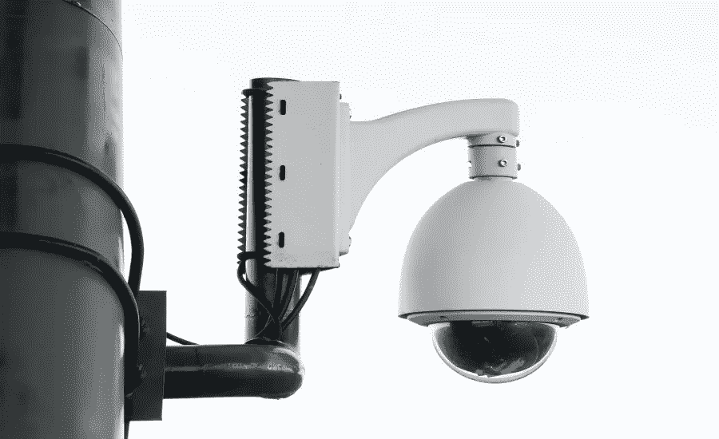

# 人工智能如何帮助打击网络犯罪

> 原文：<https://medium.com/nerd-for-tech/how-ai-helps-combat-cyber-crime-69adf0b64a69?source=collection_archive---------7----------------------->

基于人工智能(AI)的网络安全方法已被开发出来，以应对这一前所未有的挑战，帮助人工智能信息安全团队应对数据泄露和网络安全威胁。

根据凯捷研究所的一项民意调查，近 69%的企业认为人工智能在打击各种类型的网络犯罪中发挥着积极作用。随着技术的双向发展，网络攻击的变化与日俱增，并且还在快速发展。为了正确量化风险，必须根据组织的规模评估数千亿个时变信号。因此，企业正在考虑在网络安全中实施人工智能。

**网络世界的威胁**

网络世界既广阔又深邃。在整个互联网生态系统中，有数十亿个网站和服务托管在各种平台上。就像在网络世界开展业务很容易一样；维护数据安全并不容易，也是一项艰巨的任务。

网络世界的原住民经常面临的一些网络威胁包括:

网络钓鱼—要求提供个人信息和安全信息的虚假电子邮件。

恶意软件，如勒索软件，对文件进行加密，并持有文件以勒索赎金。

网站拒绝服务(DDOS)攻击，这种攻击有时会导致勒索。

对基于人工智能(AI)的网络安全方法的个人或企业账户进行黑客攻击。

组织或企业内的内部数据或安全漏洞。

网络犯罪对于安全专家来说是一项具有挑战性的任务。不断发展的技术会让数据安全和网络攻击变得更加难以应对。黑客正在寻找新的方法来突破既定的协议，窃取关键信息，通常要求赎金。

**在安全领域实施人工智能**

面对网络世界的威胁，人工智能已经成为一种可靠的选择。机器学习和人工智能正被用来通过比较类似环境中实体的行动来跟踪非法和恶意的活动，[安全系统中的人工智能](https://www.anolytics.ai/solutions/ai-security-camera/)经常被用来区分“好”和“坏”更先进的人工智能安全系统不仅可以识别好的或坏的行为，还可以分析大量数据，并帮助拼凑可能表明匿名实体可疑行为的关联活动。

企业正在使用基于人工智能和机器学习的模型来建立网络架构，以防止网络犯罪和遏制攻击。当面对新的或不熟悉的信息/行为时，AI 安全能力基于以前的行为“学习”，允许快速、可操作的上下文和洞察力；包括基于潜在的不充分的数据子集进行逻辑推理，并为已知问题提供几种解决方案，以允许安全团队选择最佳的行动方案。

人工智能方法正在增强整体安全架构及其性能，当传统安全系统被证明缓慢而无效时，它可以提供更好的保护，抵御越来越多的复杂网络攻击。对于在内部和外部流程中采用人工智能的公司来说，业务流程和财务成果已经得到改善。人工智能支持的网络安全解决方案的使用也有助于加快跨领域数据驱动的安全模型的发展。

**也可阅读:** [安防摄像机中的 AI 如何提供一站式安防监控解决方案](https://www.anolytics.ai/blog/ai-in-security-cameras-surveillance-solutions/)

**结论**

在不久的将来，我们相信人工智能将能够预见事件，并在网络安全领域提供预防措施。还预计将会广泛使用对策，使企业能够轻松应对，并为网络攻击做好准备。

此外，在网络安全方面，人工智能将能够识别复杂的攻击，阻止它们，并通过建立网络罪犯的身份并采取行动来防止他们未来的企图。此外，我们可以期待先进的自动检测系统以高概率发现攻击，而不需要现在存在的大量运营费用。除此之外，自动化软件漏洞根本原因分析的可用性也是可以预期的，它可以确定为什么存在安全缺陷以及如何补救它。一些解决方案，如当发现攻击者时，自动事件响应可以成功地将他们从网络中丢弃，或者网络钓鱼检测从不遗漏或生成错误警告。

预计网络安全领域将出现大量新的发展，而机器学习和人工智能将继续成为打击网络犯罪的首选替代方案。