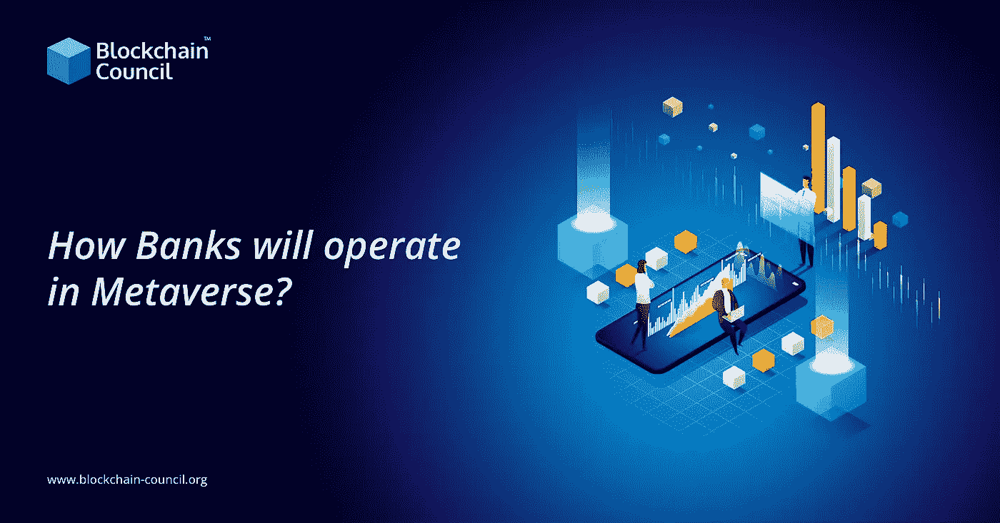

# 元宇宙的银行将如何运作？

> 原文：<https://medium.com/nerd-for-tech/how-banks-will-operate-in-metaverse-c4c0e41a9437?source=collection_archive---------1----------------------->

分散的土地、沙箱和 Somnium 空间是虚拟现实空间的一部分，构成了所谓的“元宇宙”其中一些主要用于托管视频游戏。其他的，如分散的土地，是虚拟世界，用户在其中创建反映自己的化身，并参与现实世界的活动，如找房子和婚礼策划。第一个是第二人生，一个由林登实验室在 21 世纪初创建的虚拟环境。当时有几家银行在那里开设了分行，帮助消费者在环境中管理他们的资金。这部[元宇宙区块链](https://www.blockchain-council.org/blockchain/know-everything-about-blockchain-metaverse-and-why-does-it-matter/)轰动了！最近区块链对认证的需求很大。

阅读更多- [金融专业人士区块链](https://www.blockchain-council.org/certifications/certified-blockchain-finance-professional/)

## **将 3D 功能添加到您现有的功能中**

互联网进入银行业花了 15 到 20 年的时间。开发手机花了五到六年的时间。随着我们从 2D 转向 3D，我们可以创造一个巨大的宇宙，让客户沉浸其中。银行应该思考银行业在 3D 环境中可能如何运作。

在这一领域看到早期的行业探索者并不奇怪，47%的银行家认为，到 2030 年，客户将使用增强现实(AR) /虚拟现实(VR)作为交易的替代渠道。法国巴黎银行(BNP Paribas)开发了一种虚拟现实软件，允许客户在开户等银行业务流程中使用虚拟现实，而花旗则尝试了全息交易工作站。

更多阅读- [学习区块链技术](https://www.blockchain-council.org/blockchain/how-can-a-newbie-start-learning-about-blockchain/)

我们也看到了改善员工体验的巨大机会。员工在扩大银行品牌和推动有意义的客户关系方面至关重要。沉浸式培训，例如美国银行对 5 万名员工实施虚拟现实培训，让分行员工在无风险的环境下识别情绪并改变行为。

## **创造新颖而有意义的方式与顾客互动**

尽管银行业变得更加功利化，但它在情感上仍过于脱节。具有讽刺意味的是，元宇宙为银行提供了一种急需的手段，通过以更有意义的方式满足客户需求，将人性重新引入银行业并加强现有的客户关系。

元宇宙也开辟了接触新观众的新途径，比如年轻的、了解 NFT 的一代。银行将不得不寻找新的方式来与这一人群建立联系。我们都记得和父母一起去一家支行让我们的银行存折盖章。下一代的元宇宙会是什么样的？

客户可能能够访问虚拟分支机构以获得高接触度的客户服务，与抵押贷款经纪人进行实时房地产旅行，与虚拟顾问讨论退休计划，参加投资活动，或参加银行赞助的社区活动。

阅读更多- [什么是 hyperledger](https://www.blockchain-council.org/blockchain/what-is-hyperledger-fabric-in-blockchain-a-complete-guide/)

## **新产品开发和市场拓展**

数字资产已经从加密社区中爆发出来，现在可以在市场上交易和估价。换句话说，真金白银已经被用于收购虚拟资产。他们会想在现实世界中好好利用他们的虚拟货币。

元宇宙的发展中经济是一个尚未开发的增长源，银行能够为加密货币、不可替代的代币和虚拟房地产提供保险和贷款。银行必须决定自己将扮演什么角色，以及如何利用这个机会来扩大自己的品牌。

## **收尾**

对银行来说，这一新领域前景广阔。虽然许多方面仍然未知，但底线是明确的:如果你还没有开始探索元宇宙，现在是时候这样做了。向你的员工介绍这项技术及其潜力。报名参加[最佳区块链课程](https://www.blockchain-council.org/blockchain-certification/)，开始区块链专家之旅。