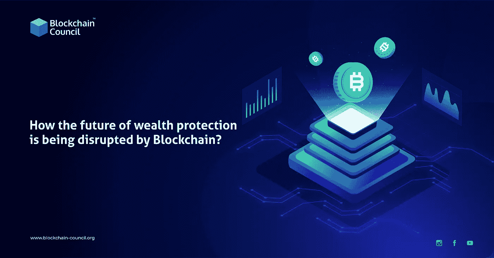

# 区块链如何颠覆财富保护的未来？

> 原文：<https://medium.com/nerd-for-tech/how-blockchain-is-disrupting-the-future-of-wealth-protection-97ae51ec7461?source=collection_archive---------4----------------------->

区块链是一项突破性技术，能够转变银行和商业模式。而财富保障市场可以显著受益于 [**【区块链】** **发展**](https://www.blockchain-council.org/certifications/certified-blockchain-developer/) **。**除了保障资金安全，它还可以改进实时结算模型、智能合约和单点真实性(SPOT)。

关注我们的媒体出版物，获取最新的区块链更新—[**https://medium.com/blockchaincouncil**](https://medium.com/blockchaincouncil)

**区块链平台**可以证明是各行各业现状的颠覆者，尤其是财富保护和管理。由于它们是不可改变和不可破解的，它们在金融服务行业中赢得了信任。让我们看看区块链科技是如何打破财富保护现状的。

# 目录

*   什么是财富保障？
*   为什么财富保护至关重要？
*   区块链和财富保护
*   区块链在财富管理方面的影响
*   区块链在财富保护中的使用案例
*   结论

# 什么是财富保障？

金融行业将财富保护描述为帮助个人或公司保护其资产(如现金)的管理策略和工具。除了不同类型的保险，还包括避税和资产保全。

# 为什么财富保护至关重要？

传统上，银行储蓄账户为消费者管理自己的财富并随着时间的推移创造更多财富铺平了道路。然而，由于负利率、通货膨胀和金融不确定性，这已经不可能了。因此，财富保护和管理成为未来规划的关键。

人们现在转向像区块链这样的新技术来保护他们的财富安全。你可以通过网上的**区块链认证印度**课程来学习。

# 区块链和财富保护

首先，分散的资产交换有助于财富保护有两个原因:

1.  交换和交易是分散的和分布式的。因此，**区块链平台**可以将众多集中式业务流程去中介化。
2.  加密硬币的兴起引发了新的资产类别和首次硬币发行(ico)。因此，投资者可以在没有银行系统帮助的情况下赚钱。

资源分配的模式已经改变。首先，投资者可以超越传统结构，参与全球财富交换。此外，**区块链发展**使得其他金融工具的股票分散交易成为可能。财富管理还可以延伸到以下服务领域:

*   退休规划
*   投资建议
*   房地产基础
*   会计
*   税务服务

# 区块链在财富管理方面的影响

目前，大多数金融相关公司都在使用保守的、有几十年历史的技术来提供资产管理服务。因此，这种遗留系统需要昂贵的数据维护，同时对客户的敏感数据和组织的声誉构成威胁。

区块链技术可以通过提高一系列服务的服务质量来为公司提供解决方案，例如投资组合管理、客户入职和资产交易。这个过程相对容易。任何有 IT 背景的人都可以搜索**如何成为区块链工程师**并注册在线课程。因此，公司也在向底层技术迁移。

任何**区块链平台**的关键要素是去中心化、不变性、共识和高效交易。因此，有了区块链技术，商业交易可以比以往任何时候都更快、更流畅。

除了实时结算模型，监管机构还可以利用区块链兑换货币、KYC 流程、智能合约和自动化投资。同样，它也正从客户那里获得动力，因为他们对这种新的资产类别感到好奇。

# 区块链在财富保护中的使用案例

如果公司接受**区块链开发**，他们可以在许可的区块链上存储参考数据。除了预订新客户，他们还可以提高客户满意度。区块链在财富管理方面的一些可能的使用案例如下:

*   **降低交易成本**

随着实时模型改变其执行过程，交易成本将会下降。这是因为区块链在降低交易对手风险方面效率很高。然而，这也将影响过渡费，这是中介机构最重要的收入来源。

*   **数据隐私保护**

它使用起来更便宜、更快捷，而且可以捆绑客户的数据。因此，**区块链平台**降低了数据隐私保护、管理财务历史和投资概况提案的成本。此外，智能合同将促进更快的客户入职和可靠的客户互动。

*   **投资组合管理**

数字投资组合对财富保护至关重要。他们不仅可以强调资产教育的重要性，还可以激发财富管理工具多样化的需求。此外，数百名开发人员在区块链认证项目中工作，以实现金融工具的自动化。此外，他们可以摒弃传统方法，引入更精简、更高效的流程。然而，新的**区块链发展**可能会威胁到额外的收入来源。

# 结论

考虑到目前的趋势，在财富管理领域，**区块链平台**的使用大幅增加。除了让个人受益，它还将改善金融相关公司的服务。一旦成为主流，它可以永远重新描绘当前的策略。

访问区块链委员会了解更多关于区块链技术的内容。

**阅读更多:**

*   [**如何在元宇宙购买土地？**综合指南](https://www.blockchain-council.org/blockchain/how-to-purchase-land-in-the-metaverse/)