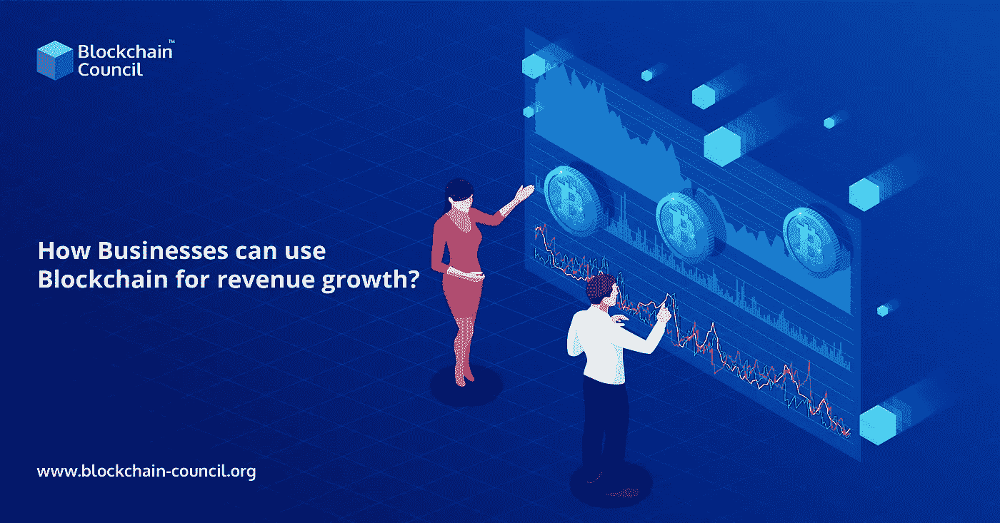

# 企业如何利用区块链实现收入增长？

> 原文：<https://medium.com/nerd-for-tech/how-businesses-can-use-blockchain-for-revenue-growth-95d6b6b6b22e?source=collection_archive---------6----------------------->

区块链技术是一个开发金融服务的框架，将填补当今虚拟市场系统的许多空白。区块链连接一组实体，并允许数据在许多独立的利益相关者之间同步，而传统数据库仅存储单个实体的信息。

使用[区块链开发](https://www.blockchain-council.org/certifications/certified-blockchain-developer/)对小企业特别有吸引力。它使他们能够支付和接收款项，获得投资和储蓄产品，并经济高效地建立信用记录。更多地获得这种技术可以帮助中小企业蓬勃发展，这反过来又有助于创造就业机会和改善经济。

区块链技术有能力深刻改变全球商业格局。然而，尽管有很多令人兴奋的事情，分布式账本系统还没有给企业带来任何现实的好处。[区块链认证印度](https://www.blockchain-council.org/info/blockchain-certification-india/)随着越来越多的企业转向团队中的区块链专家，这一数字正在上升。

分析师正在讨论区块链的众多潜在应用。然而，很少有人讨论新技术如何帮助企业增加收入、吸引更多消费者或提高他们的底线。

## **这是什么原因？**

原因是，尽管区块链有潜力，但它仍然脱离现实世界。企业领导人明白分布式分类帐将提高在线交易的安全性，但他们还没有领会这将如何使他们的组织受益。

这种情况即将改变。各行各业的高管将会明白这项技术如何帮助他们增加收入。多亏了区块链，企业将有更多机会获得当今企业界最宝贵的资产:数据。

## 数据是任何业务的核心。

企业希望更多地了解他们的消费者，并有办法获得新的消费者。因此，他们向亚马逊和脸书等公司支付客户数据。这些数据包括购买习惯、个人偏好和大量其他细节，非常重要。

企业已经习惯于为一定数量的数据支付一定数量的钱，这些数据只能从可靠的来源获得。亚马逊、脸书、谷歌和其他公司以这种方式建立了数据寡头垄断。他们是最可靠的商业信息来源。

企业更愿意直接在它们之间买卖数据，而不需要中间人。对于许多行业中的各种组织来说，这将对他们的底线产生直接影响。

然而，这是不可能的，因为公司无法知道他们是否购买了可靠的数据。除非来源完全可信，否则数据将毫无意义。

然后是区块链。由于分布式分类帐体系结构，在线交换的信息更难以伪造或篡改。它可以增加一层以前不存在的信任。使用区块链技术传输的数据是经过确认的数据，不需要数据寡头成员的额外验证。

## **结束**

区块链还有待与商业世界的主流商业逻辑相结合。许多人仍然没有意识到它的重要性。然而，区块链与数据息息相关，而数据正是推动当今行业发展的动力。

数据寡头垄断终结的开端将是允许企业直接相互买卖数据的市场。它将使企业世界中最重要的资产之一更容易被每个人所获得。在线报名参加区块链课程并开始学习。