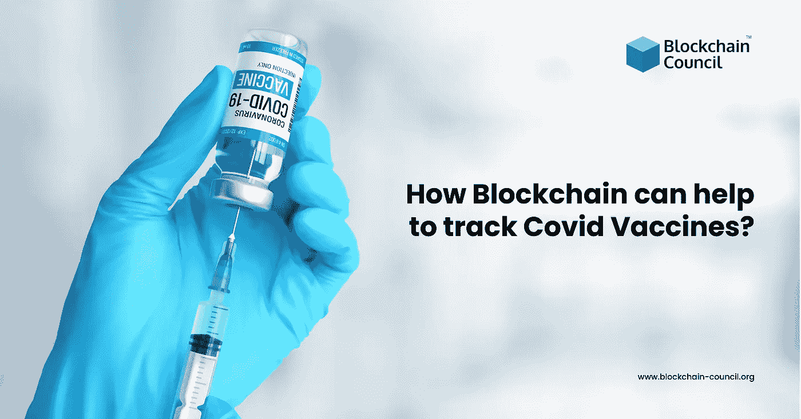

# 区块链如何帮助追踪 Covid 疫苗？

> 原文：<https://medium.com/nerd-for-tech/how-can-blockchain-be-helpful-in-tracking-covid-vaccines-a20beba49bb1?source=collection_archive---------5----------------------->

关于人们注射疫苗试验成功的消息给全球人民带来了宽慰。但是，我们不能否认这样一个事实，如果政府不恰当地分发 covid 疫苗，它们可能不会有效。此外，为了成功采用，人们需要信任疫苗来源。然而，在当前的医疗保健行业，保持高水平的透明度是不可能的，因为缺乏这样的先进系统。 [**区块链开发**](https://www.blockchain-council.org/certifications/certified-blockchain-developer/) 在这个场景下可以作为这里需要的解决方案。事实上，我们需要稳健的**区块链技术培训**项目，以利用其在疫苗分发过程中的应用。

# 目录

*   对适当的疫苗分配系统有什么需求？
*   区块链在这一领域的发展如何能有所帮助？
*   基于区块链的疫苗接种 ID 或证书如何工作？
*   结束语

# 对适当的疫苗分配系统有什么需求？

一个合适的疫苗分销系统需要满足以下几个方面:

*   使用计算机化免疫数据框架保持准确性。
*   应特别努力确保人们的个人信息安全。
*   接下来，对于突然出现的突发情况，必须有备用的身份验证系统。
*   该系统必须非常具体地只记录关于疫苗验证的数据，而不记录任何其他不必要的信息。例如，它应该避免添加一个人过去的测试和结果的数据。因此，它将消除不需要的数据聚集。
*   此外，用户应该能够实时访问该系统。对经常在州与州之间、国家与国家之间旅行的人会有帮助。

# 区块链在这一领域的发展如何能有所帮助？

据全球[**区块链专家**](https://www.blockchain-council.org/certifications/certified-blockchain-professional-expert/) 团队介绍，该技术可以满足高效疫苗验证系统的要求。由于区块链的数据加密和去中心化的特点，其账本上的数据存储获得了极大的安全性。事实上，篡改区块链网络添加到其分类账中的任何数据记录几乎是不可能的。因此，不用说，这似乎是保护人们个人数据的完美解决方案。

通过适当的**区块链技术培训**医疗保健技术部，当局可以在区块链上存储疫苗装运数据。此外，公共分类账可以根据每个包裹的序列号和其他重要数据来记录每个包裹。这样，扫描和鉴定商品在供应链的任何阶段都将变得更加容易。

为了解区块链技术如何处理信息共享和数据存储的底层机制，请参加**区块链技术培训。**

基于区块链的 covid 疫苗分销架构的一个可用示例是 VacciFi。该解决方案向人们提供 covid 疫苗接种护照，以简化他们的验证过程。

# 基于区块链的疫苗接种 ID 或证书如何工作？

在一个人在不同目的地之间旅行的场景中，区块链疫苗接种 ID 将对他们非常有帮助。在这里，未接种疫苗的人需要在附近的卫生局登记他们的详细信息，以便接种疫苗。一旦他们收到他们的疫苗接种 ID，他们可以访问各自的诊所或医院进行疫苗接种。在他们访问医院期间，接待处将记录关于此人的所有重要数据，例如，旅行者的姓名、联系人和护照号码等。

但是，所有这些信息都将根据公共数据保护法规和合规性进行链外存储。在这里，医院可以以两种形式存储信息:

*   护照号码和从疫苗 ID 生成的散列号码。
*   接种疫苗的剂量日期。

现在，组织可以将区块链与另一种称为二维码的高效技术结合起来。只需一次扫描，旅行官员就能实时检查旅行者的疫苗接种情况。

但是，请注意，区块链技术将无法解决疫苗验证框架的公平性和包容性问题。但是，它肯定可以帮助全球医疗保健部门管理一个安全的系统，同时能够保持对信息的实时访问。

# 结束语

区块链可以在全球范围内为疫苗分销网络提供支持。此外，它还可以帮助疫苗制造商监控疫苗分销过程，并提前发现任何问题。除此之外，分销商还可以获得实时可见性，并随时应对供应链中的中断。因此，不断更新疫苗供应将有助于更好地管理和监控库存。此外，它将在疫苗制造商和分销商与普通民众之间建立信任。因此，我们可以说，区块链是疫苗分销系统领域一些主要问题的有效解决方案。

加入区块链委员会，获得关于[**区块链的专家见解，了解**](https://www.blockchain-council.org/blockchain/how-can-a-newbie-start-learning-about-blockchain/) 的概念、网络、应用以及更多。您可以利用该平台向感兴趣的学习者提供的区块链认证。