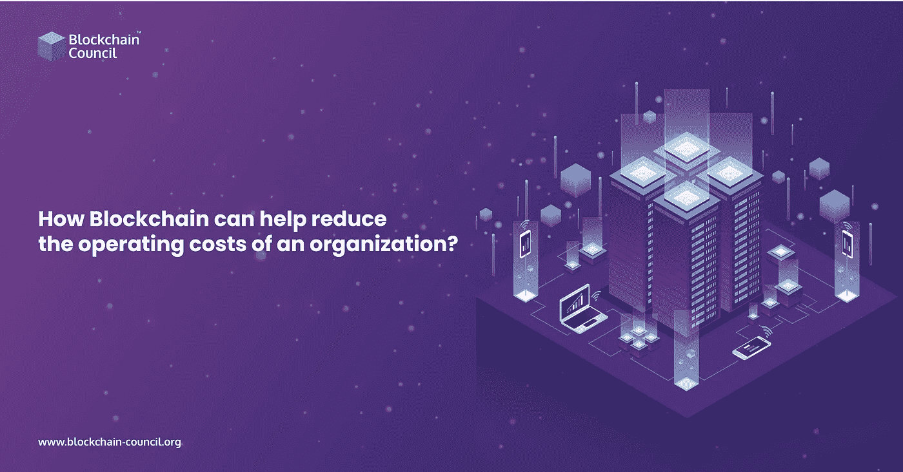

# 区块链如何帮助降低组织的运营成本？

> 原文：<https://medium.com/nerd-for-tech/how-can-blockchain-help-in-reducing-the-operating-costs-of-an-organization-f214f8f70ec8?source=collection_archive---------9----------------------->

玛斯蒂和全球经济严重依赖交易和金融指令。此外，由于中介的存在和支付的实现，交易双方都要付出一定的代价。数百万消费者的全球金融系统通过操作处理数万亿美元。全球支付行业在 2015 年创造了 18 亿美元的收入。几位作者讨论了 [**区块链工程师认证**](https://www.blockchain-council.org/certifications/certified-blockchain-developer/) 对各个领域货币操作的影响，包括安全、网络、分销网络、房地产、金融、营养和银行。

关注我们的媒体出版物，获取最新的区块链更新—【https://medium.com/blockchaincouncil

****

**[**区块链认证**](https://www.blockchain-council.org/blockchain-certification/) 是一项降低了交易价格，并在内部和外部都得到有效利用的技术。因此，许多公司开始寻求新兴的创新，不仅仅是为了节省交易费用和减少交易解决所需的时间。根据写信人的说法，金融交易需要三到四分钟来解决。**区块链认证**是探索的技术之一。**

# **什么是区块链，它是如何工作的？**

**区块链技术已经在各种业务中得到了爆发式的应用。区块链软件分为三个阶段:发布阶段，客户允许类似以太坊**区块链工程师认证**的东西与资金转移互动。股权投资仅在区块链分类账中陈述的评估阶段得到验证。在区块链数据库中记录和保存数据的记录和保存过程。**

**开发者可以上传一个社区网络，使用该技术来验证陌生人手中的每一笔交易。西方盟友描述**区块链进程**关联增量备份时间戳数据格式。**区块链课程**是一个互联机制的网络，为当前的基础设施增加了独特的品质。在程序的初始阶段，不同的当事人之间有签名的交互。**

**从那时起，至少有一个人已经核实了交易，并将其传播给其他利益相关者。该交易描述了一个双边协议，可能允许交换传统和网络资源，执行我的工作，等等。这样的参与者可以被认为是节点，这些节点收集颗粒中的事务，验证它们，并确定该事务是应该保留在区块链中还是应该被丢弃。**

# **融资成本和区块链**

**另一方面，企业和公司可以通过将一些交互从现有的市场分支转移到网络来减少他们的运营费用，而消费者则从便利中获益。毫无疑问，1999 年引入数字交易是为了改善一个人的生活。区块链就是这些技术中的一种。银行系统继续投资于您的技术，以保持不断变化的客户测试，降低资本成本并保持公司的可持续性。**

**区块链开创了金融活动的新时代，包括资金转移、交易、购买和保险。此外，加密货币的采用可能会降低金融系统和银行利用的资产的邮政。**区块链开发者工资**可以降低营销和参与者交易中的交易成本和资金转移速度。**

**支付通过当前金融系统中的许多利率水平，特别是金融机构、银行和其他金融保险，通过复杂、后果性和昂贵的过程得到缓解。相反，**区块链开发者工资**热衷者希望将整合过程集中在为消费者和企业带来问题的连接上，以大规模采用为目标，在即将到来的那一刻。**

# **方法学**

**对话对于所有的研究都是至关重要的，因为它们在研究者和回答者之间建立了诚信和道德。采访利用了区块链在零售业中应用的专家意见，并检查了创新是否会降低你感觉报告目标的交易点。根据这封信的作者，采访是快速的，可靠的，并为研究人员提供了有价值的线索，因为他们可以得到即时的反馈并解释不清楚的评论。**

**银行系统继续投资于您的技术，以保持不断变化的客户测试，降低资本成本并保持公司的可持续性。**

# **结论**

**本指南的目标是弄清楚区块链如何帮助零售行业的支付信息定价。许多专家和咨询公司将**区块链技术**视为各个行业的颠覆性技术，包括银行、房地产、资产开发、商业和供应链管理。**

**此外，与来自当前技术和零售组织的经验丰富的员工就零售支付信息进行了六次讨论。它的优点是用于形式进行，以完成这项研究的目标。对详述系统如何运作的科学出版物的综合分析。**