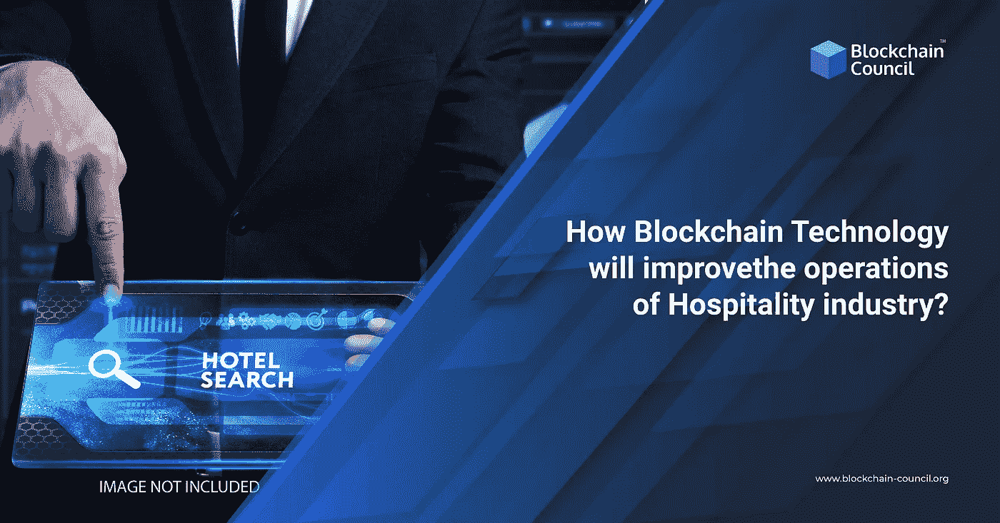

# 区块链技术如何增强酒店行业的运营？

> 原文：<https://medium.com/nerd-for-tech/how-can-blockchain-technology-enhance-operations-of-the-hospitality-industry-2cd73ab1f467?source=collection_archive---------3----------------------->

区块链技术因其技术、经济和社会关联而成为一个热门话题。毕竟，这是近代最激动人心的创新之一。 [**区块链专业人士**](https://www.blockchain-council.org/certifications/certified-blockchain-professional-expert/) 尽管技术还很年轻，但已经走进了各个部门和行业。在本文中，我们将讨论区块链在改善酒店和旅游业运营方面的潜力。

# 目录

*   区块链及其工作原理简介
*   区块链和酒店业
*   跟踪食物和食品
*   简化旅行
*   防止身份盗窃
*   跟踪客人及其行李
*   改善交易
*   结论

# 区块链及其工作原理简介

区块链是一个数字公共账本，永久匿名记录交易。简而言之，它是一个分散的结构，以特定的顺序存储事件的发生。此外,“块”是安全的和不可变的，因此，黑客不能访问或更改数据。**区块链开发者**使用密码学进行加密。

你可以通过 [**区块链学位**](https://www.blockchain-council.org/online-degree/online-degree-blockchain/) 或在线课程了解更多关于区块链的工作。

# 区块链和酒店业

区块链技术对那些从事酒店管理的人来说非常有益。例如，酒店、航空公司和其他酒店行业可以大幅改善他们的服务。此外，随着顾客满意度的提高，他们的利润也会飙升。**区块链教育**可以让酒店业的管理者和利益相关者受益。方法如下:

# 跟踪食物和食品

餐馆在从农场运送食品的过程中监控食品。他们可以引入区块链供应链管理来提高食品质量和安全；例如，餐馆可以与最初的供应商合作，使用区块链平台记录食品运输和加工过程。

此外，**区块链的专业人士**可以帮助餐馆设计个性化的平台来跟踪食品和杂货的运送。因此，顾客也可以标出他们所点食物的来源和路线。

# 简化旅行

计划一次与家人和朋友的旅行甚至会让学习的人感到困惑。此外，从购买机票到预订酒店，这些任务既复杂又耗时。区块链技术可以通过增加交易的安全性和透明度来帮助旅行者。例如，区块链可以生成一个旅行令牌，其信息将对所有航空公司和酒店可见。因此，旅行者不再需要在预订、登机和入住酒店的多个阶段出示护照。简而言之，区块链使验证过程高效而安全。

# 防止身份盗窃

顾客经常在机场、旅馆和餐馆出示他们的身份证。因此，他们很容易被窃取身份，因为他们周围的人可以获得这些个人信息。**区块链开发者**可以为游客创建一个平台，用于存储他们的身份证明、社会安全号码和护照。之后，他们可以授权酒店在登记入住时验证数据。

酒店企业也可以使用加密安全代码来确保其客户的安全。除了防止盗窃，它将消除身份伪造。

# 跟踪客人及其行李

当客人离开家或登机时，他们可以通过区块链技术即时更新酒店信息。因此，酒店管理的效率提高了，因为顾客登记入住的时间缩短了。此外，酒店可以监控客人的活动，以提升服务质量，提高客人满意度。然而，跟踪顾客可能会侵犯隐私。因此，企业主可以获得**区块链教育**来创建一个平台，询问客人他们希望与酒店分享多少信息。

行李追踪对国际旅行者来说是一个挑战。从机场和地勤服务到酒店，检查所有行李是一项艰苦的工作。区块链技术可以通过存储和行李箱数据处理数据来解决这个问题，从而减少行李箱的误操作。此外，区块链将允许各方交换信息，即使他们不属于同一家航空公司或分支机构。因此，行李跟踪在整个行业都得到了改善。

# 改善交易

完成酒店、旅行社和其他旅行相关机构之间的财务结算是复杂的。尤其是涉及货币兑换的海外交易时，向酒店和度假村付款是很复杂的。区块链可以通过消除延迟操作的中介来优化这一过程。此外，双方之间的总体透明度也将增加。

区块链的另一个用途可以是处理主要和次要交易的智能合约。例如，经理可以使用区块链开发商**的服务来加强他们的业务关系。此外，他们可以将智能合同功能扩展到客人，从而终止漫长的登记过程。**

# **结论**

**区块链是改善酒店行业运营的领跑者。除了消除低效分散的系统，区块链还可以引入各种改革来重塑行业。在**区块链专业人士的帮助下，**旅行和接待会变得更加安全和高效。**

**请访问区块链委员会了解区块链及其应用。**