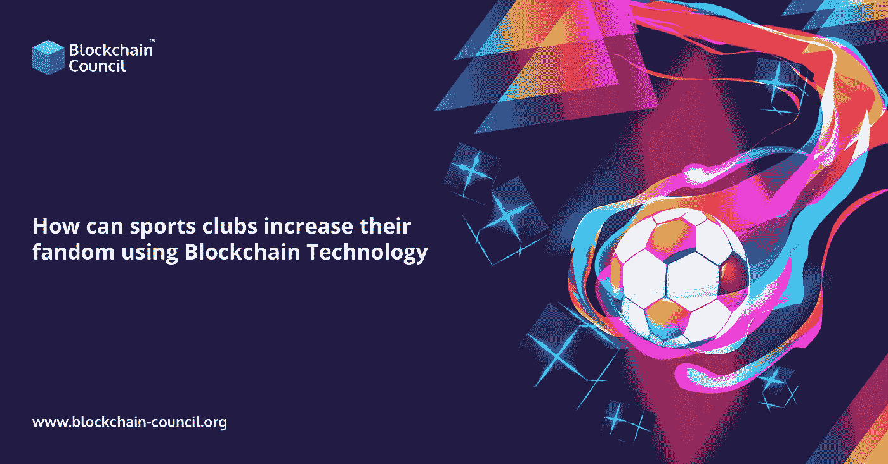

# 体育俱乐部如何利用区块链技术增加粉丝量？

> 原文：<https://medium.com/nerd-for-tech/how-can-sports-clubs-increase-their-fandom-using-blockchain-technology-774b6fbfbb6e?source=collection_archive---------5----------------------->

体育界近年来经历了巨大的变化。数字原生粉丝的出现，以及预计将大幅减少现场赛事门票收入的 2020 年赛事，刺激了体育和电子竞技企业寻找新的收入来源和创新方法，以保持粉丝的参与，同时打击欺诈和腐败。这一场景为新玩家利用尖端技术改变历史进程打开了大门。区块链就是这样一种技术发展，它改变了传统体育产业的基本原则。[区块链教育](https://www.blockchain-council.org/blockchain/why-blockchain-education-should-be-incorporated-into-colleges/)现在很重要，对区块链专家的需求更多。区块链认证最近呈上升趋势。

区块链技术有可能让体育俱乐部轻松地将他们的粉丝群货币化，并增加粉丝参与度。区块链不是未来的技术。这是 21 世纪需要的技术，应该在当前情况下充分利用。

区块链技术已经被世界各地的知名体育俱乐部(曼城、巴塞罗那和巴黎圣日耳曼)和联赛用于他们的数字战略。体育团队可能会利用区块链来发掘新的收入来源，并建立与粉丝互动的新方式。从粉丝代币到粉丝事件跟踪和忠诚度网络，完整的体育生态系统从未像现在这样开放、流畅和易于使用。

## **代币被用来增加全球粉丝的参与度。**

区块链有所作为的一个重要方式是通过引入粉丝代币。这些数字代币充当俱乐部的虚拟货币，支持者可以用 fiats(政府发行的)货币购买，如美元、英镑和欧元。粉丝可以用粉丝代币换取商品、收藏品和难忘的经历。用户还可以使用他们的代币作为进入一个安全、私人的粉丝核心圈子的门票，这些粉丝拥有共同的兴趣和价值观，允许他们通过移动投票平台参与粉丝驱动的决策。这些与众不同的标志意外地让支持者和体育迷们感到与他们的球队更加紧密地联系在一起，即使他们在远处观看。

## **互动网站上的粉丝会得到奖励。**

粉丝参与的平台可以使用区块链技术来构建。在这些平台上，运动队和俱乐部可以创建忠诚度计划。他们可以为创建和共享内容的支持者提供积分或奖励，以及收集可用于购买产品、门票和数字收藏品的积分或奖励。这种平台有助于培养球迷的社区意识和归属感，同时也加强了俱乐部与赞助商的关系。这是因为该技术的开放性使得与广告商无摩擦地共享粉丝参与数据成为可能，这有助于他们获得更高的投资回报。

## **将机票欺诈问题排除在外**

票贩子和造假一直是体育行业的问题。许多运动队在寻找更有效的解决方案的过程中，逐渐发现了区块链的完美解决方案。由于这项技术的透明性，任何人都可以检查门票的有效性，并追踪到俱乐部，以确保其合法性。

## **收尾**

这项革命性的发明正在被莱昂内尔·梅西(Lionel Messi)等高端足球明星以及 NBA 球队、体育俱乐部和电子竞技所使用，以释放前所未有的收入和收入流。伟大的网球明星 Serena Williams 最近加入了一个梦幻足球游戏平台，担任董事会顾问，这表明区块链科技是体育业务的新热点联盟，并将在未来的日子里继续这样做。

舞台已经搭好，演员们准备好了。这只是一个时间问题，游戏开始之前，我们会看到新的球迷参与感谢数字时代设计的数字解决方案。

[区块链开发者培训](https://www.blockchain-council.org/certifications/certified-blockchain-developer/)正在兴起，越来越多的人报名参加区块链的课程。立即加入并开始行动。