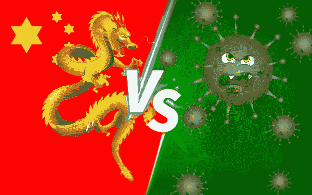
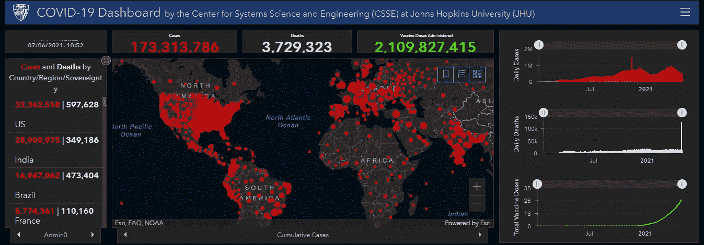
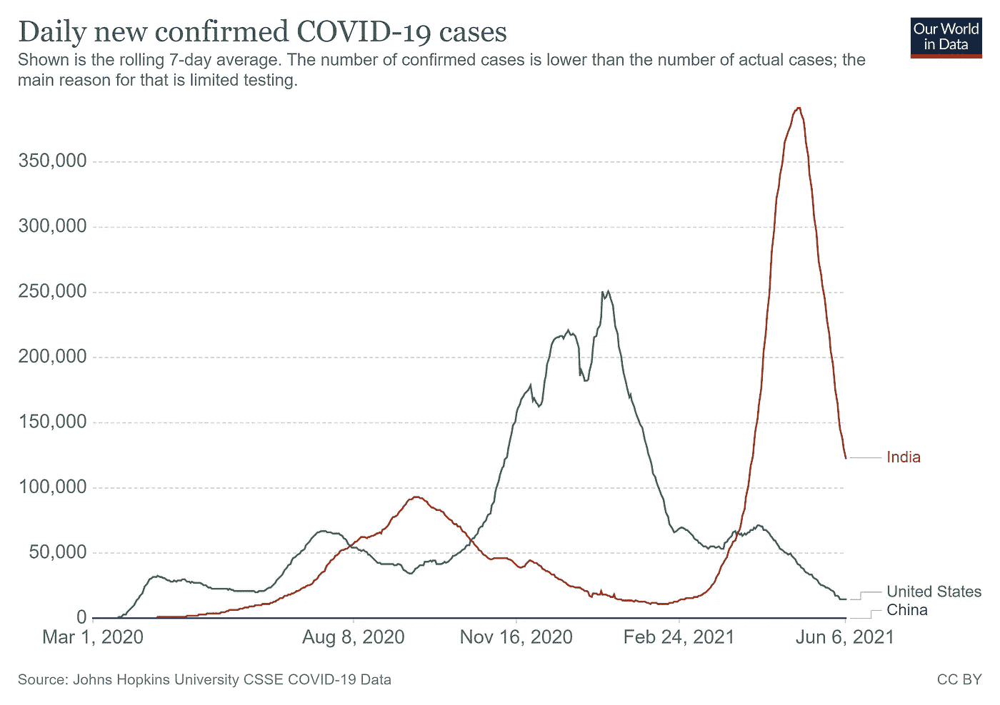
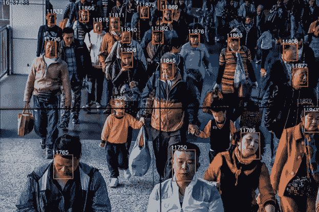
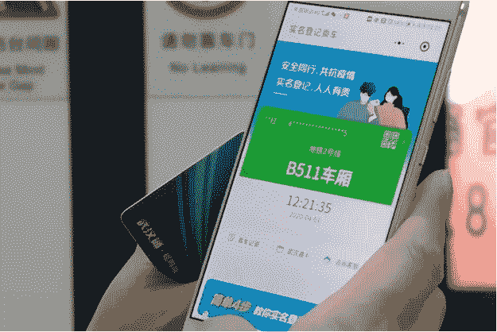
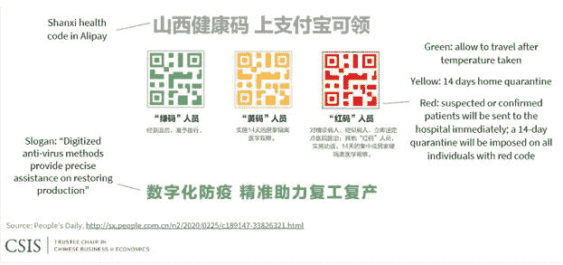
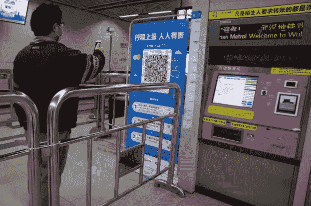
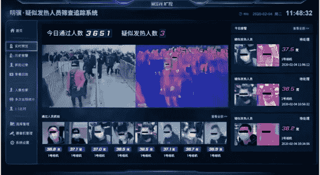
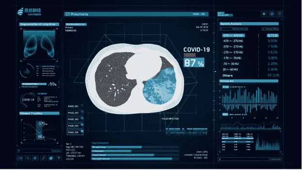
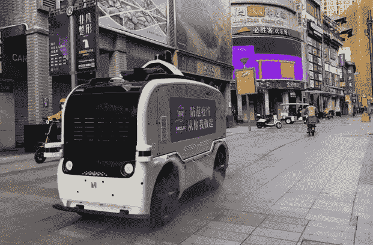

# 中国如何利用人工智能压制新冠肺炎。

> 原文：<https://medium.com/nerd-for-tech/how-china-suppressed-covid-19-using-artificial-intelligence-bf28e2cd0a79?source=collection_archive---------3----------------------->

中国如何利用人工智能压制新冠肺炎。

2020 年和即将过去的 2021 年将作为新冠肺炎疫情引发全球危机的年份载入史册。当然，这不是第一次全球性流行病，也不会是最后一次。纵观历史，人类经历了四次全球性流行病，分别是黑死病(14 世纪)、西班牙流感(1918 年)、艾滋病毒/艾滋病的全球性流行病(20 世纪)和 SARS(2002-2003 年)，它们影响了世界许多地区。新冠肺炎因为如此高的国际旅游而脱颖而出。

它在一个意想不到的时间迅速传播到世界各地，结果，许多国家完全关闭了它。在撰写本文时(2021 年 7 月 6 日)，全球已报告超过 1.73 亿新冠肺炎患者，超过 370 万人死亡。

https://coronavirus.jhu.edu/map.html 约翰·霍普斯金新冠肺炎资源中心([来源](https://coronavirus.jhu.edu/map.html)-)

新冠肺炎也不同于以往的疫情。这是因为这是世界各地的卫生组织和政府机构首次使用大数据和人工智能的新兴技术来对抗疾病。人工智能一直被描绘成一种能够适应我们不断变化的世界的技术，这次疫情可以被认为是人工智能的前奏。

利用人工智能抗击新冠肺炎病毒的一个有趣案例来自病毒的源头中国。尽管中国的新冠肺炎患者数量最初有所增加，但中国很快就控制住了疾病的传播，而世界其他地区仍在努力应对不断增加的病例。如果你看下面的图表，你会看到中国的一条直线是平的，作为一个视角，人口众多的美国和印度的病例仍然在增加。

中国诉印度诉美国的新冠肺炎案件([来源](https://ourworldindata.org/coronavirus/country/china?country=~CHN)-https://ourworldindata.org/coronavirus/country/china？国家= ~中国)

中国采取了什么行动来对抗新冠肺炎？

与其他国家不同，中国坚持不懈地使用人工智能技术来控制 Kovid-19 流行病的传播。大部分注意力都集中在人工智能上，以提供公共监控来防止传播，其次是医疗保健，以提供更快的诊断和治疗。这并不奇怪，因为中国已经是全球人工智能的领先市场。根据一份报告，中国领先的新闻网站新华网预测，到 2023 年，中国的人工智能市场将达到 119 亿美元。([来源](http://www.xinhuanet.com/english/2019-12/08/c_138615098.htm)-http://www . Xinhua net . com/English/2019-12/08/c _ 138615098 . htm)

*所以让我们仔细看看中国在人工智能方面采取的各种措施。*

# 1.大规模监控和接触追踪

众所周知，中国对其公民进行大规模监控，而不考虑人民的隐私。中国有超过 2 亿个由基于人工智能的人脸识别技术驱动的监控摄像头，可以密切跟踪其公民。中国一直因广泛使用人工智能控制其公民而受到全球批评。

中国现有的大规模监控([来源](https://www.nytimes.com/2018/07/08/business/china-surveillance-technology.html)—[https://www . nytimes . com/2018/07/08/business/China-Surveillance-technology . html](https://www.nytimes.com/2018/07/08/business/china-surveillance-technology.html))

当新冠肺炎攻击中国时，

已经建立的公共监测系统被证明非常有效，因为它可以用于跟踪患者的旅行史，跟踪接触者，并预测与患者接触的其他人的风险。

联系追踪 App ( [来源](https://www.worldpoliticsreview.com/articles/28682/coronavirus-contact-tracing-and-the-right-to-privacy-in-a-pandemic)—[https://www . world politics review . com/articles/28682/coronavirus-contact-Tracing-and-the-right-to-privacy-a-a-a-a-疫情](https://www.worldpoliticsreview.com/articles/28682/coronavirus-contact-tracing-and-the-right-to-privacy-in-a-pandemic))

中国不仅收集了人类跟踪数据，还利用这些信息，通过在阿里巴巴和腾讯等公司帮助下创建的移动应用连接，教育潜在的新冠肺炎弱势群体。

这个应用程序根据用户的风险状况给他们颜色代码。根据风险的严重程度，没有风险的人被标为绿色，有旅行史或与其他患者关系密切的人被标为黄色或红色。黄色表示自我隔离，红色的人需要去医院。

中国卫生代码([来源](https://www.csis.org/blogs/trustee-china-hand/chinas-novel-health-tracker-green-public-health-red-data-surveillance)-[https://www . CSIS . org/blogs/trustee-China-hand/China-novel-Health-tracker-green-public-Health-red-data-surveillance)](https://www.csis.org/blogs/trustee-china-hand/chinas-novel-health-tracker-green-public-health-red-data-surveillance))

这部卫生法规现在已经成为中国允许其公民使用公共场所和服务的基准。许多公共场所，如火车站、办公室、地铁和机场，都配备了许多健康代码扫描仪，将人们引向黄色或红色代码。中国规定，只有当人们的健康代码是绿色的，才允许他们开车上路。

地铁里男子扫健康码([来源](https://abcnews.go.com/International/china-rolls-software-surveillance-covid-19-pandemic-alarming/story?id=70131355)—[https://abcnews . go . com/International/China-rolls-software-supervision-新冠肺炎-疫情-报警/故事？id=70131355)](https://abcnews.go.com/International/china-rolls-software-surveillance-covid-19-pandemic-alarming/story?id=70131355))

对中国人来说，另一个非常有用的应用是百度地图，它提供关于高风险地点的实时信息，并允许人们远离那些地区。它告知用户如何使用 GPS 访问数据和卫生机构的医疗数据远离 Kovid-19 热点。

百度地图显示新冠肺炎热点([来源](https://www.capgemini.com/2020/04/new-post-lockdown-use-cases-for-artificial-intelligence-in-china/)—[https://www . capgemini . com/2020/04/new-post-lockdown-use-cases-for-artificial-intelligence-in-China/](https://www.capgemini.com/2020/04/new-post-lockdown-use-cases-for-artificial-intelligence-in-china/))

人们在此期间戴口罩已经成为一种常态，这对于抵御 Kovid-19 病毒并防止其感染他人至关重要。中国人工智能公司百度、旷视科技、商汤科技和汉王科技已经帮助政府进行面部识别监控，以识别戴口罩或不戴口罩的人。如果检测到没有戴口罩的人，系统会立即发出安全警报。这些系统还配备了热扫描，以警告人们公共场所的高温。百度在北京国王火车站的观察在 1 月下旬建立了它，并在一个月内发现了 190 起可疑案件。

中国火车站热扫描面部识别([来源](https://www.scmp.com/tech/policy/article/3049215/ai-firms-deploy-fever-detection-systems-beijing-help-fight-coronavirus)—[https://www . scmp . com/tech/policy/article/3049215/ai-firms-deploy-fever-detection-systems-Beijing-help-fight-coronavirus](https://www.scmp.com/tech/policy/article/3049215/ai-firms-deploy-fever-detection-systems-beijing-help-fight-coronavirus)

(【https://www.wechat.com/en/】来源-[)](https://www.wechat.com/en/))

中国政府机构和医疗保健科技公司最全面的数据来源来自移动应用程序“微信”。这款移动应用由中国科技巨头腾讯集团开发，目前拥有约 12 亿用户。腾讯是亚洲最有价值的公司，市值 3000 亿美元。微信是所有新冠肺炎会员追求的主要来源之一。当它与大量的观察数据相结合时，它使寻找接触者成为一项容易的任务。

# 2.医疗保健服务

卫生工作者面临的主要挑战是高风险新冠肺炎患者的到来，他们在中国疾病爆发的早期就开始前来接受诊断。这是一项艰巨的任务，因为放射科医生必须执行数千次手动扫描来确认诊断。及时的诊断和隔离对于防止 ovid-19 的传播是必不可少的，但诊断过程在当时是一个障碍。

很快，阿里巴巴、易图科技等中国人工智能公司介入了 CT 扫描图像的人工智能辅助诊断，在最少的放射科医生干预下实现了过程的自动化。

为新冠肺炎进行人工智能辅助 CT 扫描诊断([来源](https://www.itnonline.com/article/artificial-intelligence-assisted-radiology-technologies-aid-covid-19-fight-china)-[https://www . itnon line . com/article/artificial-intelligence-assisted-radiology-technologies-aid-新冠肺炎-fight-china)](https://www.itnonline.com/article/artificial-intelligence-assisted-radiology-technologies-aid-covid-19-fight-china))

中国开始使用人工智能评估 CT 扫描，标志着一个重大转折。这些系统是使用深度学习构建的，并被证明是快速和高度准确的。到 2020 年 3 月，超过 170 家中国医院正在使用人工智能程序，潜在患者有 34 万人。

另一方面，腾讯人工智能实验室与中国健康科学家合作，开发了一种深度学习模型，可以预测新冠肺炎患者的严重发病率，这可能是致命的。他们已经在网上提供了这个工具，用于提前进行高优先级治疗。 *(* [*来源*](https://aihealthcare.tencent.com/COVID19-Triage_en.html)*-https://ai health care . Tencent . com/covid 19-Triage _ en . html)*

新冠肺炎是一种新病毒，所以当它出现时，医学研究人员对它一无所知。一旦发现这一点，世界各地的研究人员就开始研究这种病毒的基因，以创造一种诊断过程，为疫苗接种打开大门。但是这样的科学研究并不容易，需要大量的资源。

为了加快和简化研究和诊断过程，阿里巴巴和百度现在都向医疗界提供了他们专有的人工智能算法。百度的开源人工智能算法比传统的基因研究方法快 120 倍，阿里巴巴的 Linearfold 人工智能算法能够将研究冠状病毒 RNA 结构的时间从 55 分钟减少到 27 秒。它对快速基因检测很有用。 *(* [*来源*](https://aihealthcare.tencent.com/COVID19-Triage_en.html)*-https://www . weforum . org/agenda/2020/04/how-next-generation-information-technologies-coucked-新冠肺炎-in-china/ )*

在这种危机中，无人机通常有助于供应或监控物资。但自动驾驶汽车和中国机器人制造商百度、Neolix 和 Idriverplus 也加入了这一行动，为医院提供自己的自动驾驶汽车，以供应医疗设备和食品。

自动驾驶汽车消毒公共场所([来源](https://www.geospatialworld.net/article/the-sino-approach-use-of-technology-to-combat-covid-19/)-[https://www . geospatialworld . net/article/the-sino-approach-use-of-technology-to-combat-新冠肺炎/)](https://www.geospatialworld.net/article/the-sino-approach-use-of-technology-to-combat-covid-19/))

普都科技，另一家为一般餐饮行业制造机器人的公司。EidriverPlus 提供了自动车辆，用于在公共场所和医院喷洒消毒剂以保持卫生，并在 40 多家医院部署了机器人以协助卫生工作者。

*社交媒体:* [*LinkedIn*](https://www.linkedin.com/in/sajith-dilshan/) ，*[*Twitter*](https://twitter.com/sajithd7)*，*[*insta gram*](https://www.instagram.com/sajithd_dilshan/)*，*[*YouTube*](https://www.youtube.com/channel/UCXvjoCD39q8s3zWCwKD-Qpw)*，* [GitHub](https://github.com/Sajith-Dilshan) 。*