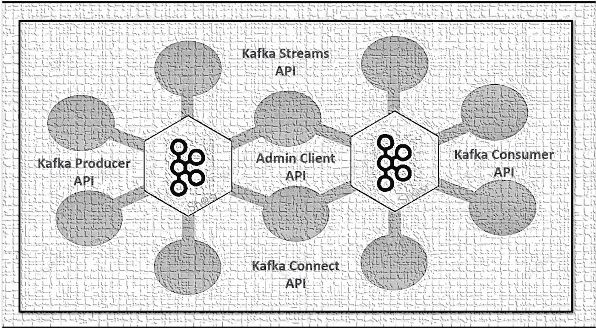
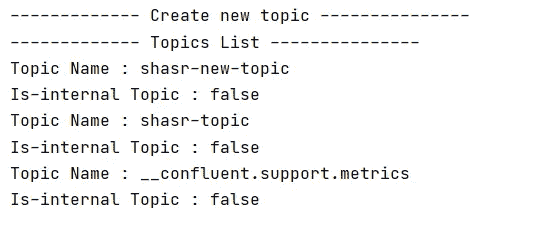
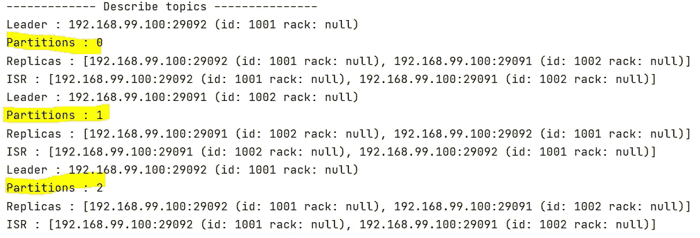
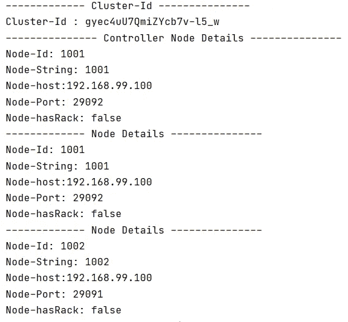
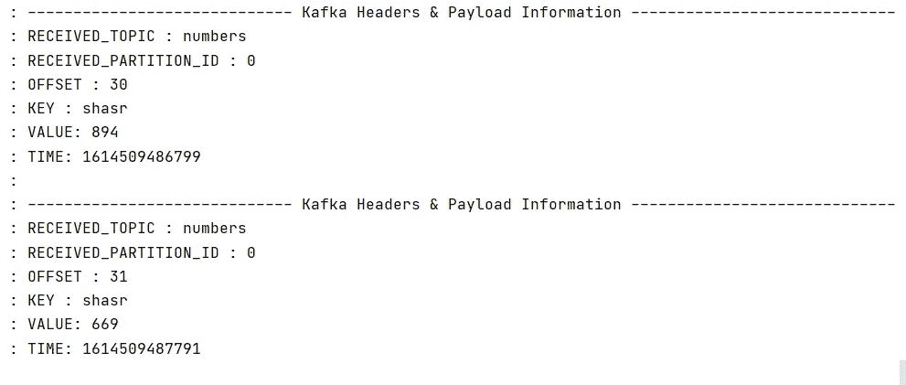

# 客户端应用程序如何与 Kafka 集群交互——通过 Kafka Java API 简化

> 原文：<https://medium.com/nerd-for-tech/how-client-application-interact-with-kafka-cluster-made-easy-with-java-apis-58f29229d992?source=collection_archive---------4----------------------->

在本文中，我们将看到如何利用 Kafka 客户端库(REST Api)与 Kafka 集群进行交互。让我们从 3 部分系列的第 1 部分开始



Kafka 客户端 API —取自 Kafka 官方网站的 Kafka 徽标

***Part-1:*** *我们会看到 3 个 Java Api 的*
-admin client Api
-Producer Api
-Consumer Api

***Part-2:****Kafka Streams(进行中—即将推出)*
—Streams API

***Part-3:*** *卡夫卡连接* *(进行中——即将推出)*
——连接 API

**在 local/Docker 中设置 Kafka 集群:**

[通过创建主题“数字”设置 Kafka 集群](/me/stats/post/ae84324cde86)

**先决条件:**

> - Kafka 集群(在本地/docker 中配置并运行)
> - IntelliJ 社区(或您选择的任何 IDE)
> -Maven/grad le(构建工具)
> - Java 8+

**Maven/Gradle 依赖关系:**

```
**MAVEN:***<!-- For Producer and Consumer API -->*
<dependency>
    <groupId>org.apache.kafka</groupId>
    <artifactId>kafka-clients</artifactId>
    <version>2.7.0</version>
</dependency>

**GRADLE:**

implementation group: 'org.apache.kafka', name: 'kafka-clients', version: '2.7.0'
```

> **管理客户端 API:**

kafka 的管理客户端，支持管理和检查主题、代理、配置和 ACL。这里我们看到了

-创建新主题
-删除主题
-描述主题
-列出主题
-获取控制器和集群节点详细信息

```
@Slf4j
@SpringBootApplication
**public class** KafkaAdminApplication **implements** CommandLineRunner {

    **private static final** String ***TOPIC_NAME*** = **"shasr-new-topic"**;

    **public static void** main(String[] args) {
        SpringApplication.*run*(KafkaAdminApplication.**class**, args);
    }

    @Override
    **public void** run(String... args) **throws** Exception {

        ***//Create Admin Client***AdminClient adminClient = getAdminClient();

        ***// Topic information***deleteTopic(adminClient);
        createNewTopic(adminClient);
        listTopics(adminClient);
        describeTopics(adminClient);

        ***// Cluster information***fetchClusterId(adminClient);
        fetchClusterController(adminClient);
        fetchClusterNodes(adminClient);
    }
}
```

*   ***用 Kafka 配置创建 AdminClient 实例***

```
**private** AdminClient getAdminClient() {
    Properties kafkaProperties = **new** Properties();
    kafkaProperties.put(AdminClientConfig.***BOOTSTRAP_SERVERS_CONFIG***, **"192.168.99.100:29092"**);
    AdminClient adminClient = AdminClient.*create*(kafkaProperties);
    **return** adminClient;
}
```

*   ***创建新主题并列出主题***

```
**private void** createNewTopic(AdminClient adminClient) **throws** Exception {

    ***log***.info(**"------------- Create new topic ---------------"**);
    NewTopic createTopic = **new** NewTopic(***TOPIC_NAME***, 3, (**short**) 2);
    adminClient.createTopics(Collections.*singleton*(createTopic));
}

**private void** listTopics(AdminClient adminClient) **throws** Exception {

    ***log***.info(**"------------- Topics List ---------------"**);
    Collection<TopicListing> topicList = adminClient.listTopics().listings().get();
    topicList.stream().forEach(topic -> {
        ***log***.info(**"Topic Name : {} "**, topic.name());
        ***log***.info(**"Is-internal Topic : {} "**, topic.isInternal());
    });
}
```

*输出*:



*   **描述主题细节:领导者、分区、ISR、副本**

```
**private void** describeTopics(AdminClient adminClient) **throws** Exception {

    ***log***.info(**"------------- Describe topics ---------------"**);
    DescribeTopicsResult describeTopicsResult = adminClient.describeTopics(Collections.*singleton*(***TOPIC_NAME***));
    Map<String, TopicDescription> topicDescriptionMap = describeTopicsResult.all().get();

    List<TopicPartitionInfo> topicPartitionInfoList = topicDescriptionMap.get(***TOPIC_NAME***).partitions();
    topicPartitionInfoList.stream().forEach(topicInfo -> {
        ***log***.info(**"Leader : {}"**, topicInfo.leader());
        ***log***.info(**"Partitions : {}"**, topicInfo.partition());
        ***log***.info(**"Replicas : {}"**, topicInfo.replicas());
        ***log***.info(**"ISR : {}"**, topicInfo.isr());
    });
}
```

***输出*** :



*   **删除主题:deleteTopics()**

```
**private void** deleteTopic(AdminClient adminClient) **throws** Exception {

    Collection<TopicListing> topicList = adminClient.listTopics().listings().get();
    ***log***.info(**"------------- Delete topic ---------------"**);
    **if** (topicList.contains(***TOPIC_NAME***)) {
        adminClient.deleteTopics(Collections.*singleton*(***TOPIC_NAME***));
    }
}
```

*   ***访问集群信息:Cluster-Id***

```
**private void** fetchClusterId(AdminClient adminClient) **throws** Exception {

    ***log***.info(**"------------- Cluster-Id ---------------"**);
    String clusterId = adminClient.describeCluster().clusterId().get();
    ***log***.info(**"Cluster-Id : {}"**, clusterId);
}
```

*   ***访问集群信息:控制器详情***

```
**private void** fetchClusterController(AdminClient adminClient) **throws** Exception {

    Node controllerNode = adminClient.describeCluster().controller().get();

    ***log***.info(**"--------------- Controller Node Details ---------------"**);
    ***log***.info(**"Node-Id: {}"**, controllerNode.id());
    ***log***.info(**"Node-String: {}"**, controllerNode.idString());
    ***log***.info(**"Node-host:{}"**, controllerNode.host());
    ***log***.info(**"Node-Port: {}"**, controllerNode.port());
    ***log***.info(**"Node-hasRack: {}"**, controllerNode.hasRack());
}
```

*   ***访问集群信息:所有集群节点***

```
**private void** fetchClusterNodes(AdminClient adminClient) **throws** Exception {

    Collection<Node> clusterNodes = adminClient.describeCluster().nodes().get();

    clusterNodes.stream().forEach(node -> {
        ***log***.info(**"------------- Node Details ---------------"**);
        ***log***.info(**"Node-Id: {}"**, node.id());
        ***log***.info(**"Node-String: {}"**, node.idString());
        ***log***.info(**"Node-host:{}"**, node.host());
        ***log***.info(**"Node-Port: {}"**, node.port());
        ***log***.info(**"Node-hasRack: {}"**, node.hasRack());
    });
}
```

***输出*** *:集群详情*



> **生产者 API:**

Producer API 帮助我们构建向 Kafka 集群发布记录的生产者。

*   **bootstrap.servers:** 主机名/ip 形式的 kafka 代理/服务器列表，带有要连接的端口详细信息。
*   **key.serializer:** 为键配置序列化程序类(例如:StringSerializer)。
*   **value.serializer:** 为键配置序列化程序类(例如:StringSerializer)。

Kafka 客户端库有几个帮助与 Kafka 集群交互的类。在这里，我们创建了带有生产者配置(代理细节、键和值序列化程序)的 KafkaProducer 实例

在这种情况下，KafkaProducer 'send '方法接受带有主题详细信息、键(可选)和值的 ProducerRecord。

最后，我们用 producer.close()方法优雅地关闭了生成器。

```
**public void** generateNumber() { Properties kafkaProperties = **new** Properties(); *// Set the brokers (bootstrap servers)* kafkaProperties.setProperty(**"bootstrap.servers"**, **"localhost:9091"**); *// Set how to serialize key/value pairs* kafkaProperties.setProperty(**"key.serializer"**, **"org.apache.kafka.common.serialization.StringSerializer"**);
   kafkaProperties.setProperty(**"value.serializer"**, **"org.apache.kafka.common.serialization.StringSerializer"**); *// Create Kafka Producer* Producer<String, String> producer = **new** KafkaProducer<>(kafkaProperties); **for** (**int** i = 100; i < 200; i++) { *//Create Producer Record with topic-name, key(optional), value* ProducerRecord producerRecord = **new** ProducerRecord(**"numbers"**, Integer.*toString*(i)); *// Send producer record to kafka* producer.send(producerRecord);
   }
   producer.close();
}
```

> **消费者 API:**

消费者 API 帮助我们构建从 Kafka 集群读取数据的消费者。让我们配置消费者属性以从 Kafka 集群中读取数据，如下所示

*   **bootstrap.servers** :主机名/ip 形式的 kafka 代理/服务器列表，带有要连接的端口详细信息。
*   **group.id** :消费者的消费群 id。
*   **key.deserializer** :配置 key 的反序列化类(例如:StringDeserializer)。
*   **value.deserializer** :为 value 配置反序列化器类(例如:StringDeserializer)。
*   **auto.offset.reset** :定义当没有提交位置或偏移量超出范围时消费者的行为(可以取“最早”、“最晚”——默认，“无”——手动处理)。

```
**private** Properties getKafkaProperties() { *// Configure the consumer* Properties kafkaProperties = **new** Properties(); *// Point it to the brokers* kafkaProperties.setProperty(**"bootstrap.servers"**, **"localhost:9091"**); *// Set the consumer group (all consumers must belong to a group).* kafkaProperties.setProperty(**"group.id"**, **"SHASR-NUMBERS"**); *// Set how to serialize key/value pairs* kafkaProperties.setProperty(**"key.deserializer"**, **"org.apache.kafka.common.serialization.StringDeserializer"**);
    kafkaProperties.setProperty(**"value.deserializer"**, **"org.apache.kafka.common.serialization.StringDeserializer"**); *// Read messages from the start.* kafkaProperties.setProperty(**"auto.offset.reset"**, **"earliest"**);
    **return** kafkaProperties;
}
```

*订阅(..)*:消费者订阅的主题列表。

*poll(Duration . of millis(100))*:poll 方法接受以毫秒为单位的持续时间，以从订阅的主题中读取消息。

*close()* :优雅地关闭消费者

```
**public void** readData() { Properties kafkaProperties = getKafkaProperties();

    **final** KafkaConsumer<String, String> consumer = **new** KafkaConsumer<>(kafkaProperties);
    consumer.subscribe(Collections.*singletonList*(**kafkaTopic**)); **try** {
        **while** (**true**) {
            ConsumerRecords<String, String> records = consumer.poll(Duration.*ofMillis*(100));
            records.forEach(record -> {
                *// print the offset,key and value for the consumer records.* ***log***.info(**"RECEIVED_TOPIC : {} "**, record.topic());
                ***log***.info(**"RECEIVED_PARTITION_ID : {} "**, record.partition());
                ***log***.info(**"OFFSET : {} "**, record.offset());
                ***log***.info(**"KEY : {} "**, record.key());
                ***log***.info(**"VALUE: {} "**, record.value());
                ***log***.info(**"TIME: {}"**, record.timestamp());
            });
        }
    } **finally** {
        consumer.close();
    }
}
```

*输出:*



> 完整代码库: [GITHUB](https://github.com/shashirl9/kafka-client-api)

> **总结**:

我很高兴你坚持到最后，希望这个系列的第 1 部分有所帮助，我们经历了 3 个 Kafka 客户端 API

*   *管理客户端 API* :

kafka 的管理客户端，支持管理和检查主题、代理、配置和 ACL。我们创建了新主题，描述了分区-领导者-副本-isr 详细信息的主题，删除了主题。

*   *生产商 API* :

Producer API 帮助我们构建基于代理和主题细节向 Kafka 集群发布记录的生产者。

*   *消费者 API* :

消费者 API 帮助我们构建消费者，这些消费者基于代理、主题和偏移重置细节从 Kafka 集群中读取数据。

> **卡夫卡系列**:

*   [Apache Kafka:快速启动](/nerd-for-tech/apache-kafka-quick-start-1edeef53773e)
    - [Kafka Connect:快速启动](/nerd-for-tech/kafka-connect-quick-start-e9249ec2bbaa)
    - [在 Local/Docker 中设置 Kafka 集群](/nerd-for-tech/steps-to-setup-kafka-cluster-on-local-and-docker-ae84324cde86)

> 参考资料:

*   [https://kafka.apache.org/documentation.html#api](https://kafka.apache.org/documentation.html#api)