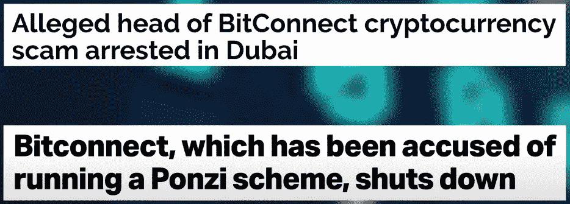
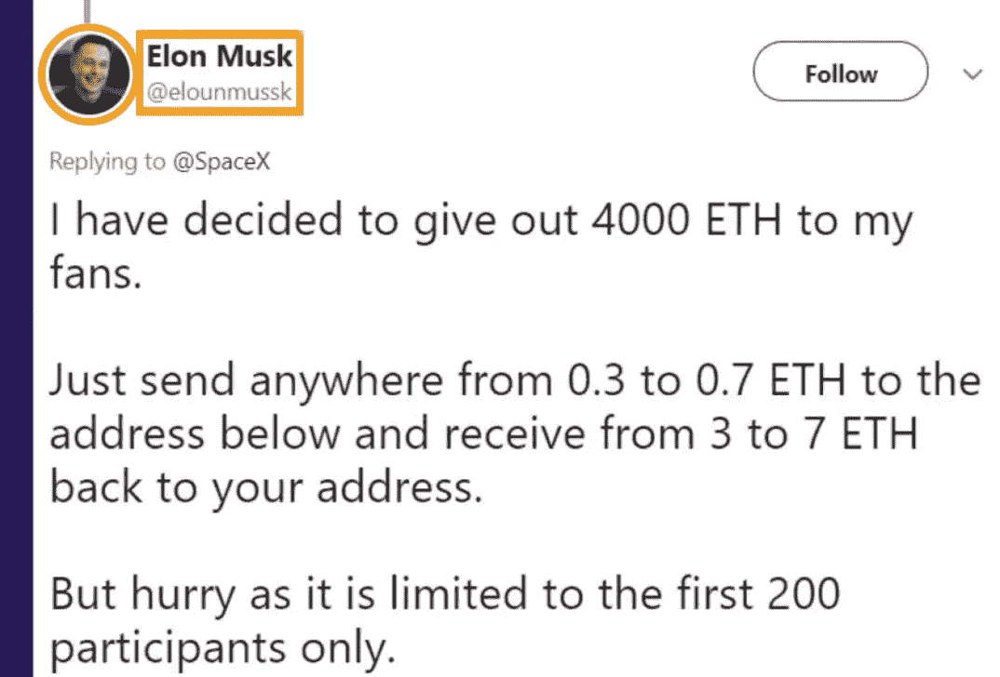
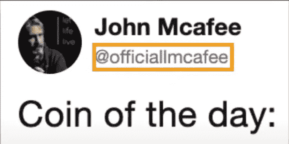

# 加密货币骗局是如何运作的

> 原文：<https://medium.com/nerd-for-tech/how-cryptocurrency-scams-work-de757db81d65?source=collection_archive---------4----------------------->

杰里米·贝赞格在 [Unsplash](https://unsplash.com?utm_source=medium&utm_medium=referral) 上的照片

什么是加密货币？这是一个吸引了许多兴奋和许多骗子的行业。加密货币是一种新兴技术，它希望取代传统货币。它的主要吸引力在于它是分散的，这意味着没有像银行或政府这样的权威机构来监管虚拟货币。这个想法是你完全控制自己的钱。例如，世界上任何地方的两个人都可以直接给对方汇钱，而不需要银行介入。为加密货币提供动力的技术被称为区块链。基本上，这是一个超级安全的在线数据库，很难篡改。

区块链数据库不是易受黑客攻击的中央数据库，而是广泛分布在网络的消费者安全计算机部分。而且，由于所有这些数据库副本都在流通，要操作或删除它们非常困难。加密货币公司的估值可能高得离谱，这就是为什么围绕它有如此多的嗡嗡声。

但这也让它成为骗子的沃土。要购买加密货币，你必须使用真实的货币，尽管你不必与银行打交道，但你必须与第三方交易所打交道。有很多这样的例子，这些交易所在一夜之间关闭，在这个过程中损失了人们的钱。

以下是加密骗局如何开始，以及如何避免它们。

# Bitconnect 的案例

Buzzfeed 新闻

Buzzfeed 新闻

Bitconnect 曾经是一个非常受欢迎的交易所，抹去了 T4 大约 25 亿美元的价值。在被指控操纵庞氏骗局后，该公司停止了运营。Bitconnect 将其关闭归因于负面报道和对平台的攻击。

# Twitter 赠品骗局

Buzzfeed 新闻

在 Twitter 上，你还会发现加密赠品骗局，比如骗子冒充一个知名人物，然后设置一个假赠品。他们会模仿像埃隆·马斯克这样的人，经常模仿手柄、头像和推特

原始账户。然后他们会使用这个假账户来欺骗人们，让他们认为埃隆·马斯克正在网上分发加密货币。你要做的就是先把你自己的钱寄给他。这看起来完全合法。

你不一定要成为名人亿万富翁才会成为目标。这种事发生在我身上不是一次，而是两次，我没有钱。让我说清楚。我没有，也从来没有赠送过加密货币。但有些骗局甚至更为精细。

# Twitter 账户假冒骗局

Buzzfeed 新闻

骗子将创建虚假的 Twitter 账户来开展协调的虚假信息活动，这一切只是为了操纵加密货币的价格。McAfee 防病毒软件背后的人 John McAfee 一直在 Twitter 上推广不同的加密货币。但是，你注意到这个有什么不对吗？

@officiallmcafee 里有两个 L，不是一个。因此，当这个假账户推广一种特定的加密货币时，人们会相信它，并带来硬币。但在 Telegram 上，人们被告知推广奖金推文，并被告知购买和出售硬币的具体时间。

Buzzfeed 新闻

这是一个真正清晰的泵和转储方案。Trackback 提示:模仿骗局并不是加密行业独有的，但它们特别有效，因为加密货币仍在出现，因此充满了不确定性。为了避免受骗，请记得检查您正在访问的网站的 URL，或者您从中获取信息的用户名。