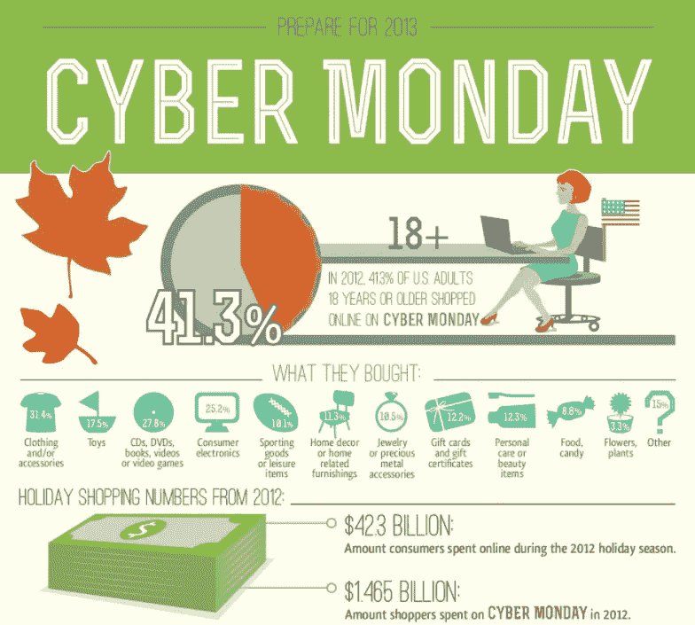
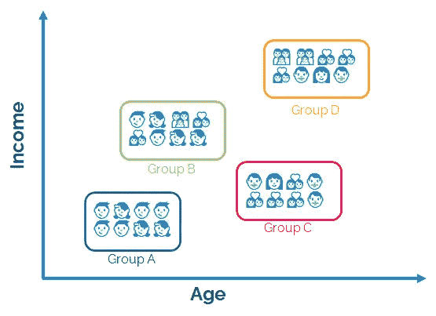
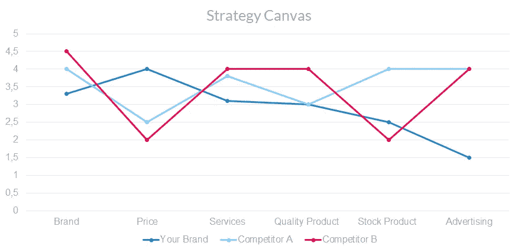

# 数据分析如何影响您的业务

> 原文：<https://medium.com/nerd-for-tech/how-data-analytics-impact-your-business-a07a5d62827?source=collection_archive---------14----------------------->

资料来源:dribbble.com 账户 Shahriar Chwodury

大家好！很久没有写，我只是想分享我的经验，数据驱动可以使你的业务增长，肯定是高质量的数据。我认为我们对*数据驱动、用数据说话、社交媒体分析*或任何与数据分析交叉的东西都很熟悉。任何关于如何获得你的商业收入的事情，都应该对你的数据进行更深入的分析。数据分析将帮助您识别数据的模糊性、您公司的绩效、验证您公司缺少的任何东西，让我们尝试通过数据来解决这些问题！因此，这是一种分析你的外部或内部数据，并与其他企业或竞争对手进行比较的方法。

> “没有大数据分析，公司就像瞎子和聋子一样，在网络上游荡，就像高速公路上的小鹿一样。”——作者杰弗里·摩尔，美国管理顾问兼作家

# 社交媒体分析

第一部分，我想分享如何从 twitter，instagram，谷歌上的趋势获取外部数据，并举例说明在此分析中应该汇编哪些数据。我们来看看怎么做！

## 抓取 Twitter 和 Instagram

在这一部分，你可以利用你拥有的社交媒体平台(可能是 twitter 或 instagram)来了解你的商业品牌有多大，或者你的公司和产品在消费者中的知名度有多高。通过这种方式获取数据。

用 Twint 抓取 Twitter 数据

> **Twint** 是一个用 Python 编写的高级 Twitter 抓取工具，允许从 Twitter 个人资料中抓取推文，而无需使用 Twitter 的 API——Twint 文档

用 Instascrape 抓取 Instagram 数据

> ***Instascrape*** 是一个轻量级的 Python 包，为抓取 Instagram 数据提供了一个富有表现力和灵活性的 API。— Instascrape 文档

有了 *twint* 和 *instascrape* 你不需要 API 键来抓取你想要的所有数据。你得到的 json 文件都是关于你的品牌或公司的，有用户在 twitter 上的**提及**、**点赞**或**转发**以及更多数据。您获得的 Instagram 数据，如**用户**、**帖子喜欢**、**搜索 hastag、**等。关于这两个包中您需要的所有数据，您可以在它们的文档包中进行更深入的探索。我将附上文件包的来源。

资料来源:cygnismedia.com

在你得到数据后，这是我对数据的一些见解。

*   分析**用户档案**(如果他们的档案上有任何描述)。所以，你可以根据客户资料对需要你产品的人进行分组。
*   分析你的公司品牌或产品与竞争对手相比有多大。总**关注者**，平均**点赞帖子**，平均或总**提及**，总**转发**，在**谷歌趋势**中趋势你的产品。您可以在 [google trends 平台](http://trends.google.co.id)中按客户搜索并分析您的产品搜索趋势。
*   分析评论和推文，了解**用户需要**，他们对我们的**产品或服务的评价**这是**好的**还是**不好的**，也许你可以了解客户**是否喜欢你的产品**。如果你对此感兴趣，你可以用情感分析来探索，我已经在链接中写了[。](/analytics-vidhya/amazon-cell-phone-reviews-with-vader-analysis-444bc95d3daa)

# 内部数据分析

第二部分是关于您公司或企业的内部数据。您可能需要开始进行分析所需的数据。这是需要更深入分析的示例数据。

*   事务数据

交易数据可以帮助你计算零售利润(例如)，你一周或一个月有多少交易，最喜欢的产品是什么。您可以在信息图表中创建有关交易数据的报告。

来源:[https://id.pinterest.com/infographmania/_created/](https://id.pinterest.com/infographmania/_created/)

*   客户数据

剖析顾客非常重要。通过对你的客户进行剖析，公司或企业可以根据已经完成的细分来锁定消费者。如果您需要深入了解客户细分，您可以访问此链接中的[。](/analytics-vidhya/customer-segmentation-with-rfm-analysis-kmeans-clustering-32c387d04dfe)

作者图片

这是两个例子，您可以从内部数据中进行更深入的分析，以从您的数据中获得更多洞察力。你也可以做一个机器学习(如果需要的话)来给你的商业感觉和预测分析。交易数据可以从每笔交易、推荐产品、几个月的预测销售、情感分析(如果您对产品的每笔交易都有评论)等等中创建关联规则。可以通过创建细分客户、细分产品、针对某些客户以及创建营销策略来分析客户数据，从而获得您的产品和业务。

# 结论

如何编制外部和内部数据？这两者能做些什么呢？我的答案是战略画布。您可以创建战略画布来分析我们的竞争对手。有了外部和内部数据后，尝试定义我们要比较的因素。这是一个基于内部和外部数据分析竞争对手产品策略的例子。

> 战略画布提供了一种简单的方式，可以直观地展示你的竞争对手如何吸引顾客，和/或你的顾客如何选择他们在你的类别中购买的产品或服务。这允许你通过选择不同的竞争因素组合来使自己与众不同。—strategiccoffee.chriscfox.com

比较的因素是品牌、价格、服务、优质产品、库存产品和广告。之后，试着给每个因素打分，记住你可以根据你的数据来假设分数。举个品牌因素的例子，你的竞争对手在 instagram 上有 50000 名粉丝，平均每个帖子有 5000 个赞，6 小时内有 1500 人访问 instagram。您可以通过创建加权矩阵分数并尝试计算它，将其与外部数据进行比较。

作者的示例策略画布

当然，这一步中有很多假设来衡量矩阵得分，但我们可以通过矩阵得分来了解贵公司与竞争对手相比遗漏了哪些因素。你的品牌赢在价格因素上，其余的都是你应该去修正的因素。与相关部门一起集思广益会给出一个最佳策略来处理你比竞争对手失去的所有因素。您可以利用已经完成的数据分析，为业务增长和产品开发做出更好的决策。为 visualize 创建出色的报告，每次您向其他部门展示您的见解时。因此，你、你的团队和'**数据'**有一个击败竞争对手的大计划。

这就是我的全部，我希望你能从这次讨论中得到启示。我所做的每一项分析仍然有许多错误和缺点。这个分析一点也不完美，而且我也不擅长营销。仍然有很多营销工具可以与我们现有的数据相结合。也许这次讨论会成为你的参考之一。

关于这个讨论的更多细节，代码，和更多的可视化你可以通过点击这个链接到达我的 github【https://github.com/Anugrahn。随便问，让我们开始讨论家伙！

谢谢，我希望你们喜欢它。下一个故事再见。祝您愉快！:)

来源:

1.  【https://pypi.org/project/insta-scrape/ 
2.  [https://github.com/twintproject/twint](https://github.com/twintproject/twint)
3.  [https://strategic coffee . chriscfox . com/2012/10/how-to-use-strategy-canvas . html](https://strategiccoffee.chriscfox.com/2012/10/how-to-use-strategy-canvas.html)