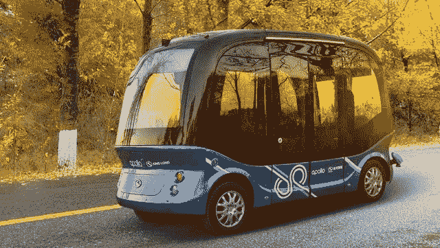

# 3D 点云标注对推动自动驾驶产业不可或缺

> 原文：<https://medium.com/nerd-for-tech/how-data-annotation-services-fuel-self-driving-industry-2021-part1-f537346b82ba?source=collection_archive---------32----------------------->

## 数据注释服务如何推动自动驾驶行业 2021？—第一部分

来源:百度阿波罗

## **百度 Apollo 无人驾驶汽车加入抗疫大战，助力广州市民物资配送和出行**

2021 年 6 月 4 日，广州荔湾区被堵小区附近，百度 Apollo 的自动驾驶汽车聚集在一起，开始物资发放工作。当晚，阿波罗团队集结在社区，在 7 个小时内完成了 1500 多名师生、医护人员的接送服务，成功协助新冠肺炎检测。

据我们所知，战胜新冠肺炎的关键是抓住每一分钟。6 月 3 日晚，广州市政府紧急号召广州科技企业参与抗争。4 日凌晨，以百度 Apollo 为代表的当地自动驾驶企业立即做出反应，连夜制定出全面的受阻区域物资配送方案。

目前，百度 Apollo 已向抗疫一线部署 500 kg 物流配送无人车、熟食配送无人车、1 吨无人驾驶小巴、2 吨无人驾驶中巴、共享无人车等五类车辆，全力支持隔离区物资配送。

根据 6 月 3 日发布的消息，封闭区内的人数已增至约 18 万人，物资发放工作量十分巨大。无人车物资运输将有效减轻当地一线工作人员的劳动强度。

为满足防疫需要，无人驾驶公交车，承担医护人员和市民的临时运送，可以很好地降低运力压力和驾乘人员的疫情接触风险。

事实上，在一线抗疫战斗中，无人车天然具有“零接触、多功能、全天候”的优势，可以充分减少相互接触，完成物资配送。同时，**无人车在物流运输、送餐、移动零售、移动服务**等不同场景下有多种服务模式。

## 无人驾驶技术的实现

在无人驾驶技术中，环境感知系统充当无人驾驶车辆的“眼睛”。它主要通过装载在车辆上的外部传感器获取外界环境信息，并准确、快速地将地理信息和障碍物信息传输给计算机控制系统。该系统可以在没有任何人工干预的情况下安全运行。

无人驾驶餐车至少应该包括传感器、配电柜、搭载 AI 技术的驾驶系统。为了让无人车“看得见”，至关重要的传感器系统需要配备摄像头、鱼眼镜头、雷达、超声波系统、激光雷达等。目前，车辆周围环境的三维建模主要是通过激光雷达进行的。

## 自驾车行业中的数据标注服务

驾驶过程中任何微小的错误都可能导致可怕的后果。如今，随着几起自动驾驶汽车事故的发生，人们越来越关注驾驶安全问题。

此前有媒体报道称，一名用户在乘坐智能驾驶车辆时发生车祸。调查后发现，智能驾驶系统未能区分白色车辆和云的区别，没有识别障碍物。车辆未能及时刹车，进而引发悲剧后果。

在这种情况下，缺乏准确的数据来区分白色车辆和云是导致悲剧的直接因素。

因此，针对不同场景、不同需求提供高质量训练数据的措施逐渐成为人工智能解决方案的共识。

## 常见的数据标注类型包括:

*   2D 包围盒
*   [车道标线](https://tinyurl.com/u7u4me)
*   [语义分割](https://tinyurl.com/48w576p7)
*   [视频跟踪标注](http://tinyurl.com/wmu4yfhh)
*   点标注
*   三维物体识别
*   3D 分割
*   传感器融合:传感器融合长方体/传感器融合分割/传感器融合长方体跟踪

**更多信息:** [**什么是激光雷达，什么是 3D 点云？**](https://tinyurl.com/w3kav68k)

# 结束

将你的数据标注任务外包给[字节桥](https://tinyurl.com/s49s8pex)，你可以更便宜更快的获得高质量的 ML 训练数据集！

*   无需信用卡的免费试用:您可以快速获得样品结果，检查输出，并直接向我们的项目经理反馈。
*   100%人工验证
*   透明和标准定价:[有明确的定价](https://www.bytebridge.io/#/?module=price)(含人工成本)

为什么不试一试呢？

来源:https://mobile . zol . com . cn/769/7699448 . html

**相关文章:**

[1 2021 年自主汽车高质量训练数据](/nerd-for-tech/high-quality-training-data-for-autonomous-cars-22d542d62cbf)

[2 什么是语义分割、实例分割、全景分割？](/nerd-for-tech/what-is-semantic-segmentation-instance-segmentation-panoramic-segmentation-3bbb03856c12)

[3 自动驾驶汽车行业常用的八种数据标注和标签工具](https://tinyurl.com/u7u4me)

[4 自动驾驶，算法和算力哪个更重要](https://tinyurl.com/854mhz39)

[5 当 Cruise 实现全无人驾驶汽车载客时，它的商业测试还会远吗？](https://tinyurl.com/yk4vmcwh)