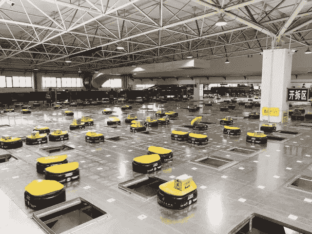

# 2021 年数据标签和标注服务如何赋能快递？

> 原文：<https://medium.com/nerd-for-tech/how-data-labeling-and-annotation-services-empower-express-delivery-in-2021-3c0c03f2476b?source=collection_archive---------11----------------------->

在中国，2021 年 6 月 18 日购物节期间，快递行业已收到超过 65.9 亿个包裹，最高日处理量超过 4 亿个。

很多消费者惊喜地发现，以往订单激增导致的“爆仓”的糟糕体验基本没有了，通常情况下，他们发现自己处于“昨晚刚下单，今天早上就到了”的情况！

快递的工作量可以称之为“海量”。怎样才能快速发货？

这背后，智能物流是关键。

# 多个周期的人工智能实施

智能物流不仅提高了效率，还降低了成本，增强了安全性。所谓智能物流是指运用一系列智能技术。物流系统能够模仿人类的智能，具有思维、感知、学习和推理判断的能力，能够自行解决物流中的一些问题。

简而言之，智能物流就是利用智能设备和系统，取代物流周期**的所有环节。**

近年来，随着人工智能、大数据、云计算、物联网等技术的发展，物流行业正在逐步实现许多流程的智能化。

在分拣的过程中，以前都是依靠拣货员每次拣货时扫描二维码，然后将包裹放到代表相应配送位置的区域，不仅效率低，而且容易出错。如今的多型技术装备加上 AI，大大提高了效率问题，解决了困扰行业多年的“仓爆”问题。

智能分拣系统的高速图像识别技术可以每秒识别数百个条形码，然后结合传感、处理、控制等一系列先进的智能技术，将包裹货物运送到指定区域。先进的智能物流运输分拣系统平均每小时可以完成 10 万个包裹，单个系统节省 70%以上的人力。

物流行业的智能化发展不仅可以改善消费者的网购体验，还可以为生产提供各种便利。

**例如，在一个智能仓库里，在四个人的帮助下，可以挑选 12000 个箱子。传统方式需要 20 个人。**

“本来运营每天的发货能力只有 3000–4000 箱，一旦超过就会延期到第二天，一个月错误率 20–30 次”，智能物流的经理说；智能物流系统应用后，我们一天最多能达到 6 万箱，一年出错率只有 1–2 次。"

在民航机场，智能行李分拣机可以独立完成从行李托运、运输、分拣到行李提取的无人化流程，大幅提升机场效率。

裕丰科技联合创始人、董事长兼首席执行官吴表示:“过去几年，劳动力成本上涨了两到三倍。还有一点就是安全。除了交通事故，还有人身安全等很多方面，这些问题都可以通过我们自主研发的自动驾驶技术来解决。

# 快递行业 AI 转型

从人工智能技术的研究方向来看，无论是在传统的机器学习领域还是深度学习领域，基于训练数据的监督学习仍然是一种主要的模型训练方法。尤其是在深度学习领域，需要更多的标记数据来提高模型的有效性。

我们需要明确的是，对于 AI 公司和整个行业来说，**数据标注是实现人工智能的重要一环。**标注数据的准确性和效率影响人工智能算法模型的最终结果。

特别是智能转型的传统企业和科技企业，更需要拥有丰富项目经验的 **AI 训练数据服务商**的协助，帮助他们梳理 AI 训练数据指令，获取更适合的数据。在特殊场景下使用高质量的数据，减少研发周期，加速实施过程，帮助企业更快更好地进行智能化转型。

## 快递中常见的标签类型

*   2D 包围盒
*   [3D 边界框](https://tinyurl.com/u7u4me)
*   [语义分割](https://tinyurl.com/48w576p7)

**更多信息:** [**八种常用数据标注工具**](https://tinyurl.com/u7u4me)

## 快递中常见的标签类型

*   **物体识别**
*   **视频中的物体跟踪**
*   **工业机器人导航**
*   **机械臂引导裂纹检测**

① **机器人分拣和材料处理，如包裹递送、仓库库存处理**

② **QA 检查、维护**

# 结束

将您的数据标注任务外包给[字节桥](https://tinyurl.com/4pwcnuv6)，您可以更便宜、更快速地获得高质量的 ML 训练数据集！

*   无需信用卡的免费试用:您可以快速获得样品结果，检查输出，并直接向我们的项目经理反馈。
*   100%人工验证
*   透明和标准定价:[有明确的定价](https://www.bytebridge.io/#/?module=price)(包含人工成本)

为什么不试一试呢？

资料来源:https://baijiahao.baidu.com/sid=1705056851399216922&wfr