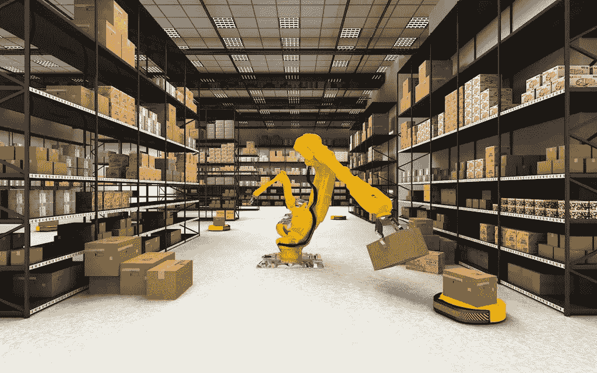

# 数据标签服务如何赋能物流机器人？

> 原文：<https://medium.com/nerd-for-tech/how-data-labeling-service-empowers-logistics-robot-13fce296a026?source=collection_archive---------10----------------------->

## **物流机器人普及，行业数字化、智能化转型进程加快**

https://m.50yc.com/information/hangye-wuliu/17832

# 整个物流产业链的智能化

随着大数据、5G、云计算等新兴技术的蓬勃发展，物流行业正在进入智能化阶段，从单个设备的智能化走向整个物流产业链的智能化。

移动物流机器人作为智能物流中极其重要的基础设施，应用越来越广泛，持续吸引着各行各业的资本和巨头。

最近，字节跳动、联想等公司投资了无人物流机器人开发商 Syrius Torch，这引起了物流行业的广泛关注。在业内人士看来，随着资本的不断加持，以及越来越多的电商、物流、科技公司的参与，**移动物流机器人市场将进入发展快车道，推动整个物流行业向数字化智能转型。**

## **上市公司加快布局物流机器人赛道**

物流机器人主要用于仓储、分拣中心和运输场景，执行货物转移和处理等操作。早在 2012 年，AGV 产品就被引入亚马逊的仓库网络，随后掀起了一股仓储物流自动化的浪潮，国内也诞生了一批自动化设备和解决方案的制造商。

近年来，在电子商务、新零售等新兴商业模式创新发展需求的驱动下，以及在人力成本高、招工难(由于人口红利逐渐下降)等因素的影响下，物流行业全线智能化、数字化转型已成为必然趋势。

同时推动了上下游产业的智能化升级，各种物流机器人产品开始普及应用。例如，在仓储物流领域，AGV(自动导向车)、码垛机器人、分拣机器人、AMR(自主移动机器人)逐渐取代人工，承担物流、运输、配送等任务。它在降低成本和提高效率方面具有显著的优势，并在行业中得到普遍认可。

在去年的双 11 购物狂欢节和今年的“6·18”电商促销期间**(两次促销都类似于黑色星期五)**，“分钟级”包裹派送越来越受欢迎。这背后，离不开智慧物流的持续赋能。

在 AI 技术的加持下，“智能”分拣机器人可以在各个快递分拨中心自由穿梭，可以精准地将包裹配送到不同的“路口”。它的**效率是人工分拣**的 2 到 3 倍。这些机器人大大提高了货物的分拣效率和运送速度，减轻了操作人员的工作压力。

# 工业机器人领域的背后，是数据注释行业

目前，各行业对最优质的 AI 训练数据需求迫切。人工智能应用于各个领域，如教育、法律、智能驾驶、银行和金融等。每个领域都有细分和专业化的要求。

其中，尤其是智能转型的传统企业和科技企业，更需要有丰富项目经验的培训数据服务商的协助，帮助整理数据标注指令，获取更适合的数据。在特殊场景下使用高质量的数据，减少研发周期，加速实施过程，帮助企业更快更好地进行智能化转型。

我们需要明确的是，对于 AI 公司和整个行业来说，数据标注是实现人工智能的重要一环。标注数据的准确性和效率影响着人工智能算法模型的最终结果。

## 工业机器人领域有四种常见的数据标注工具:

*   2D 包围盒
*   3D 边界框
*   [多边形](https://tinyurl.com/u7u4me)
*   [分割](https://tinyurl.com/zt33b3ve)

## 机器人中常见的标签场景

*   物体识别
*   视频中的目标跟踪
*   工业机器人导航
*   机器人手臂导航
*   裂纹检验

①机器人分拣和材料处理，如包裹递送、仓库库存处理

②质量保证检查、维护

# 结束

将你的数据标注任务外包给 [ByteBridge](https://tinyurl.com/2tsrkfkm) ，你可以更便宜更快的获得高质量的 ML 训练数据集！

*   无需信用卡的免费试用:您可以快速获得样品结果，检查输出，并直接向我们的项目经理反馈。
*   100%人工验证
*   透明和标准定价:[有明确的定价](https://www.bytebridge.io/#/?module=price)(包括人工成本)

**为什么不试一试？**

来源:https://baijiahao.baidu.com/s？id=1708704269023167383&wfr