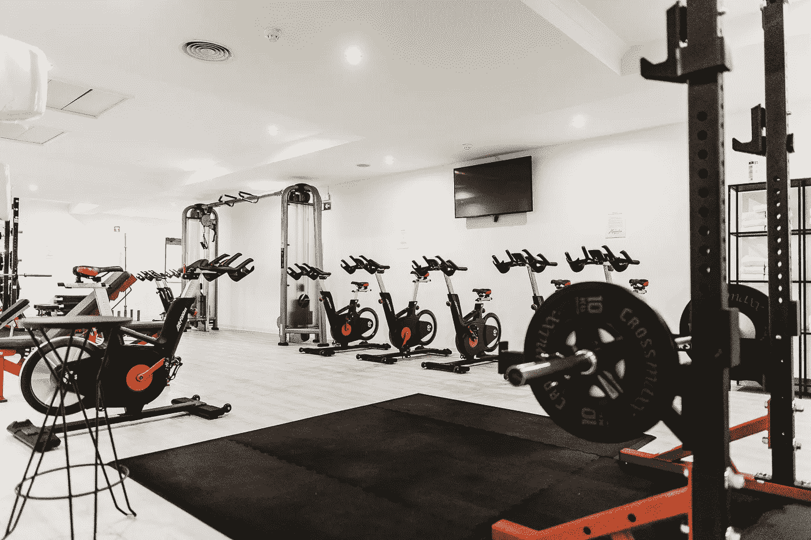

# 2021 年数据标签服务如何助推智能健身？

> 原文：<https://medium.com/nerd-for-tech/how-data-labeling-service-fuels-intelligent-fitness-in-2021-749e0f3d4da9?source=collection_archive---------15----------------------->

# 智能健身上市公司

最近，第二家智能健身上市公司诞生了。由詹姆斯、阿诺德·施瓦辛格、辛迪·克劳馥等巨星赞助的 Beachbody 不久前成功 IPO。

除了 Peloton 和 Beachbody，以及被 Lululemon 收购的 Mirror，还有很多聪明的健身人才，比如 Tonal，Tempo，Hydro，Grit EPIQ，Fightcamp，VAHA 等等，吸引了莎拉波娃，詹姆斯，库里，泰森等众多体育明星成为合作伙伴。

# 智能健身已经成为全球新的产业出路

全球进入疫情常态化时代以来，居家健身的发展加速了其路径。据网上相关市场调研显示，未来五年，全球智能健身市场规模将达到 428 亿美元。考虑到这个市场只有两三家上市公司，新势力还是有很多机会的。这也是为什么 top capital 愿意为 Tonal、Tempo、FITURE 投入大量资金的原因。

与此同时，美国科技巨头也开始瞄准这个规模可观的新兴市场。FAAMNG 中，苹果、亚马逊、谷歌都在智能健身领域展开了布局。据悉，苹果目前正在调研硬件市场，并加大了健身领域员工的招聘规模，为 Apple One 生态提供了新的基础。

此外，经历了 Kindle、Fire phone、Echo、Halo 等众多硬件产品沉浮的亚马逊，在投资了 Tonal 之后，似乎对硬件产生了前所未有的兴趣。最近亚马逊启动了健身负责人的招募，看来离成为玩家不远了。

有健身专家指出，虽然智能健身带来了新的解决方案和潜在的盈利空间，但健身行业的本质是服务，其体验取决于内容。但优质内容的输出能力并不是短时间就能具备的。在这方面，FITURE 的联合创始人兼总裁张先生表达了类似的观点。他认为，智能健身赛道上的厂商竞争会**涉及硬件、软件、AI、内容、社区、服务、零售、品牌、等各个方面，任何一条捷径都会造成不好的体验**。显然，竞争是非常大的，即使是那些刚刚进入或者即将进入市场的科技巨头。FITURE 的“硬件+内容+服务+ AI”模式有一些差异化优势。

# 人工智能模式

FITURE 的技术团队花了一年半的时间自主研发了 FITURE Motion Engine 智能运动追踪系统。目前，该系统已经达到智能健身的 L4 级别，可以实现运动捕捉、实时纠错、数据分析等功能。反馈延迟 300–400 ms，同时，FITURE 不断以健身数据集丰富 AI 系统，并结合专属营养健康顾问为用户呈现定制化的智能健身服务。随着强 AI 技术的不断应用，FITURE 也在努力让自己的智能运动追踪系统接近 L5 级别。

不难看出，凭借其独创的模式，FITURE 在技术研发、自制内容等方面都具有一定的差异化优势，甚至可以在全球市场上与 Tempo 和 Tonal 相抗衡。

# 数据—新的核心竞争优势

随着 AI 商业化进程的加快，以及辅助驾驶、客服聊天机器人等 AI 技术在各行各业的应用，人们对特殊场景下的数据质量的期望越来越高。高质量的标签数据将是人工智能公司的核心竞争力之一。

如果说之前的算法模型使用的一般数据集是粗粮，那么算法模型目前需要的是定制的营养餐。如果公司想要进一步提高某个模型的商业化，他们必须逐步从通用数据集向前发展，以创建独特的数据集。

## 智能健身中常见的标签类型

*   目标检测
*   对锻炼者进行标记和跟踪
*   手势识别

**更多信息:** [**八种常用数据标注工具**](https://tinyurl.com/u7u4me)

# 结束

将你的数据标注任务外包给 [ByteBridge](https://tinyurl.com/59xsh57n) ，你可以更便宜更快的获得高质量的 ML 训练数据集！

*   无需信用卡的免费试用:您可以快速获得样品结果，检查输出，并直接向我们的项目经理反馈。
*   100%人工验证
*   透明和标准定价:[有明确的定价](https://www.bytebridge.io/#/?module=price)(包含人工成本)

为什么不试一试呢？