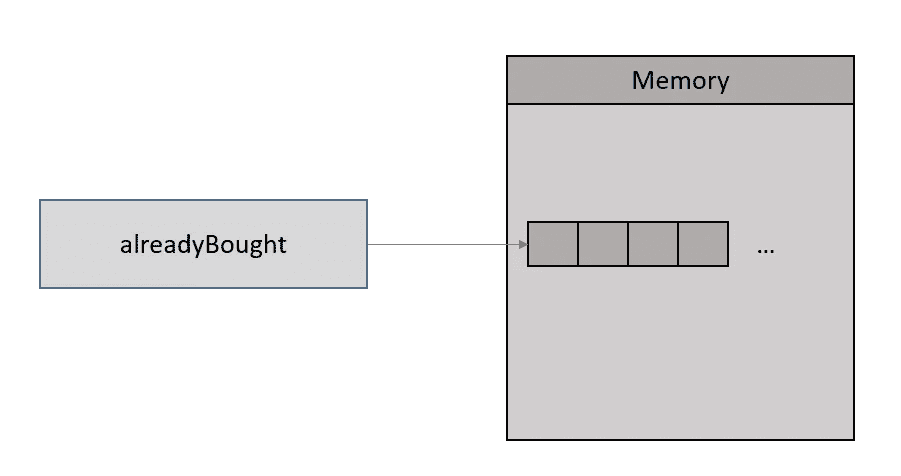
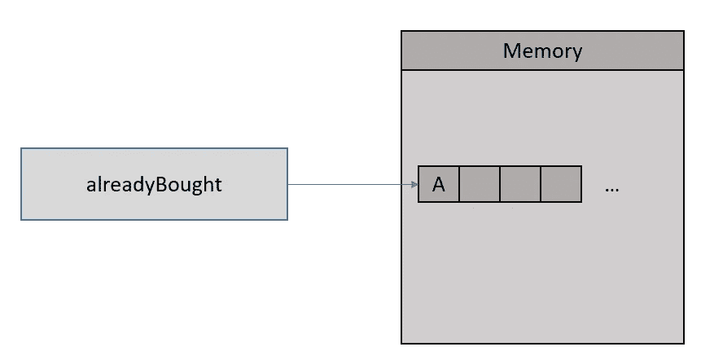

# 默认参数如何造成混乱 Python

> 原文：<https://medium.com/nerd-for-tech/how-default-parameters-could-cause-havoc-python-e6cb3d8fefb8?source=collection_archive---------18----------------------->

这篇文章是我根据自己的亲身经历写的。很多时候，由于 python 中默认参数的奇怪行为，我被困了几个小时。这就是我这篇文章要分享的内容。

## 什么是默认参数？

默认参数是具有默认值的参数，在调用函数时可以选择传递这些参数。如果在没有参数的情况下调用函数，参数将被赋予默认值。

```
def callPerson(name='guest'):
 print(f'hello {name}')
```

如果您调用该函数，

```
>> callPerson('saravana') #  hello saravana>> **callPerson() #  hello guest**
```

这是默认参数的工作方式，

*   你给它传递一个值，它全心全意地接受并使用它。
*   如果你没有传递任何值，它不会抱怨，它会使用它所拥有的值。


照片由[迈赫迪](https://unsplash.com/@messrro?utm_source=unsplash&utm_medium=referral&utm_content=creditCopyText)在 [Unsplash](https://unsplash.com/s/photos/bomb?utm_source=unsplash&utm_medium=referral&utm_content=creditCopyText) 拍摄

**那么默认参数有什么问题呢？**

默认参数本身没有任何问题。当它被赋予一个**可变对象时，比如**、**列表、字典、集合、**或任何**用户定义的类。**

> 使用可变对象作为默认参数值可能会导致混乱

如你所知，可变对象可以改变，变异。

```
myList = [1,2,3]  # list - mutable
myList[0] = 10    # Fine✌myTuple = (1,2,3) # tuple- immutable
**myTuple[0] = 10   # ERROR🚫**
```

现在让我们看看为什么不应该在默认参数中使用可变对象。

先说个例子。

```
>>> def buyStuff(item,**alreadyBought=[]**):
          alreadyBought.append(item)
          print('You bought ',alreadyBought)>>> buyStuff('apple',['mango','jackfruit'])
You bought  ['mango', 'jackfruit', 'apple']   #fine>>> buyStuff('apple')
You bought  ['apple']                         #this is also fine>**>> buyStuff('apple')
You bought  ['apple', 'apple']**           #Wait, free apple?
```

我们只想要一个苹果，但是有人给了我们两个苹果，而且也没有人出价🤔

去理解为什么会发生这种情况？我们必须首先了解默认参数是如何工作的。

> Python 的默认参数在函数被定义时被评估一次，而不是每次函数被调用时

*   第一次用`**alreadyBought=[]**` 定义函数时，`alreadyBought` 变量开始指向一个空列表。



指向空列表的已备份变量

*   当你向它添加数据时。它会变成，



将元素追加到列表后。

*   由于 ***已经购买的变量总是指向那个列表*** ，相同的列表每次都被重用，这就是为什么我们会得到那个奇怪的行为。

## 如何避免这种情况？

1.  尝试用相应的不可变对象替换可变对象。

```
list() -> **tuple()**
set()  -> **frozenset()** dict() -> [**frozendict(**](https://pypi.org/project/frozendict/)**)**
```

2.但是上述方法并不总是优选的。如果我们真的想要一个可变的呢？

我们能做的最安全的事情是在函数定义中将`**None**` 赋给默认参数，并在函数中为其赋可变值。

```
>> def buyStuff(item,alreadyBought=None):
      **if not alreadyBought:
           alreadyBought = []**
      alreadyBought.append(item)
      print(‘You bought ‘,alreadyBought)>>> buyStuff(‘apple’)
**You bought [‘apple’]** >>> buyStuff(‘apple’)
**You bought [‘apple’]**
```

现在，每次我们调用不带`alreadyBought` 参数的函数时，我们将在函数中显式地给它分配一个空列表。但可悲的是我们只收到了一个苹果🍎 ☹.

## 世界上的每一个人都是有福的！！

默认参数中的可变对象也不例外。在某些情况下，我们可以利用奇怪的行为(不再奇怪)。

> 有时，您可以专门“利用”(阅读:按预期使用)这种行为来维护函数调用之间的状态。这通常是在编写缓存函数时完成的。— [文档](https://docs.python-guide.org/writing/gotchas/)

```
# ith fibbonaci number using dynamic programmingdef fibbonaci(i,**memo={0:0,1:1}**):
 if memo.get(i)!=None:
       return memo[i]
 memo[i] = fibbonaci(i-1)+fibbonaci(i-2)
 return memo[i]
```

如你所见，我们不想在每个调用中都传递`memo`字典，它是在默认参数中为我们维护的。

我希望下次你知道，当你得到那个`*extra apple🍏*`时该做什么。感谢您的阅读。拍手声👏如果你学到了新东西。如果你想了解更多，请阅读这篇文章。