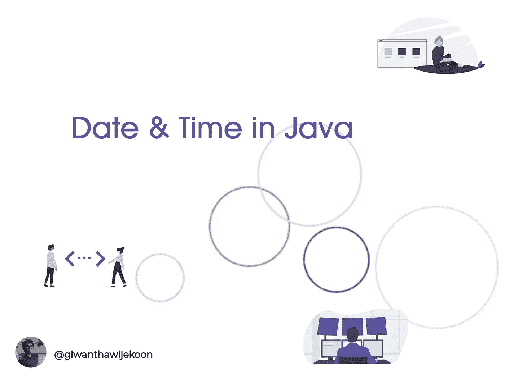
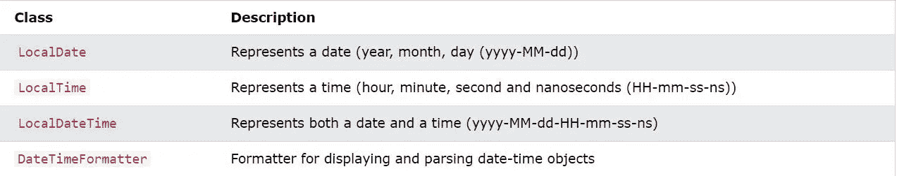

# 开发人员如何在 Java 中处理日期和时间

> 原文：<https://medium.com/nerd-for-tech/how-developers-deal-with-the-date-and-time-in-java-bcb3a66a2e09?source=collection_archive---------3----------------------->

日期和时间是开发软件时最重要的两件事。例如，在一个时间很关键的系统中，如果时间不准确，关键系统发生故障或被中断，损害通常是迅速和巨大的。诸如此类的问题之所以会发生，是因为全球各地的时区不同、夏令时和各种时间格式。

首先，我们需要知道什么是纪元时间。

## 什么是纪元时间？

纪元时间或 Unix 时间是自 1970 年 1 月 1 日 00:00:00 UTC 以来经过的秒数。

## 什么是时区？

时区是保持相同标准时间的区域。

## 什么是夏令时？

夏令时是一种做法，即在夏季将时钟时间从标准时间向前拨 1 小时，然后调整回标准时间。

> *那么，这些东西对开发者有什么影响呢？*

如前所述，开发软件时，在时间关键的系统中；时间应该是准确的，因此，在开发软件时，开发人员应该考虑时区和夏令时。

最佳做法是采用 UTC(协调世界时)时间，稍后应用夏令时。

例如，开发人员可以获取用户的本地时间，并将其存储为 UTC。当检索数据时，开发人员可以获取存储的 UTC 时间，并将它们转换为本地时间并显示出来。

# Java 日期和时间

在 java 中，没有内置的日期类，因此我们可以使用 **java.time** 包来获取任何日期格式。

java.time 包的类。[https://www.w3schools.com/java/java_date.asp](https://www.w3schools.com/java/java_date.asp)

## 那么什么是 **java.util.date** ？

它用纪元时间来描述特定的时刻。这个类有很多问题，现在不推荐使用，不再推荐使用。

# java.sql.Date vs java.util.Date

如前所述，java.util.Date 是时间上的一个特殊时刻，从纪元时间算起的精度为毫秒。根据 java 文档，java.sql.Date 是“一个毫秒值的薄薄的包装，允许 JDBC 将其识别为 SQL `DATE`值。毫秒值表示自 1970 年 1 月 1 日 00:00:00.000 GMT 以来经过的毫秒数。这意味着 java.sql.Date 扩展了 java.util.Date 类。

java.sql.time 的主要目的是保存不带时间数据的日期。

## 作为结论

*   日期和时间应该以 UTC 时区存储
*   避免使用 java.uti.Date 类
*   当显示给用户时，将 UTC 时间转换为本地时间。