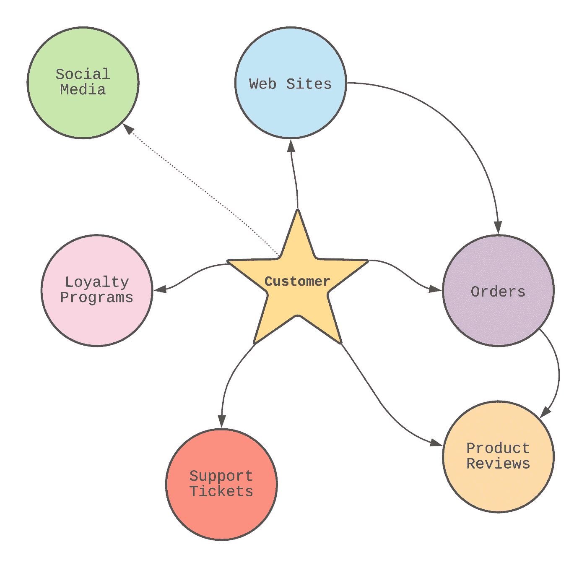
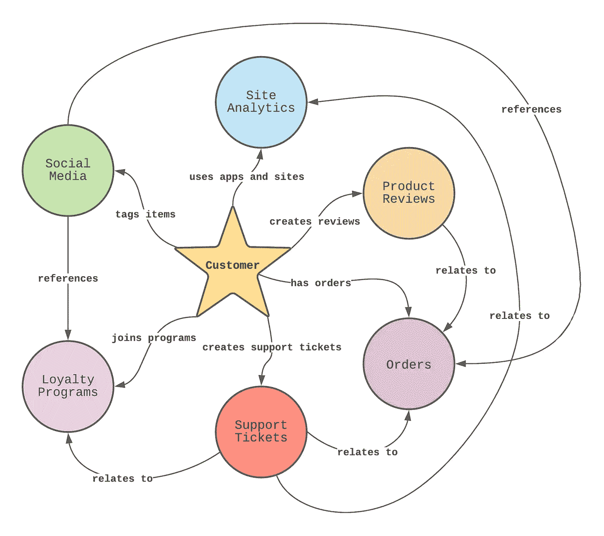
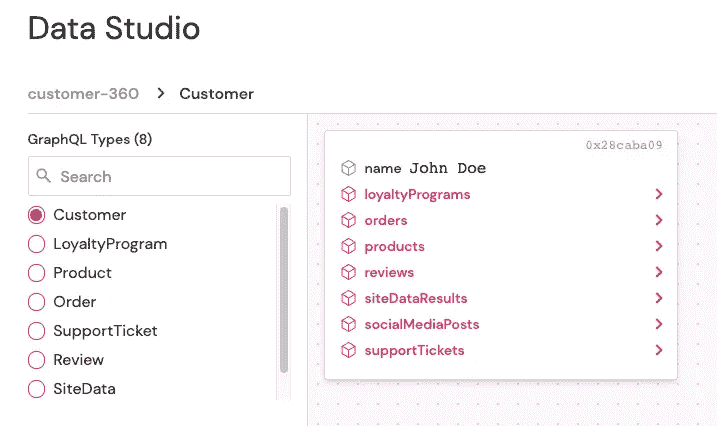
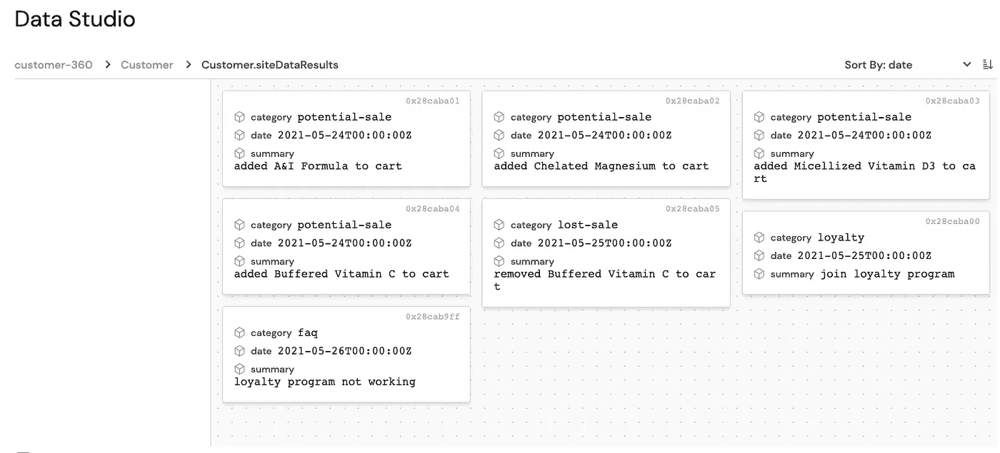

# Dgraph Cloud 如何帮助您的客户实现 360 度目标

> 原文：<https://medium.com/nerd-for-tech/how-dgraph-cloud-can-assist-your-customer-360-goals-b454f9b31307?source=collection_archive---------7----------------------->


达到一个项目或计划成功的程度是令人兴奋的。然而，目标并不是真的成功。相反，目标只是“想要成功”

让我们用一个例子来说明问题。

考虑一个场景，你发现自己在达到一个重要的里程碑后非常兴奋，以至于你实际上停止了正在做的事情，与你的配偶、朋友或爱人分享你最近的消息。

你是否因为一个唾手可得的机会而兴奋不已，想要伸出援手？最有可能的是，不。相反，你对成功的兴奋是努力工作得到回报的结果。

实际上，这项工作是从潜在的成功愿望开始的。这种特质在你的灵魂中更加根深蒂固，并被从事你喜欢的事情的激情所推动。有了坚实的基础，一段自然的培养和重构期让你成功地创造了一些有价值的东西。

不管“它”是什么，被贴上“成功”的标签，一些随后的客户会相信你的热情，并建立必要的联系，从而使合作关系“成功”我发现用帕特·苏米特描述“胜利”的方式来思考“成功”是很有用的。下面是对 Summitt 的话的转述，我用胜利代替了成功:

> “成功是有趣的……是的。但成功不是重点。想要成功才是重点。不放弃才是重点。不放松才是重点。永远不要对自己所做的事情完全满意，这才是重点。”——改编自 Pat Summitt 对“胜利”的定义

# 现在困难的部分开始了

虽然乘坐“内啡肽 high”并与他人庆祝的刺激是一种惊人的体验，但现实是最困难的挑战现在就在你的雷达上。你已经赢得了客户…现在最难的部分是留住客户。

你最终赢得了这个客户，因为他们有兴趣把事情引向一个新的方向。虽然你的产品或服务令人惊叹，但真正开始销售过程需要客户采取行动。

那么，是什么让他们放弃你的产品，转而选择新的产品呢？

听起来熟悉吗？

# 什么是客户 360？

与客户保持成功关系的最佳方式是充分了解客户。这种“客户的完整视图”通常被称为客户 360。

需要注意的是，客户 360——客户的完整视图——是从您的角度出发的。此视图不仅仅是了解谁是您的客户，还包括以下信息:

*   使用站点跟踪工具与您的网站或应用服务进行交互
*   了解客户代表记录的支持票证
*   社交媒体数据的监控

有了稳固的客户 360 度，你自然会发现自己处于满足客户需求的最佳位置。这最大限度地减少了潜在损失，并缩小了您与客户需求之间的理解差距。

# 数据图表云如何提供价值

在以前的文章中，我提供了 Dgraph Cloud(以前的 Slash GraphQL)如何提供一流的服务平台来满足您的分析需求的示例:

*   [使用斜线 GraphQL 构建类似亚马逊的推荐引擎](https://dzone.com/articles/building-a-recommendations-engine-using-spring-boo)
*   [用棱角分明的斜线图追踪最差的科幻电影](https://dzone.com/articles/tracking-the-worst-sci-fi-movies-with-angular-and)
*   [使用斜线 GraphQL 创建 Twitter 图表](https://dzone.com/articles/creating-a-twitter-graph-using-slash-graphql)
*   [使用 Slash GraphQL 创建 insta Meme——一款 Meme 分享应用](https://dzone.com/articles/using-slash-graphql-to-create-instamemea-meme-shar)

基于我在撰写这些出版物时获得的知识，我相信 Dgraph Cloud 是构建客户 360 度视图的理想选择。以下是一些原因:

1.  图表数据库是客户 360°数据的理想选择，Dgraph Cloud 是 GitHub 上排名第一的图表数据库。
2.  Dgraph Cloud 提供快速启动和运行所需的一切；您只需提供模式和数据。
3.  Dgraph Cloud 的底层架构不仅允许在原型开发阶段持续迭代，还允许在需求变化时持续迭代。
4.  Dgraph Cloud 提供 lambda 解析(利用标准 JavaScript)来执行高级操作，帮助数据收集、转换和分析。
5.  Dgraph Cloud 旨在以最大限度减少(或完全消除)停机时间的方式适应您不断发展的业务需求。

# 为客户 360°使用 Dgraph 云

请看下图，它从较高的层面概述了 360 度客户视角的输入源:



在本例中，客户以下列方式互动:

*   利用您可以跟踪站点分析的应用程序和网站
*   从您维护的目录中订购产品
*   评论关于您或您的产品的产品
*   出现问题时创建支持票证
*   加入忠诚度计划以换取折扣甚至免费服务
*   在社交媒体上提及您或您的产品

如前所述，这些高级示例从您的角度展示了客户的全貌。

# 数据集成和转换

一个有效的假设是每个导入源都有不在图形数据库中的数据。事实上，这些系统中的大多数很可能利用了一个关系数据库，它适合于执行事务…并且执行得相当好。

关键是将这些数据源中的有效负载转化为能够为 Dgraph Cloud 和最终的客户 360 带来价值的方式。考虑到这一点，可以如下所示重构原始插图:



有了这个模型，可以起草一个简化的模式，如下所示:

```
type Customer  {
 id: ID! 
 name: String! 
      loyaltyPrograms: [LoyaltyProgram] 
      orders: [Order] 
 products: [Product] 
 supportTickets: [SupportTicket] 
 reviews: [Review] 
 siteDataResults: [SiteData] 
 socialMediaPosts: [SocialMedia] 
}type LoyaltyProgram  {
 id: ID! 
 joined: DateTime! 
 level: Int! 
}type Product  {
 id: ID! 
 name: String! 
 category: String! 
 price: Float! 
}type Order  {
 id: ID! 
 products: [Product!] 
 amount: Float! 
}type SupportTicket  {
 id: ID! 
 category: String! 
 status: String! 
 order: Order 
 product: Product 
 loyaltyProgram: LoyaltyProgram 
 summary: String! 
 created: DateTime! 
 lastUpdated: DateTime 
}type Review  {
 id: ID! 
 product: Product! 
 rating: Int! 
 summary: String 
}type SiteData  {
 id: ID! 
 category: String! 
 summary: String! 
 date: DateTime! 
}type SocialMedia  {
 id: ID! 
 source: String! 
 tags: [String] 
 summary: String! 
 posted: DateTime! 
}
```

# 运行中的图形云

在将一些样本数据插入到模式中时(通常通过 Dgraph Cloud 驱动的与外部系统的集成获得)，Dgraph Cloud 中的 Data Studio 视图呈现了客户的高级视图:



Data Studio 允许我轻松地浏览数据关系。例如，展开“站点数据结果”会显示以下数据:



这些结果可能来自在使用面向客户的网站和电子商务解决方案期间捕获的分析数据。

可以使用 Dgraph Cloud 创建以下示例查询:

```
query MyQuery {
  queryCustomer(filter: {id: "0x28caba09"}) {
    id
    loyaltyPrograms {
      joined
      level
    }
    orders {
      amount
      products {
        name
        category
        reviews {
          rating
          summary
        }
      }
    }
    siteDataResults {
      date
      category
      summary
    }
    supportTickets {
      category
      summary
      status
    }
    socialMediaPosts {
      posted
      source
      summary
      tags
    }
    name
  }
}
```

使用示例数据，结果可能如下所示:

```
{
  "data": {
    "queryCustomer": [
      {
        "id": "0x28caba09",
        "loyaltyPrograms": [
          {
            "joined": "2020-01-01T00:00:00Z",
            "level": 3
          }
        ],
        "orders": [
          {
            "amount": 20.25,
            "products": [
              {
                "name": "Chelated Magnesium",
                "category": "health",
                "reviews": []
              }
            ]
          },
          {
            "amount": 21.5,
            "products": [
              {
                "name": "A&I Formula",
                "category": "health",
                "reviews": []
              },
              {
                "name": "Micellized Vitamin D3",
                "category": "vitamins",
                "reviews": [
                  {
                    "rating": 5,
                    "summary": "Great product, excellent taste!"
                  }
                ]
              }
            ]
          }
        ],
        "siteDataResults": [
          {
            "date": "2021-05-26T00:00:00Z",
            "category": "faq",
            "summary": "loyalty program not working"
          },
          {
            "date": "2021-05-25T00:00:00Z",
            "category": "loyalty",
            "summary": "join loyalty program"
          },
          {
            "date": "2021-05-24T00:00:00Z",
            "category": "potential-sale",
            "summary": "added A&I Formula to cart"
          },
          {
            "date": "2021-05-24T00:00:00Z",
            "category": "potential-sale",
            "summary": "added Chelated Magnesium to cart"
          },
          {
            "date": "2021-05-24T00:00:00Z",
            "category": "potential-sale",
            "summary": "added Micellized Vitamin D3 to cart"
          },
          {
            "date": "2021-05-24T00:00:00Z",
            "category": "potential-sale",
            "summary": "added Buffered Vitamin C to cart"
          },
          {
            "date": "2021-05-25T00:00:00Z",
            "category": "lost-sale",
            "summary": "removed Buffered Vitamin C to cart"
          }
        ],
        "supportTickets": [
          {
            "category": "loyalty",
            "summary": "Not getting free shipping option",
            "status": "closed"
          }
        ],
        "socialMediaPosts": [
          {
            "posted": "2021-06-02T00:00:00Z",
            "source": "twitter",
            "summary": "Loving the way I feel taking Micellized Vitamin D3 everyday!",
            "tags": [
              "#companyNameGoesHere",
              "#vitaminD3",
              "#health"
            ]
          },
          {
            "posted": "2021-06-01T00:00:00Z",
            "source": "twitter",
            "summary": "Who has the best price on Buffered Vitamin C?",
            "tags": [
              "#vitaminC",
              "#health",
              "#buffered"
            ]
          }
        ],
        "name": "John Doe"
      }
    ]
  }
}
```

通过审查这些数据，可以得出以下发现:

*   虽然顾客关注健康的解决方案，但他们更喜欢味道好的产品。
*   客户对缓冲维生素 C 产品不满意。
*   能够加入忠诚度计划并立即使用免费送货选项可能会有更大的问题。

# 结论

从 2021 年开始，我开始关注以下我认为适用于任何 IT 专业人士的使命宣言:

> “将您的时间集中在提供扩展您知识产权价值的特性/功能上。将框架、产品和服务用于其他一切。”j·维斯特

这份使命陈述提供了如何最好地实现“成功”诠释的方向和指导，其灵感来自于 Pat Summitt 的“胜利”励志名言。本质上:不要因为试图重新发明一个已经存在的可靠的解决方案而失去你的焦点。

因为“成功”是与对成功的渴望联系在一起的，所以这个定义真的没有止境。事实上，一个成功的里程碑仅仅是开始下一个旅程的信号。

在这份出版物中，我们着重于维护客户关系，因为我们知道这是一系列持续的成功愿望。使用客户 360 度方法可提供多种数据源，帮助您从自己的角度全面了解客户。

Dgraph Cloud 是一款出色的 SaaS 解决方案，可以满足您的这些需求。作为一个奖励，这项服务非常符合我的个人使命，它为你的团队提供了一个成功的平台。

祝你今天过得愉快！