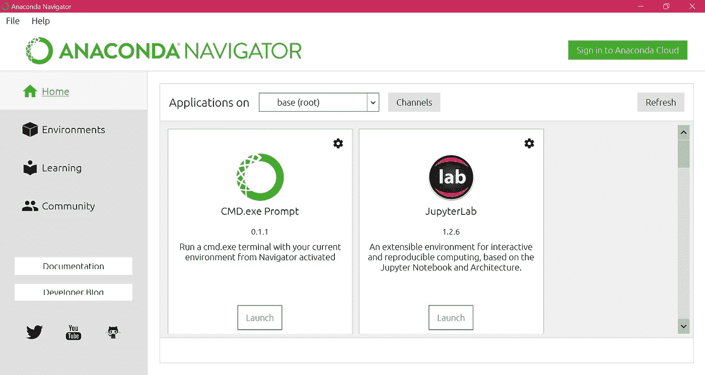
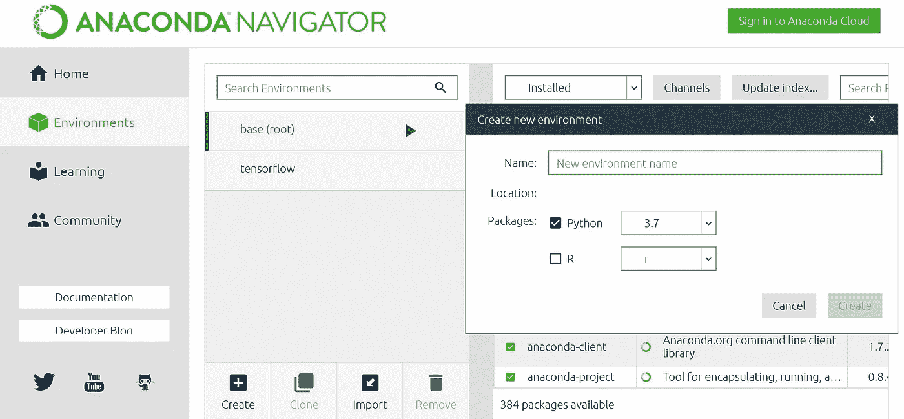
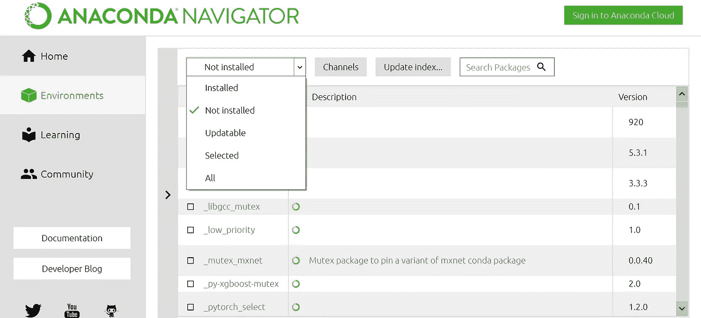
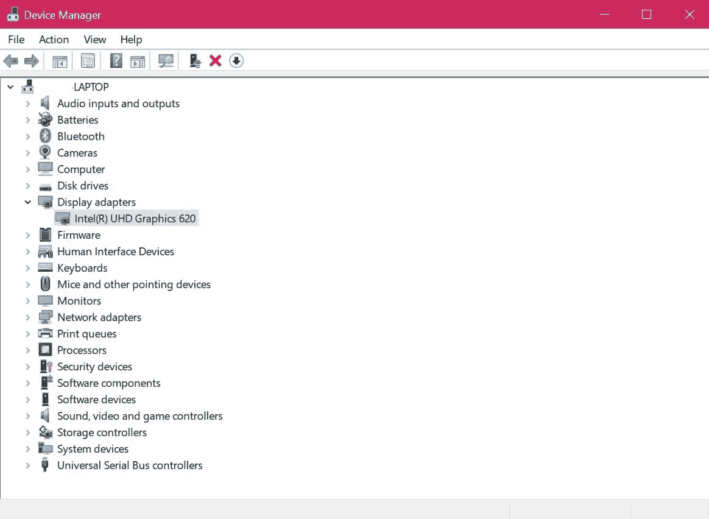

# 纠结了一个星期我是怎么安装 TensorFlow 的！

> 原文：<https://medium.com/nerd-for-tech/how-did-i-install-tensorflow-after-struggling-for-a-week-dd704a1a9067?source=collection_archive---------2----------------------->

Tensorflow-最流行的 ML 库之一

现在我知道了，在读完标题后，你们中的许多人可能会问我，我是认真的吗？我花了这么多时间在我的电脑上安装最流行的机器学习库之一——‘T2’tensor flow？对此，我的回答是一个完美的'*是的*'！顺便说一下，我是 windows 用户:)

我最近学到了一些新技能，我觉得现在是时候把我的知识应用到实践中去了。我记得那是一个周六的下午，我拿起我的电脑，肾上腺素飙升，准备用 TensorFlow 库做我的第一个项目。我计划了一个非常简单的项目——基于使用 TensorFlow 的分类。

所以在开始我的项目之前，我在我的电脑上安装了 **Anaconda** 和 **Jupyter Notebook** 。

> 对于那些不知道什么是 Anaconda 和 Jupyter 笔记本的人，让我来帮你:

Anaconda 是 Python 和 R 的开源发行版，有助于简化包管理。现在简单地说，当你在你的环境中为一个项目安装大量的包时，你必须有一个工具来管理你已经安装的或者将要安装的包，anaconda 来了。我按照这个文档[在我的电脑上安装了 Anaconda。](https://docs.anaconda.com/anaconda/install/windows/)

蟒蛇

Jupyter Notebook 是一个服务器-客户端应用程序，允许您通过本地主机服务器上的 web 浏览器运行笔记本文档。简而言之，它就像你使用的任何其他编辑器一样，但是这个编辑器运行在本地服务器上的 web 浏览器中。它支持 ***Ju*** lia、 ***Pyt*** hon、 ***R*** 语言。我按照这个文档安装了 jupyter 笔记本。

Jupyter 笔记本

您还可以从 anaconda navigator 安装 Jupyter Notebook，一旦您安装了 anaconda，它就会安装在您的系统上。

巨蟒领航员

先决条件安装完成后，现在进入'*环境*。在运行 TensorFlow 之前，您必须创建一个环境。简单来说，就像生物在栖息地生存一样，同样，你必须在构建你的项目之前，创建一个运行 TensorFlow 库和其他包的环境。

> 只需使用 Anaconda Navigator，您就可以创建一个没有任何代码的环境。

使用导航器创建环境

因此，您可以访问导航器中的环境选项卡(*显示在左侧*)，然后单击“create ”,这将为您创建一个环境。可以将环境命名为 TensorFlow。

一旦创建了环境，现在就可以安装 TensorFlow 包了。

要安装该软件包，您只需进入下拉菜单中的“未安装”选项，然后搜索您想要安装的软件包，如图所示。

巨蟒领航员

您现在一切就绪！

所有安装完成后，您可以访问加载了库的 Jupyter 笔记本。

安装 TensorFlow 时需要注意的重要一点是:

TensorFlow 是一个能够用来执行繁重任务的库。TensorFlow 有两个版本:

*   **tensor flow 的 GPU 版本**(如果你的电脑上有 NVIDIA/AMD GPU，它会使用)
*   TensorFlow(使用 CPU)的 **CPU 版本**。

这里从 GPU，我指的是专用的 GPU。如果你的电脑有 GPU，那么除了安装 TensorFlow 库之外，你还需要在你的电脑上安装 CUDA 和 CUDNN 包。如果你的电脑只有一个 CPU，那么你不需要安装这些额外的软件包。

要检查您的电脑是否有 GPU，请执行以下操作:

只需在电脑上的“搜索框”中输入“设备管理器”。

你会看到一个像这样的对话框被打开。

设备管理器

现在只需进入显示卡，检查你是否有一个专用的图形处理器。

> 上图，没有专用的 GPU。因此，如果我在这台电脑上安装 TensorFlow，那么 TensorFlow 的 CPU 版本将在我的 Jupyter 笔记本上运行。

在浏览了不同的网站后，我找到了这种方法(我相信这是最简单的方法，不需要太多的编码)。

至此，我的安装之旅告一段落:)