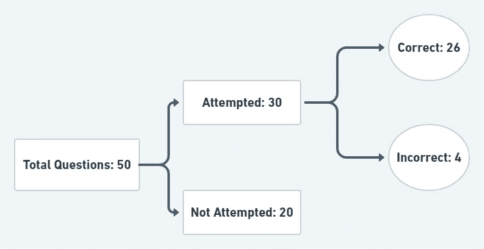
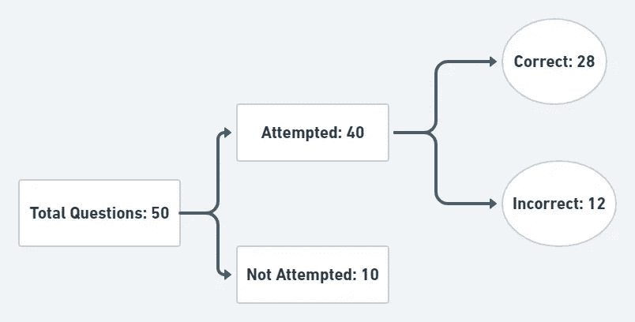
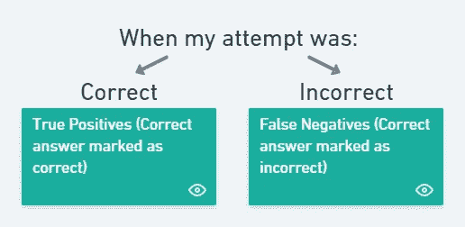
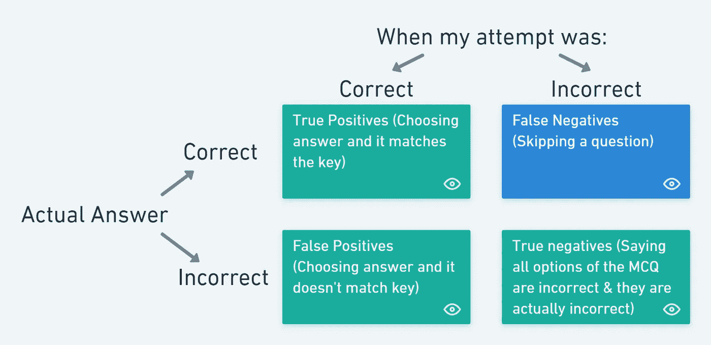
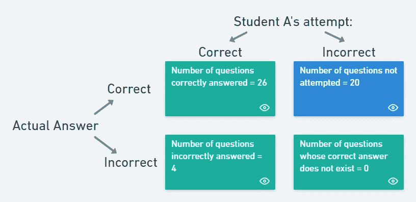
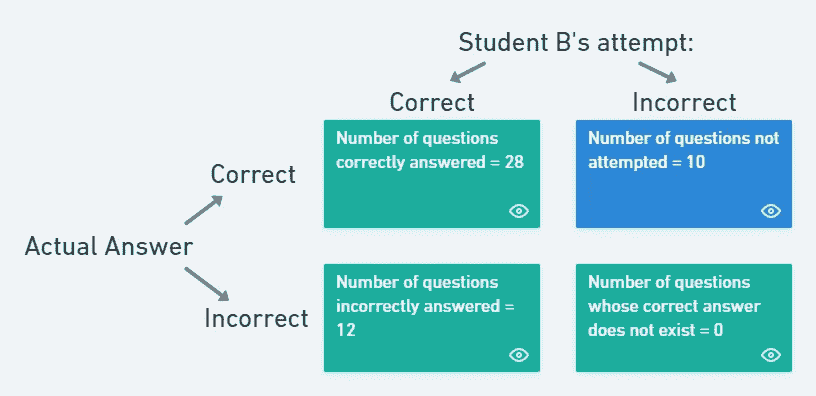
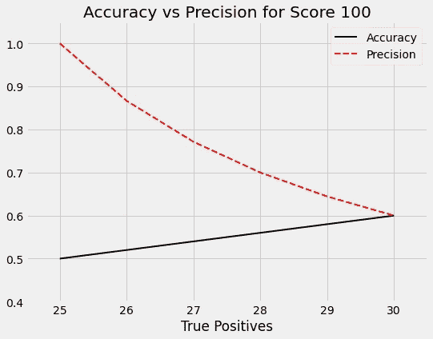
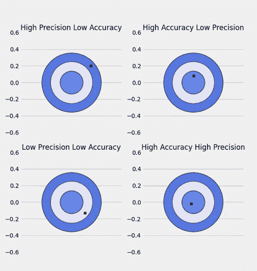

# 准确度和精确度分数如何影响你的入学考试排名？

> 原文：<https://medium.com/nerd-for-tech/how-do-accuracy-and-precision-scores-impact-your-entrance-exam-rank-2410f653b0fe?source=collection_archive---------10----------------------->

## 本文试图从入学考试的角度解释统计学和机器学习中三个臭名昭著但却很重要的词——准确度、精确度和回忆。

在我们生命中的某个时刻，我们肯定经历过参加入学考试的恐惧。考试通常由多项选择题组成。标准是——如果你答对了，你得正分，如果你答错了，你得负分，如果你跳过了这个问题，你得零分。三者的累积和就是你的总分。

仅此而已吗？分数的总分解包含更多的东西吗？我们来了解一下。

**集:**

1.  **直觉——摘掉{准确、精密}的头罩。**
2.  **优化策略。**
3.  **形式化直觉，引入回忆。**
4.  **可视化的准确性和精确性。**

# 1.直觉

考虑一个叫做 **A** 的学生的记分卡，他最近的入学考试由 **50 个问题**组成:

*a)每个正确答案奖励+4 分。*

*b)每个错误答案奖励-1 分。*

*c)不尝试提问得 0 分。*

学生 A 的尝试(作者图表)

如图所示，学生 A 只能尝试 **30 个问题**(我们都来过:P)并且在尝试的 30 个问题中，26 个是正确的，其余的是错误的。因此，学生 A 的**总成绩** = (26 正确*4) + (4 不正确*-1) = **100**

我们来问一些关于分数的问题: ***学生 A 答对的题的百分比是多少？***

问题总数= 50，正确= 26

因此，正确答案的百分比= 26/50 = **0.52 = 52%**

就是这样。这是**准确度**，在本例中，学生 A 的准确度为 **52%** 。

简单地说，我们可以说精确度是:

学生能正确回答的问题的百分比是多少？

好吧。这不困难吗？那么，是什么引起了所有的大惊小怪？

为了理解这一点，我们现在介绍另一个学生，叫他 B，分数明细如下图所示:

学生 b 的尝试。

学生 B 的**总成绩** = (28 正确* 4) + (12 不正确* -1) = **100**

等等！现在怎么办？**这两个学生得分相同。**

现在的问题变成了: ***我们授予谁更高的军衔？***

唉！我们需要一个可靠的策略来做出明智的选择。因为这样的考试通常竞争非常激烈，一个等级的微小差异可能很容易成为进入学生梦想大学的决定性因素。一种方法是利用考试对不正确答案的否定评分系统。

**如何？**

谁在考试中得的负分少，谁的错误就少，谁就能获得更高的名次。对学生 A 和 B 使用这种策略，我们观察到:

1.  学生 B 犯了 12 个错误
2.  学生 A 犯了 4 个错误

因此，根据这个策略，**学生 A 应该被授予更好的等级。**瞧！这就是**精度。学生 A 比学生 b 更精确。**

如果我们比较两个学生的数据，我们看到学生 A 和 B 的精度可以直观地计算如下:

Precision-A = 26 正确/ (26 正确+ 4 不正确)= **0.867**

Precision-B = 28 正确/ (28 正确+ 12 不正确)= **0.7**

> *恭喜学生 A！*

# 2.最佳化

第一个逻辑策略是尽可能多地得分，但对于一个特定的分数，如果你想确保获得最佳排名的最大可能性，策略应该是:**最大化精度**。

这意味着人们应该避免随意猜测答案，原因很简单，因为这样做有两层惩罚:

*惩罚 1* :每答错一题，分数减 1 分。

*惩罚 2* :精度降低。

惩罚 2 的重要性非常高，尤其是如果相同的分数由多人共享。我们只能优化这些吗？检查最后一部分:P

# 3.现在一点数学…？要正规化！

既然我们已经有了清晰的直觉——让我们向一些我们大多数人以前肯定听过的词问好，可能是在不同的上下文中。

作者图片

从学生的角度来看，他/她尝试的问题有两种可能性——要么答案是正确的，要么答案是不正确的。我们可以用旁边的矩阵形式来表示这些可能性。

但这仅仅显示了一半的可能性。图中只显示了我们对答案的预测。一个完整的图片还将包括下面显示的实际答案。

尝试的混乱矩阵。作者图片

让我们正式定义写在方块内的疯狂术语。

1.  **真阳性:**当我们正确识别阳性类时。
2.  **真否定:**当我们正确识别否定类的时候。
3.  **假阳性:**当我们错误地识别阳性类别时。
4.  **假阴性:**当我们错误地识别出否定类别时。

技术废话！让我们试着坚持我们一直遵循的例子:

1.  *A* ***真阳性*** *在这种情况下将简单地从给定的选项中选择正确的答案。*
2.  *一个* ***真否定*** *在同一个语境下会排除一个问题的所有不正确选项。*
3.  *一个* ***假阳性*** *就会选择一个不正确的答案。*
4.  *最后，最棘手的情况:一个* ***假阴性*** *会跳过一个问题。(假设总是存在正确答案)*

我们现在使用以上几点来形式化准确性和精确性背后的直觉。如果我们还记得上一集的话，准确率是:****学生 A 正确尝试的题目百分比是多少？****

****

**作者图片**

**因此，学生 A 的正确率=(真阳性+真阴性)/总问题数= 26+0 / 26+20+4 = 0.52**

**同理，**学生 A 的精度=真阳性/(TP+FP)= 26/26+4 =*0.867*****

**我们也可以计算学生 B 的相同结果。**

****

**作者对学生 b .图像尝试的混淆矩阵**

**学生-B 的准确率= (TP + TN) /总题量= (28+0)/28+10+12 = 0.56**

**同理，**学生 B 的精度=真阳性/(TP+FP)= 28/28+12 =*0.7*****

**因此，学生 B(0.7)的精度比学生 A(0.867)差。因此，我们在数字上确定学生 A 应该被授予更好的等级。**

**还有最后一个我们还不了解的指标——回忆。回忆**衡量你找到正确答案的程度(忽略不正确的答案)。**仔细看，表面上，回忆看起来非常接近精确，但它们是完全不同的度量标准。**

**数学上，**

****学生 A 的回忆=真阳性/ (TP + FN) = 26 / 26 + 20 = 0.565****

**这意味着学生 A 可以从所有答案中识别出 **56.5%** 的正确答案，而 Precision 识别出学生 A 尝试的所有答案中有 **86.7%** 是正确的。**

**等等！啊！我理解你。它需要大量的注意力和精神能量来跟踪所有的指标。因此，让我们结合所有指标来看一看:**

1.  **在所有答案中，你能找出多少个正确和不正确的答案？—准确性。**
2.  **在你能找出的所有正确答案中，有多少是正确的？—精度。**
3.  *****在所有答案中，你能找出多少个正确的(不包括错误的)答案？—回忆。*****

***注:现在有人可能认为* ***优化策略*** *应该包括最大化召回率而不是精确度。但是请记住，回忆会受到您没有尝试一个答案的影响***对您的分数的贡献为 0，而精确会受到一个错误答案的影响***对您的分数的贡献为-1。*****

# **4.可视化的准确性和精确性。**

****

**旁边的图显示，对于某个分数，随着真阳性的数量增加，精确度下降。**

**奇怪？**

**想一想…**

**请记住，当错误答案的数量增加时，精确度会受到更大的影响。因此，对于同样的 100 分，当正确答案的数量从 25 增加到 30 时，错误答案的数量自然也会增加。这就是降低精度的原因。**

> **一张图胜过千言万语。**
> 
> **亨利克·易卜生**

**下面是我对这句名言的翻译:**

> **一部动画抵得上一千张图片。**

**准确地说，一部动画无论使用多少帧都是有价值的:P**

**重点是，消化一张图片比硬核公式容易得多，消化一部动画比一张信息密集的图像容易得多。**

**这里有一个小的**动画**描绘准确度和精确度。**

****

**众所周知的飞镖可视化的准确性和精确性，动画！**

**可以在我的 GitHub [这里](https://github.com/rvs-23/Accuracy_Precision_EExam)找到代码，以计算出问题数量与特定分数的组合以及动画代码。**

*****参考优化一集:*** *还有一层优化我们可以执行。这可以通过使用精确度和准确度创建一个单一的度量来实现。这个想法将在下一部分讨论。所以，敬请关注。***