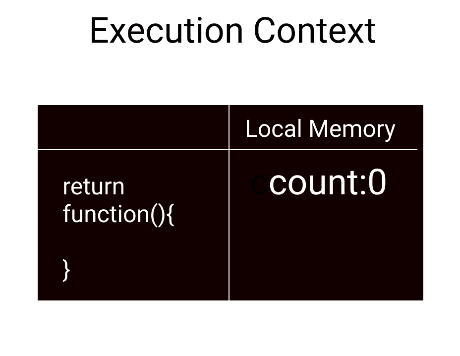

# JavaScript 中闭包是如何工作的？

> 原文：<https://medium.com/nerd-for-tech/how-do-closures-work-in-javascript-32c15ed46bec?source=collection_archive---------14----------------------->


闭包是 JavaScript 中最优雅的特性之一。正如我们所知，在 JavaScript 中，函数只是对象，正因为如此，我们可以用 JavaScript 中的函数做一些非常神奇的事情，比如将函数作为参数传递给其他函数。根据定义，闭包是从另一个函数返回的函数。但是闭包实际上是如何在引擎盖下工作的是非常神奇和令人印象深刻的。

因此，让我们看一个简单的例子，并尝试理解它:

```
function outer(){
let count=0;
return function(){
count++;
return count;
}
}const result=outer();
console.log(result()); //1
console.log(result()); //2
```

在我们的控制台上，我们先看到 1，然后是 2。*等一下！JavaScript 如何知道 count 之前是递增的？它不应该再给 1 吗？*

让我们深入到代码的逐步执行中，以了解幕后发生了什么。

**第一行:**我们在全局内存中声明一个名为 outer 的函数。全局内存包含任何没有在函数中定义的东西。此时，JavaScript 只知道 outer 是一个函数，但不知道它内部发生了什么，因为这只是声明。

**第二行:**我们在全局内存中声明一个名为 result 的常量，并将 outer 的返回值存储在其中。所以我们现在必须执行 outer()。outer()的执行上下文如下所示:



在 JavaScript 中，每个函数都有自己的执行上下文，它有一个本地内存来存储函数中声明的所有本地变量。这里，我们有计数变量，它被初始化为 0。然后一旦我们遇到返回语句，我们就从函数中出来，从 outer 返回的函数存储在常量结果中。函数返回后，它的执行上下文被破坏，因此我们不再能访问它内部的任何变量。但是正如我们所看到的，即使没有 outer()的执行上下文，我们也能够增加计数。我们没有在内部函数中定义 count，因此在它的执行上下文中没有任何东西，这难道不会给我们一个错误吗？

嗯！！下面是这个问题的答案。当我们从外部返回函数时，返回的不仅仅是函数，还有这个返回函数的背包中的一些数据。背包这个词是我在[前端大师](https://frontendmasters.com/) *的一个课程中接触到的，用来定义它的。*现在，这个小背包对我们来说是隐藏的，我们无法直接接触到它。它只包含对外部函数中那些在我们返回的函数中使用的变量的引用。在我们的例子中，这个背包最初将 count 设置为 0，每当我们调用这个函数时，JavaScript 将更新这个背包中的值。这不是太令人兴奋了吗！，我们在全局内存中有持久数据，从技术上来说，它被称为**持久词汇范围参考数据(PLSRD)或可变环境上的封闭数据。**

这就是 JavaScript 中闭包的工作方式。在现实世界中，我们可以在这样的场景中使用闭包，例如，我们想要计算函数中的第 5676 项。如果每次执行函数都要从头开始，这将是一个非常昂贵的操作。所以我们可以做的是，使用 closure 跟踪最后一个计算的项，然后下一次我们将在我们的背包中有最近的项，我们可以从那里继续。

希望它有助于更好地理解 JavaScript 中的闭包！

如果这对你有帮助，请鼓掌！

请在评论中提供您的反馈！