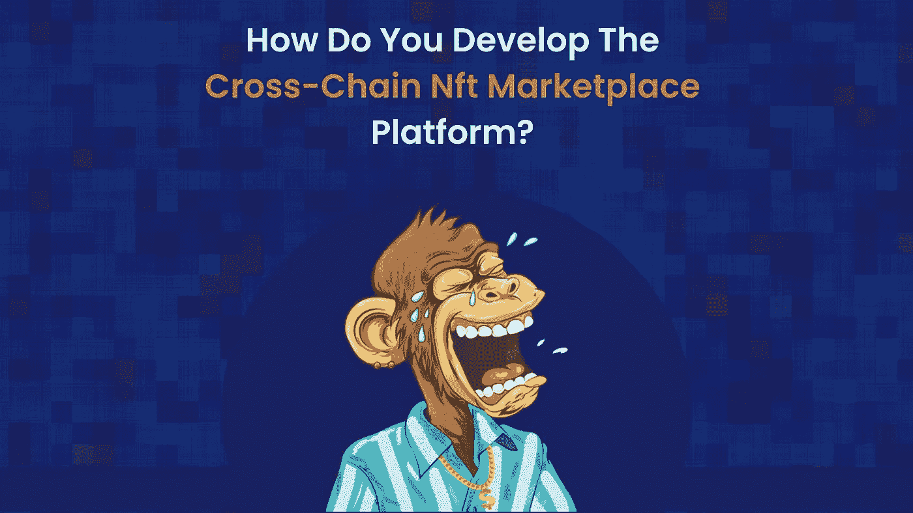

# 如何开发跨链 NFT 市场平台？

> 原文：<https://medium.com/nerd-for-tech/how-do-develop-the-cross-chain-nft-marketplace-platform-791979c4ccdf?source=collection_archive---------6----------------------->

近年来，NFT 市场飞速发展，促使企业家们想方设法在这个利润丰厚的市场留下自己的印记。由于人们对 NFTs 的广泛理解，NFT 的销量将在 2021 年大幅增长。企业家们正在收集他们的想法，并在市场上进行检验。随着市场的不断发展，多链 NFT 市场是吸引大量用户加入平台的最有效方式。

众所周知，NFT 市场使用区块链技术来确保非金融交易和交易的安全。然而，市场尚未调查几个区块链网络的特性。本文将讨论跨链 NFT 市场的演变。

什么是跨链 NFT 市场平台？

[跨连锁 NFT 商场](https://www.clarisco.com/nft-marketplace-development)已经成为 NFT 市场的热门话题。企业家希望尝试一些与众不同的东西，以吸引用户的注意力。谈到区块链网络，每一个都是为了满足某些要求而设计的。那么，当所有的区块链合并到平台的一个区域时会发生什么呢？它将为消费者交易他们的数字收藏品提供一个极好的平台。

一些 NFT 公司已经开始着手解决这个问题，跨链 NFT 平台是最有效的方法之一。多链 NFT 平台将允许用户通过暴露许多区块链来构建他们的 NFT。互操作性是鼓励人们选择跨链 NFT 解决方案的主要因素。

考虑以下场景:如果一个移动网络品牌只允许其用户与使用类似网络的人通信，会怎么样？不难想象吧？跨链 NFT 市场试图通过允许用户交换 NFT 来弥合这一差距，而不管他们的区块链网络。此外，用户将能够使用任何适合他们的非本地货币来铸造、购买和交易他们的非本地货币。

**为什么跨国连锁的 NFT 市场是首选？**

分散式金融业务首先高度重视建立多链 NFT 系统。跨链 NFT 市场开发侧重于许多与 NFT 平台功能相关的痛点。跨链 NFT 市场将解决互操作性、可持续性和能源效率等问题。关注跨链 NFT 平台将引导我们踏上元宇宙的转型之旅。

短语 K2M，或元宇宙之钥，通常用于指代向元宇宙的过渡。这些密钥将为进入元宇宙的各种程序提供访问控制。以元宇宙为例，它是所有区块链网络的统称。甚至那些把钥匙放在以太坊区块链的用户也应该能够把它们转移到索拉纳或者另一个区块链网络。这就是市场需要交叉链 NFT 系统的原因。

open sea——NFT 的一个主要市场，同样处于将跨链合规性整合到其平台的早期阶段。

**跨链 NFT 平台的用户优势**

如前所述，互操作性是跨链 NFT 交易所要解决的最重要的问题。然而，为用户开发一个跨链 NFT 平台还有许多额外的好处。

*   互操作性将使区块链网络能够直接与其他用户通信，不再需要中介。
*   该平台将在不同的区块链寻求跨链交易。
*   该平台的安全特性通过加密得到了增强。
*   跨链 NFT 平台将确保平台的交易和效率。
*   跨链 NFT 平台支持多令牌系统。
*   在多链遵从性中，数据所有权得以保留。

**创建跨连锁 NFT 市场的步骤**

你可以参考下面列出的阶段来帮助你建立最好的跨链 NFT 市场。这些包括:

**1。构思或规划**

在开始开发之前，一切都必须计划好。设计你的新业务的第一步是定义它的专业。

**2。设计市场**

规划你的设计比什么都重要，尤其是在区块链各地工作的时候。如果设计吸引人，体验天衣无缝，用户会更高兴，更有可能推荐你的产品。

**3。开发阶段**

发展一个跨连锁的 NFT 市场至关重要。前端开发对于保证您的跨链 NFT 市场平台的高效运行非常重要。

**4。测试&发射**

在整个软件开发过程中，需要进行大量的测试。bug、错误和其他缺陷会扰乱跨链 NFT 市场的平稳运行。

**5。发布门户更新**

随着用户群的扩大和新问题的出现，定期更改对于保持组织的安全性和相关性至关重要。

**跨链 NFT 平台如何运作？**

跨链 NFT 平台将涉及多个方面，他们的交易将在市场上取得成功。多链 NFT 平台将以以下方式工作。

*   许多区块链网络交集背后的天才是原子交换系统。两个区块链不可能与其它区块链网络通信。另一方面，原子互换系统将实现这一点。
*   跨链 NFT 平台中的下一件大事是**接力**，其中主链通过股权凭证来确认。
*   **简化支付验证(SPV)** 是一个无状态且不跟踪交易的支付系统。但是，它将使智能合同能够验证工作证明共识的子集。

**NFT 平台的跨链兼容性特征**

跨链 NFT 平台具有与众不同的品质，使其有别于其他平台。考虑跨链 NFT 平台的以下关键特性。

**智能合约**

NFT 市场平台最重要的功能是智能合约。它们对于指明完成交易必须满足的要求至关重要。智能合约必须足够强大，能够抵御区块链的操作。随着智能合约变得更加强大，平台的安全性不会受到威胁。

**交易速度**

NFT 系统的交易速度是吸引用户的一个关键因素。在跨链 NFT 平台上，交易速度可以得到保证，在那里他们可以很容易地进行交易。平台在提供高速交易的同时，不会牺牲安全性或交易成本。

**交易成本**

不管区块链网络如何，交易成本应该是所有用户都能负担得起的，这样他们才能平静地交易他们的非功能性交易。作为 NFT 平台的所有者，你不仅应该关注百万美元的交易，还应该关注微交易。这些微交易将用于说明 NFT 博彩资产的收购。因此，跨链 NFT 平台应该建立最低交易费用，使你的 NFT 平台更有吸引力。

**互操作性**

NFT 可以根据需求进行互操作。因此，NFT 很容易适应跨链网络，同时丰富他们的工作。

**管理面板**

因为它是 NFT 市场的主要枢纽，所以其职能由 it 部门管理。因为它包含每个功能的基本数据，所以这个面板需要是安全的。这些错误是管理员的错，管理员也负责修复它们。

**跨链 NFT 平台使用的区块链技术**

尽管多个区块链网络可以在跨链平台上运行，但只有少数区块链技术可以以这种方式应用。仔细观察可用于构建 NFT 平台的区块链网络。

*   以太坊
*   索拉纳
*   多边形
*   币安智能连锁
*   雪崩

**跨连锁 NFT 市场的类型**

*   NFT 艺术市场
*   音乐 NFT 市场
*   NFT 体育市场
*   配件 NFT 市场
*   NFT 数码收藏品市场
*   摄影 NFT 市场
*   梦幻体育 NFT 市场
*   房地产 NFT 市场
*   游戏 NFT 市场
*   域名 NFT 市场

**最后的对话**

当 NFT 市场升温时，对变化的条件做出反应将帮助你跟上形势。因此，现在是你带着[跨链 NFT 平台](https://www.clarisco.com/nft-marketplace-development)进入市场的理想时机。马上开始计划你的 NFT 之旅吧！