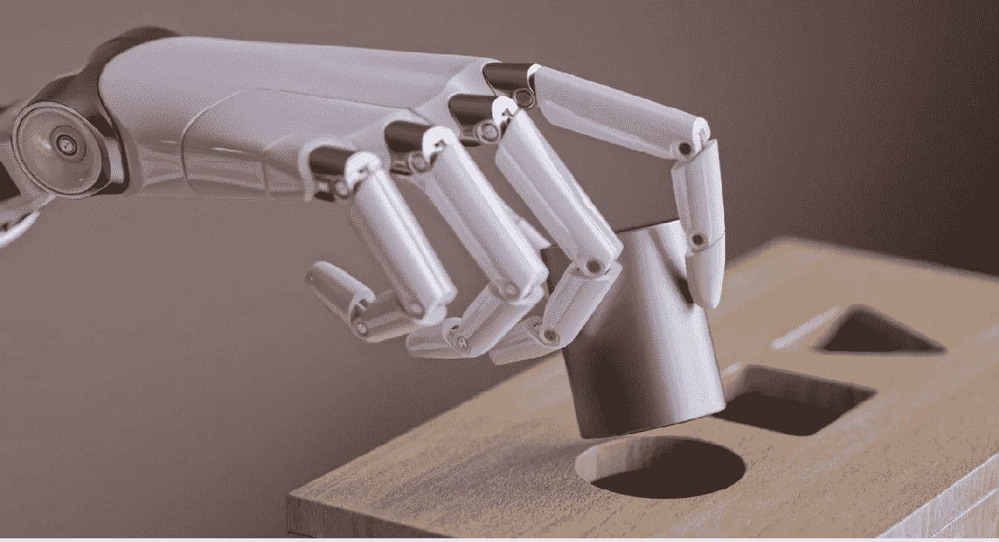
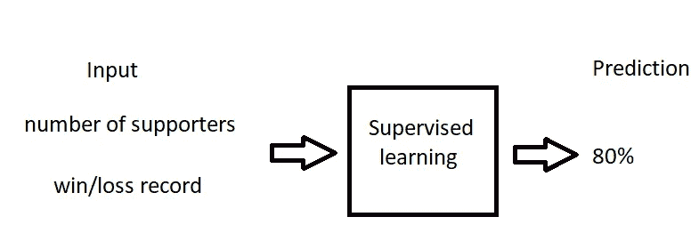
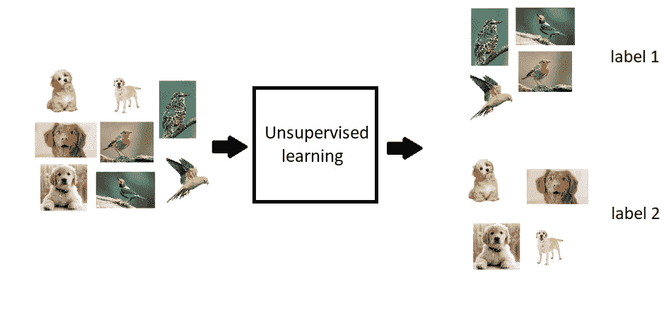
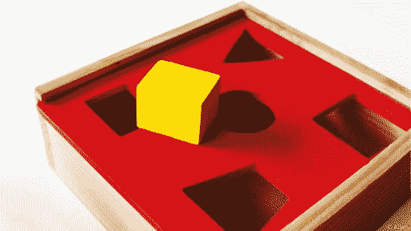
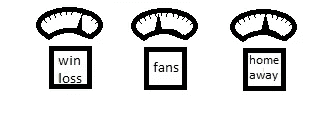
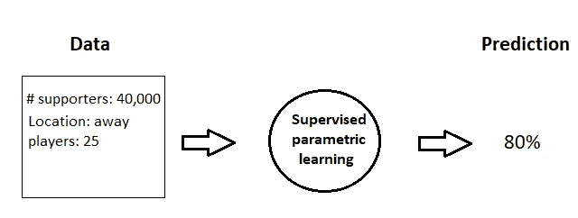
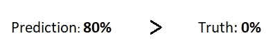
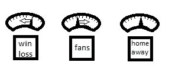
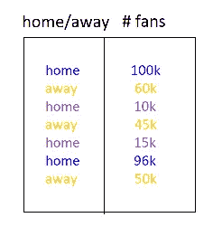
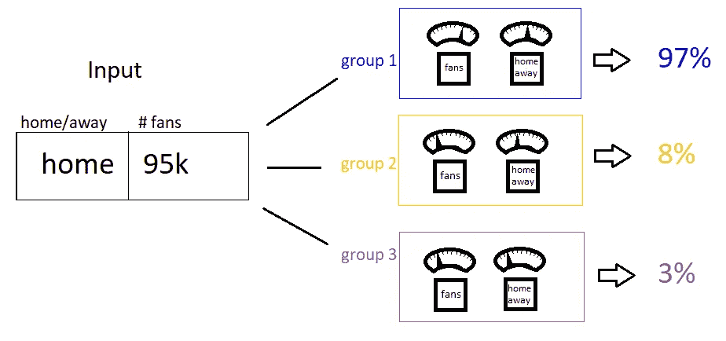

# 机器是如何学习的？监督和非监督学习。参数和非参数学习

> 原文：<https://medium.com/nerd-for-tech/how-do-machines-learn-supervised-unsupervised-learning-parametric-nonparametric-learning-52d420fa6968?source=collection_archive---------7----------------------->

来源:[图片](https://magazine.fbk.eu/en/news/do-machines-learn/)

机器学习是一个致力于研究和开发能够学习的机器的领域。深度学习是机器学习的一个子集。

深度学习是人工智能的一个分支，可以处理计算机视觉、自然语言处理和语音识别中的问题。*人工神经网络*用于机器学习方法的这个子集。

我们现在知道深度学习是机器学习的一个子集，但机器学习到底是什么？这是计算机科学的一个分支，在这个分支中，计算机在没有明确编程的情况下学习完成任务。我们提供一个输入数据集，机器学习算法学习这些数据，这样它们就可以为以前看不到的数据生成输出。机器学习可以分为两种主要类型:*有监督*和*无监督*。

S **监督学习**是一种将一个数据集转换成另一个数据集的方法。它的输入是*你知道的，*它的输出是*你* ***想要*** *知道的。*

例如，假设您想要确定您最喜欢的足球俱乐部赢得世界职业棒球大赛的几率。该模型接受输入数据(如体育指标线赢/输记录、支持者数量等。)然后做一个预测(概率)。

U **无监督学习**同样将一个数据集转移到另一个数据集，但与监督学习不同，结果是之前看不到或无法理解的。它只是在数据集中找到常见的模式，并对它们进行分类。为了更好地理解它，我们来看一个例子。

我们给模型我们的数据集，其中包括狗和鸟的图片。然而，我们不会告诉模型它们是不同的动物。该模型在数据中寻找共同的模式。例如，狗与鸟类的区别在于它们的大小、耳朵、鼻子、两对腿和尾巴。另一方面，鸟和狗的区别在于它们的体型小，有翅膀、喙和小眼睛。因此，有鼻子、耳朵、尾巴或两对腿的物体将被分配到第一类/组。那些长着翅膀、喙和小眼睛的动物自然会被分到第二类/第二组。该算法不会识别图像中的对象，但会返回标签。如果它学习了 10 个不同的对象/类，它会给我们从 1 到 10 的标签。因为我们有两个类(狗和鸟),所以我们得到标签 1 和标签 2。无监督学习就是对数据进行分组。

P参数化&非参数化学习。我们现在将机器学习算法分为另外两类:参数和非参数。所以，有四种不同类型的算法。算法可以是监督的或无监督的，也可以是参数的或非参数的。您可能会对术语“非参数”感到困惑“Non”并不意味着没有参数。事实上，它们确实有参数，而且数量是无限的。随着参数数量的增加，模型变得越来越复杂。可以使用的参数数量没有限制。然而，训练过程很慢，因为他们需要更多的参数。然而，参数学习的情况并非如此。它们有固定数量的参数。更简单，更容易理解。它们也比非参数学习更快。尽管如此，参数学习不如非参数学习有效。

让我们想象这个问题是将一个方钉安装到正确的(方)孔中。例如，婴儿只要把它塞进所有的洞，直到合适为止(**参数**)。然而，一个成年人会数边数(4)，然后寻找边数相同的洞(**非参数**)。

来源:[robinschooling.com](http://robinschooling.com/longing-to-belong/)

S **监督参数学习**有一个**固定数量的**旋钮(参数部分)，通过改变旋钮的角度来完成学习。在我们之前的“世界职业棒球大赛”的例子中，模型首先获取输入数据(赢/输记录、粉丝数量等)并预测结果(80%)。从那里，模型观察这个团队是否赢了。在它知道他们是否赢了之后，学习算法会调整旋钮，以便在下次看到类似数据时做出更准确的预测。

如果这是一个好的预测，模型将“增加”“赢/输”旋钮的角度。另一方面，如果这是一个不好的预测，它将“调低”“支持者数量”旋钮。该模型只是简单地试验不同的旋钮配置，改变它们，并重试，直到找到一个做出良好预测的旋钮(方形钉的例子)。让我们把我们俱乐部赢得世界大赛的可能性分解成三个步骤:

1 **:预测**

汇编体育统计数据，通过机器发送，做一个预测。

2 **:对比实际结果**

如你所见，球队输了。但是我们的模型预测他们会赢。如果它预测了 0%，这将是一个完美的预测。现在我们想有一个准确的预测。

3 : **学**

在这一步中，模型通过计算模型错过了多少(80%)来调节旋钮。而下一次模型看到同样的体育统计，预测将低于 80%。

U **监督参数学习**以类似的方式工作。正如我们已经知道的，无监督学习的目标是对数据进行分组。在无监督的*参数*学习中，使用旋钮来完成。每个组通常包括几个旋钮，每个旋钮将输入数据的接近程度映射到特定的组。假设我们想把数据分成三组。(每一组都有其独特的颜色)。

然后，我们通过我们训练的无监督模型传播输入。如下图所示，最接近**组 1** 。

每个组的旋钮将输入数据转换为 0 到 1 之间的值(*100%)，表示数据属于该组的概率。

N 以 K-最近邻(KNN)算法为例。KNN 是一种既简单又传统的非参数分类技术。它用于分类和回归。

来源:d[atacamp.com](https://www.datacamp.com/)

在 KNN， **k** 是邻居的数量。输入被分配给给定元素的 k 个邻居中最常见的类，这些类是已知的。当 k=3 时，该算法计算最近的三个邻居，并为标签投票。在我们的例子中，**类 B** 中的对象数量超过了**类 A** 中的对象数量，因此输入将与**类 B** 相关。模型参数随着训练集增加，这就是为什么 KNN 是非参数的。您可以将每个训练实例视为模型中的一个参数，因为它是您用来进行预测的。

摘要:在这篇文章中，我们学习了四种不同类型的机器学习算法。我们熟悉了有监督的和无监督的机器学习方法之间的区别。此外，我们了解到非参数算法根据数据集改变它们的参数，而参数算法有固定数量的参数。

## 查看我的 [Kaggle](https://www.kaggle.com/selbinyyazsultanova) 、 [Github](https://github.com/selbiniyaz31) 、[栈溢出](https://stackoverflow.com/users/12907959/selbiniyaz-sultanova)。欢迎和我一起参加 Kaggle 上的任何比赛！我们一起将能够发展和实践我们在这些文章中学到的东西！不要忘记👏！