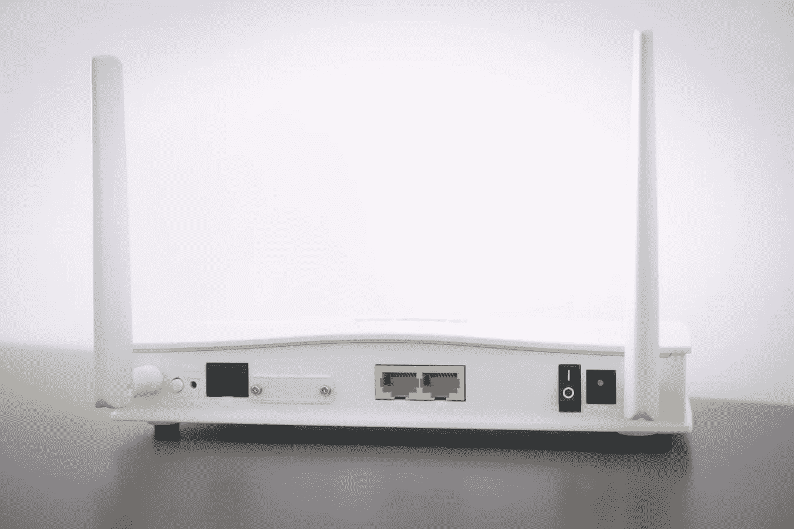

# 我们如何连接到互联网和访问网页？

> 原文：<https://medium.com/nerd-for-tech/how-do-we-connect-to-the-internet-and-access-the-web-588a98dbaf11?source=collection_archive---------7----------------------->

## 深入了解我们每天做几十亿次的事情

在我们这个时代，几乎不可能一天不与互联网进行有意义的互动。你看得到和看不到的地方都有。很难相信，就在 30 年前，互联网还只被少数科学家、大学和政府机构使用，而万维网刚刚诞生！**这篇文章不打算深究互联网和网络的历史，而是着眼于我们如何访问这两者的内部运作。**

# 互联网与万维网

让我们弄清楚一件事——T4 互联网和万维网的区别。这两个术语经常互换使用，但实际上并不是同义词。即使在这篇文章的开头，我也在纠结用什么术语。互联网实际上已经存在了 30 多年，而万维网只是在 1989 年才创建。

从广义上讲，互联网是全球网络的网络，而 web 是通过互联网访问的信息的集合。互联网发送和接收数据(文件、电子邮件),并提供数据传输的路径。web 是一种服务(或应用程序),位于互联网基础设施之上，将信息保存为我们可以通过互联网访问的数据。请记住，即使不与网络互动，也很有可能通过互联网发送、接收和访问数据。

你如何知道你是否在使用网络？如果涉及到[超文本传输协议(HTTP)](https://developer.mozilla.org/en-US/docs/Web/HTTP/Overview) 、[超文本标记语言(HTML)](https://developer.mozilla.org/en-US/docs/Learn/Getting_started_with_the_web/HTML_basics) 或[统一资源定位(URL)](https://developer.mozilla.org/en-US/docs/Learn/Common_questions/What_is_a_URL) ，这很好地表明您正在与 web 交互(当然是通过互联网)。

关于大写的补充说明——互联网*和网络*应该小写，而万维网应该总是大写。这 3 个单词最初都是大写的，但截至 2016 年，小写已成为新的推荐。它们仍然被认为是专有名词——这是一个有趣的解读，这里的*。*

# *您的电脑如何访问互联网*

**

*如果我们先把它插上可能会有帮助*

*你的电脑上网时首先连接的是你的[局域网，或者本地连接](https://www.howtogeek.com/353283/what-is-a-local-area-network-lan/)。LAN 是一个单一的网络，多个设备可以在一个位置访问它。一个明显的例子是你家里提供互联网连接的调制解调器及其路由器(很可能是 [Wifi](https://www.cisco.com/c/en/us/products/wireless/what-is-wifi.html#:~:text=Wi%2DFi%20is%20a%20wireless,to%20interface%20with%20the%20Internet.&text=Internet%20connectivity%20occurs%20through%20a%20wireless%20router.) )，它允许你的电话、电脑和电视等多个设备共享同一连接。然后你的局域网连接到一个更大的网络，称为[广域网，或广域网](https://www.cisco.com/c/en/us/products/switches/what-is-a-wan-wide-area-network.html)。广域网是局域网的集合，很可能是由你的互联网服务提供商运行的路由器。您的直接广域网可能位于您的社区，然后连接到另一个区域广域网，可能是您的整个城市或城镇。如此循环往复，经过多次[跳](https://www.lifewire.com/what-are-hops-hop-counts-2625905)，你就连上了互联网的[主干](https://www.networkworld.com/article/3532318/what-is-the-internet-backbone-and-how-it-works.html)。*

## *脊梁*

**

*互联网的主干传输数据的速度高达每秒 100 GB，由康卡斯特、AT T、威瑞森、Sprint 等一级互联网服务提供商组成。所有一级互联网服务提供商在由所有骨干互联网服务提供商维护的[互联网交换点(ixp)](https://en.wikipedia.org/wiki/Internet_exchange_point)自由共享彼此的连接。这些 ixp 是物理结构，通常包含在拥有自己的[网络交换机](https://en.wikipedia.org/wiki/Network_switch)的建筑物中。这些交流通过互联网将整个世界联系在一起。第 2 级和第 3 级互联网服务提供商实际上并不连接到主干网，而是向较大的第 1 级提供商付费，后者随后为较小的第 2 级或第 3 级 ISP 提供到主干网的连接，以销售给他们的客户群。*

# *如何通过互联网访问网络*

**

*您可能是通过 google 搜索导航到这篇文章的，或者可能是通过单击另一个网站上这篇文章的链接。但是你的浏览器实际上是如何显示这个页面的内容的呢？*

*让我们来分解一下:*

## *域名系统(DNS)*

*当您导航到本文的 URL 时，您的浏览器(也称为客户端)首先需要进行 [DNS 或域名系统](https://www.keycdn.com/support/what-is-a-dns-server)查找。DNS 就像互联网的电话簿。每个网站都有一个唯一的 [IP 地址](https://en.wikipedia.org/wiki/IP_address)，可以通过网站的域名在 DNS 中找到。您的浏览器首先检查您自己的设备的本地缓存 DNS 存储，以查看它之前是否已经查找过域名并拥有 IP 地址。如果找不到，它会检查您的互联网服务提供商的 DNS 记录，在那里通常可以解析 IP 地址。IP 地址将被缓存在你的机器上，以便下次更快地查找。这个 IP 地址将用于 HTTP 请求。*

## *HTTP 请求*

*然后，带有 IP 地址的 HTTP 请求被发送到相应的服务器。所有 HTTP 请求和响应都使用[传输控制协议(TCP)](https://www.fortinet.com/resources/cyberglossary/tcp-ip) 。TCP 是确保端到端通信和数据传输的最基本的互联网标准之一。因此，您的请求打开了一个到服务器的 TCP 通道，该服务器通过 URL 的 IP 地址托管所请求的数据。然后，服务器批准了这个请求，并发回一条“200 OK”[HTTP 状态消息](https://www.w3schools.com/tags/ref_httpmessages.asp)。200 代码告诉您的浏览器，您的请求已被正确接收，数据正在发送给您。*

*数据传输是通过互联网实现的，而不是网络——记住，互联网是基础设施。每个数据包都必须符合被称为互联网协议(IP)的标准。类似于包裹实际上是如何通过邮件发送的，每个数据包必须有其目的地的 IP 地址，并且必须遵守规定的大小限制。在你的案例中，数据包上有你电脑的 IP 地址。如果数据包(即文件)很大，它们会被分割成更小的数据包，并通过具有不同跃点的许多通道发送，然后在到达客户端(您的计算机)时重新组合。*

## *更多关于“啤酒花”的信息*

*一个请求可能要经过 2 跳才能到达互联网的主干网，2 跳才能到达主干网，然后 3 跳才能到达服务器。然后，发送回来的数据包可能会被分成更小的数据包，所有这些数据包都要经过多跳才能到达主干网，然后再经过多跳才能离开主干网到达您的本地计算机，在那里它们都被重新组装成一个文件或数据包。*

*您可以通过使用“ [Traceroute](https://en.wikipedia.org/wiki/Traceroute) ”来查看您的请求数据所经过的所有跳数——参见 Mac 的方向[这里](https://www.godaddy.com/help/performing-a-traceroute-in-mac-os-x-3366)，Windows 的方向[这里](https://www.hellotech.com/guide/for/how-to-run-a-traceroute-windows-10)，Linux 的方向[这里](https://www.howtogeek.com/657780/how-to-use-the-traceroute-command-on-linux/)。*

## *解析网站*

*我们对网站的请求返回了一个由我们的浏览器解析的 [HTML](https://www.w3schools.com/html/html_intro.asp) 文件。HTML 包含链接到网站将引用的 [CSS](https://www.w3schools.com/css/css_intro.asp) 和 [JavaScript](https://developer.mozilla.org/en-US/docs/Learn/JavaScript/First_steps/What_is_JavaScript) 。在 HTML 被解析并且 [DOM](https://developer.mozilla.org/en-US/docs/Web/API/Document_Object_Model/Introduction) 被构建之后，CSS 被应用并且网站的第一个视觉表示被“绘制”在我们的浏览器中。最后，解析并应用 JavaScript 使站点具有交互性。*

*感谢您的阅读，我希望这能让您对互联网和网络的运作有所了解！*