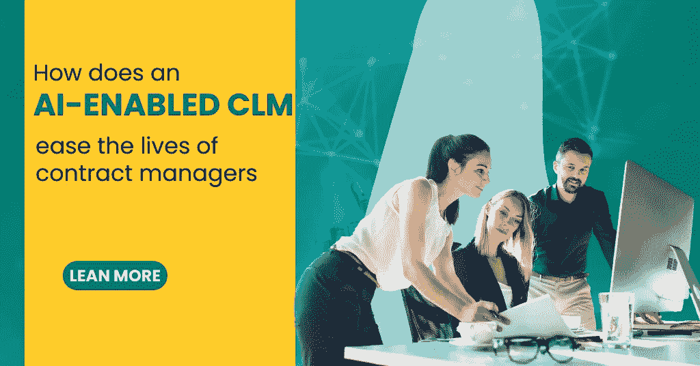
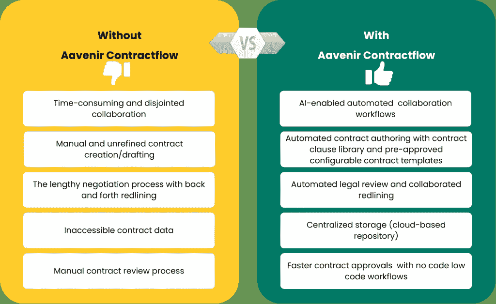
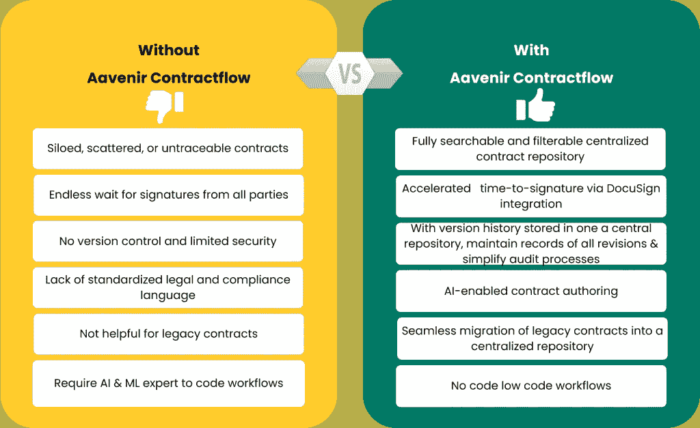
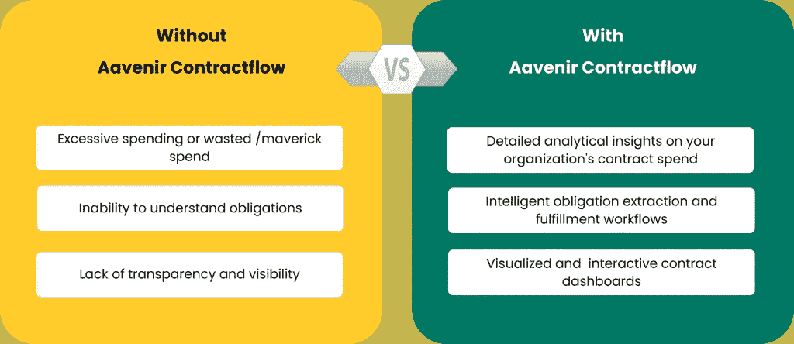

# 人工智能支持的 CLM 如何减轻合同经理的生活？

> 原文：<https://medium.com/nerd-for-tech/how-does-an-ai-enabled-clm-ease-the-lives-of-contract-managers-db43e43bd5d7?source=collection_archive---------5----------------------->

关于人工智能在 CLM 解决方案中的作用，你听够了吗？但是，作为一名合同经理，你从未体验过它能让你的生活变得轻松的程度吗？ [***合同生命周期管理***](https://aavenir.com/servicenow-contract-management-software/) 主要有三个阶段，即。执行前阶段、执行阶段和执行后阶段。

## 在**预执行阶段**，人工智能驱动的 CLM 解决方案:

*   为简单合同启用基于阈值的自动批准，并为复杂合同提供有条件的工作流
*   启用自动审查和批准工作流，并允许您为团队分配角色和权限，以便随时查看合同状态
*   作为所有合同数据的单一来源，包括相关文件、评论和谈判阶段的沟通

## 在**执行阶段**，一个人工智能驱动的 CLM 解决方案:

*   能够阅读、理解和解释法律和法规遵从性语言，并快速找到文档、条款和合同，让您的组织获得生产优势
*   帮助您快速找到增加收入和降低风险所需的信息

最后，

## 在**后执行阶段**，一个人工智能驱动的 CLM 解决方案:

*   提供分析合同、提取关键条款、确定义务和分配完成任务的工作流程
*   提供关于已实现合同价值的详细分析见解

让我们以 Aavenir Contractflow 为例，这是一个基于 NOW 平台的人工智能 CLM 解决方案。

# 预执行阶段:

# 执行阶段:

# 执行后阶段:

# 交给你了！

**阅读详细文章，** [**此处**](https://aavenir.com/contract-manager-before-and-after-aavenir-contractflow/) **。**如今的企业已经认识到并意识到对合同生命周期管理解决方案的需求。您是否正在寻找一款适用于您企业的 CLM 解决方案，但觉得合同管理软件需要几个月的时间来实施，并且需要大量的实施后培训？

如果不确定，请参考 [CLM 评估清单](https://aavenir.com/resource/clm-evaluation-checklist/)来评估 CLM 供应商和软件功能，根据您的需求评估 CLM 功能，并为您的组织确定合适的 CLM 解决方案。如果您期待实施经过仔细评估的 CLM 解决方案，请遵循 [CLM 实施清单](https://aavenir.com/resource/contract-lifecycle-management-clm-implementation-checklist/)中建议的提示和步骤，确保成功实施。