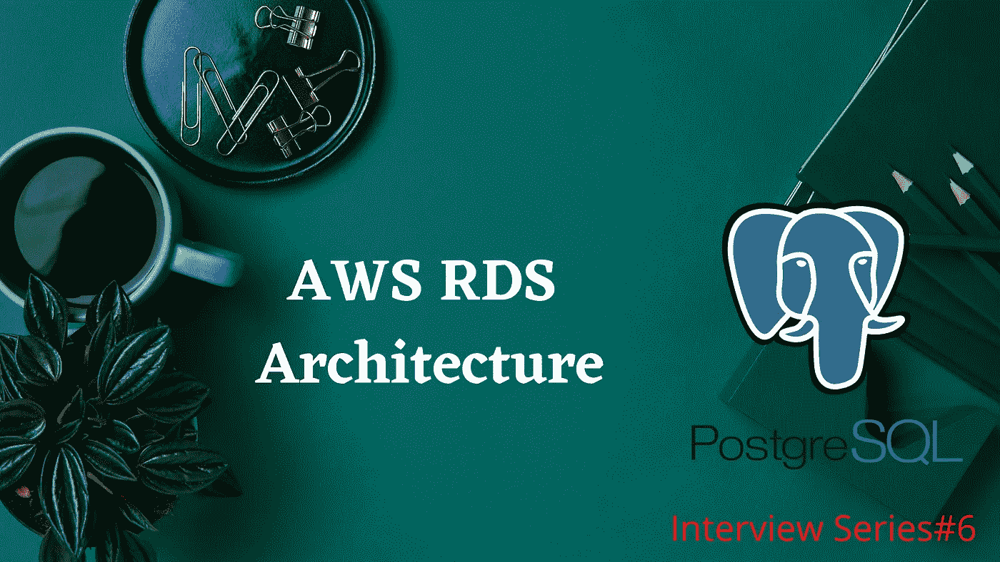
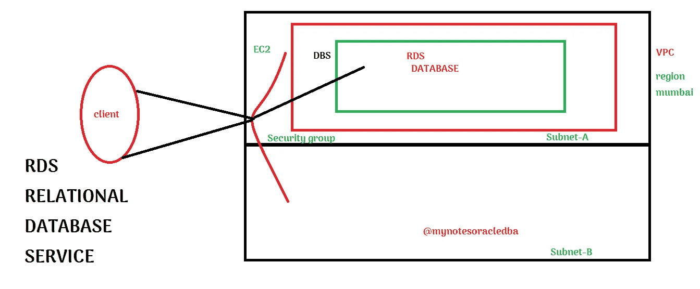

# AWS RDS 如何工作| AWS RDS 架构概述|访谈问答

> 原文：<https://medium.com/nerd-for-tech/how-does-aws-rds-works-aws-rds-architecture-overview-interview-q-a-722625f65c60?source=collection_archive---------11----------------------->

了解 AWS RDS 架构概述和组件

什么是 RDS？

- RDS 是一个包含数据库的服务器，我们只需启动并使用服务，我们不需要担心组件。

-这是一个有自己特色的服务器。

**RDS 的组成:**

**1。EC2-弹性云计算:**

-它是 RDS 的服务器，仅用于 RDS 目的。

**2。DBS:**

-在 EC2 之上，我们有数据库软件

-作为客户/用户，我们无权使用 EC2 / DBS 服务。

-我们可以指定 EC2 和 DBS 的配置

-除了 UI RDS 之外，它可以支持许多 DB 风格，这意味着我们可以将 RDS 与端点和端口连接

**3。端点:**

-它是一个字符串或主机名，也是服务器的完全限定地址。

AWS RDS 架构图

**4。VPC:**

-所有必要的配置都已在 VPC(虚拟私有云)中完成

- VPC 什么都不是，但 AWS 是一个公共云，在其中保存我们的资源或逻辑分组并保存它们。所以没有其他帐户可以使用它。

-这是一个地区的地图。

-区域不过是基础设施。

-在 vpc 内部也划分为子网例如:在孟买，我们有可用性区域，这与数据中心有些类似，当我们放置 VPC 时，我们也在放置子网

-子网是 VPC 的逻辑细分，这些子网也映射到 AZ(可用性区域)

-从逻辑上讲，我们将使用 VPC，但从物理上讲，我们将使用多 AZ

**5。安全组:**

-每当客户端通过一个点进行连接以访问数据库时，数据库资源都受到安全组的保护。其充当防火墙。

6.**读取副本:**

-读取副本，可以帮助您针对读取密集型数据库工作负载，扩展到单个数据库部署的容量之外。对源数据库实例的更新被异步复制到读取副本。

-如果 web 应用程序和报告应用程序都使用同一个数据库实例，这种机制将非常有用。在这种情况下，所有只读流量都将被路由到读取副本。主数据库将用于 web 应用程序的读写流量。

7.**备份和维护**

-AWS 自动创建 RDS 实例的备份。Amazon RDS 为您的数据库实例创建一个存储卷快照，备份整个数据库实例。为了降低性能影响，应在应用程序使用率较低时配置备份和维护。