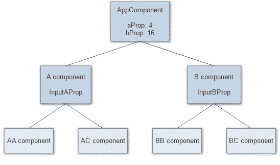

# 如今 Angular 中的变化检测机制是如何工作的？

> 原文：<https://medium.com/nerd-for-tech/how-does-change-detection-mechanism-work-in-angular-today-d2363a375fb5?source=collection_archive---------1----------------------->


劳拉·奥克尔在 [Unsplash](https://unsplash.com?utm_source=medium&utm_medium=referral) 上的照片

大多数 Angular 开发人员认为变化检测(以后我会将其命名为 CD)是对象，但这不是真的。当我们的应用程序启动时，Angular 通过两个部分的初始化阶段:

*   构建组件树
*   运行变化检测

组件树是增量树，其节点是类别**视图的对象。** Angular 为每个组件创建一个视图。类视图对象扮演了一个容器的角色，它包含了所有需要的信息和逻辑来寻找应用程序的状态，并在我们的屏幕上反映这些变化。变化检测机制是每个视图对象的一部分。

# 视图状态

每个视图都有一个状态，这个状态起着非常重要的作用，因为根据它的值，CD 决定是对视图及其所有子视图运行变更检测，还是跳过它。视图状态可以有以下值(您不需要记住它们，因为它们可以随版本的不同而变化):

1.  首次检查
2.  已启用检查
3.  出错
4.  破坏

如果 ChecksEnabled 为 false 或者视图处于 Errored 或 Destroyed 状态，则更改检测会跳过视图及其子视图。默认情况下，所有视图都用 ChecksEnabled 进行初始化，除非 ChangeDetectionStrategy。使用 OnPush。这些状态可以组合在一起，例如，一个视图可以同时设置错误和销毁标志。CD 由以下事件触发:

1.  微任务(例如 Promise)
2.  宏任务(例如 setTimeout)
3.  浏览器事件(例如点击)

得益于 zone.js 库，实现了对浏览器环境打补丁，跟踪所有上述事件。ng zone(zone . js 的 Angular wrapper)用它来自动调用 CD 机制。如果没有它，我们会手动调用 CD。不幸的是，大多数开发人员认为**输入**值的改变也会调用 CD。这不是真的。

# 变化检测逻辑

正如我上面提到的，每个视图对象中都有一个包含 CD 逻辑的方法。该方法名称和该逻辑的步骤顺序是不相关的，因为它们在版本之间是变化的。我们的目标是理解主旨。

1.  检查视图状态。ChecksEnabled(如果为 false，则 CD 不处理该对象及其后代)
2.  设置视图状态。如果视图是第一次被检查，则 FirstState 为 true，如果之前已经被检查过，则为 false
3.  检查和更新子组件/指令实例的输入属性
4.  更新子视图更改检测状态
5.  为嵌入式视图运行 CD(重复列表中的步骤)
6.  如果绑定更改，调用子组件上的 OnChanges 生命周期挂钩
7.  对子组件调用 OnInit 和 ngDoCheck(on init 仅在第一次检查时调用)
8.  更新子视图组件实例上的 ContentChildren 查询列表
9.  在子组件实例上调用 AfterContentInit 和 AfterContentChecked 生命周期挂钩(仅在第一次检查时调用 AfterContentInit)
10.  如果**当前视图(**组件实例)中的属性发生变化，则更新**当前视图**的 DOM 插值
11.  为子视图运行 CD(重复此列表中的步骤)
12.  更新当前视图组件实例上的 ViewChildren 查询列表
13.  在子组件实例上调用 AfterViewInit 和 AfterViewChecked 生命周期挂钩(仅在第一次检查时调用 AfterViewInit)
14.  禁用对当前视图的检查

我想强调的事情不多。

首先，我想提醒你注意数字 4 下面的台阶。CD 设置视图状态。checks 仅当其输入属性被更改时才在子视图中启用，否则不执行任何操作。

其次，我们可以提一下数字 6 下的步骤，说 ngOnChanges()甚至可以调用 ViewState。CheckesEnabled 设置为 false

第三，DOM 更新(数字 10 以下的步骤)一个元素一个元素地进行。在更新绑定了某个类属性 Angular 的每个元素之前，将该属性的当前值与属性 **oldValues** 中存储的值进行比较。如果这些值是不同的角度，则更新该元素(通过参考值进行比较)。

最后，只有当我们使用 ChangeDetectionStrategy 时，CD 才会禁用对当前视图的检查(数字 14 下的步骤)。 **OnPush** 。这是两种策略之间的一个区别。正是因为这个原因，默认策略每次被触发时都会遍历整个树，而 OnPush 则不会。

## 发展模式

在开发模式下，Angular 运行 CD 两次，以检查自第一次运行以来该值是否发生了变化。在生产模式下，更改检测仅运行一次，以获得更好的性能。为了避免这种情况，我们必须明白第二个 CD 调用是放在包含 CD 逻辑的函数中的，所以我们无法中断第二个循环来更新旧值。为了避免错误**ExpressionChangedAfterCheckedError**我们可以 **:**

1.  在第二个循环中递归调用 CD 来更新属性 **oldValues** 。(例如 detectChanges())
2.  CD 为获得当前值而必须执行的指令，使其成为微任务或宏任务。在这些情况下，第二个循环没有得到新的值，所以它使用了上次循环中存储在变量中的值，这是我们需要的
3.  更改应用程序逻辑，使这种情况不存在

## ChangeDetectionRef 方法

假设我们有以下组件树:



如上所述，每个组件都与一个组件视图相关联。每个视图都用 ViewState 初始化。启用检查，这意味着当角度运行变化检测时，将检查树中的每个组件。

假设我们想要禁用组件及其子组件的变更检测。这很容易做到，我们只需要设置视图状态。ChecksEnabled 为 false。Angular 提供了使用 ChangeDetectionRef 对象作为接口，我们可以用它来解决我们的任务。

```
class ChangeDetectorRef {
  markForCheck (): void
  detach (): void
  reattach (): void

  detectChanges (): void
  checkNoChanges (): void
}
```

让我们来看看如何使用它。

## 方法分离()

此方法只是禁用对当前视图的检查，设置视图状态。ChecksEnabled 为 false。我想提一下，那个视图的子视图也不会被检查。

## 方法重附属()

此方法只是启用对当前视图的检查，设置视图状态。ChecksEnabled 为 true。

## 方法 markForCheck()

attach 方法只对当前组件启用检查，但如果没有对其父组件启用更改检测，则不会影响。这意味着重附属方法只对禁用分支中最顶层的组件有用。方法 **markForCheck()** 允许检查所有父组件，直到根组件。

## 方法检测更改()

该方法为当前组件及其所有子组件运行一次变更检测**。此方法对当前组件视图运行更改检测，而不管其状态如何，这意味着对当前视图的检查可能保持禁用，并且在随后的常规更改检测运行期间不会检查组件**

## **方法 checkNoChanges()**

**最后一个方法确保值不被更改(它检查视图状态。ChecksEnabled)。如果发现已更改的绑定或确定应该更新 DOM，将引发异常。**

**感谢您的关注。我希望这篇文章能帮助你理解 Angular 中的变化检测机制。**