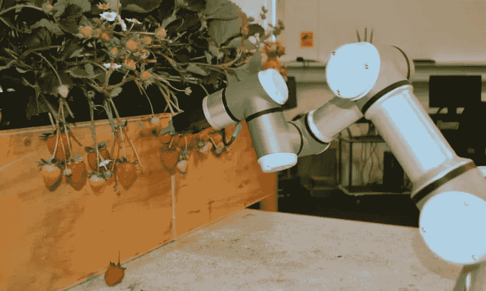

# 数据标签服务如何赋能智慧农业？

> 原文：<https://medium.com/nerd-for-tech/how-does-data-labeling-services-empower-smart-agriculture-f07ba60b642b?source=collection_archive---------4----------------------->

## **机器人成为采摘助手，智慧农业迎来全新升级**

m.elecfans.com

## 中国制造 2025 计划

据相关数据显示，随着“中国制造 2025”规划的实施，农机装备作为一个重要领域，已经成为当前和未来发展的重要任务。

农业机器人作为智能农业机械装备的一部分，受到了广泛的关注。预计到 2026 年，农业机器人产业市场规模将达到 10.44 亿元。由此可见，中国农业机器人市场前景广阔。

近年来，在政府政策的大力支持下，我国智慧农业建设发展迅速，农业机器人的使用得到推广。

根据工作内容，农业机器人可分为**采摘机器人、除草机器人、施肥机器人、耕作机器人**等。

## 采摘机器人

作为农业机器人的一个细分领域，采摘机器人的使用给农业生产带来了极大的便利。

据悉，采摘是整个农业生产中最费时费力的工序之一，需要整个生产劳动时间的 40%。为了把农民从繁重的采摘活动中解放出来，国内外许多专家学者都致力于水果采摘机器人的研究。

在中国，许多 R&D 部门对采摘机器人有浓厚的兴趣，并相继开发出独特的机器人产品。比如中国农业大学研发的黄瓜采摘机器人，利用多传感器融合技术，区分采摘对象的成熟度，引导机械手采摘黄瓜；北京市农林科学院研发的草莓采摘机器人可以自主搜索、识别、采摘成熟的草莓。使用采摘机器人不仅可以降低人工成本，还可以减轻农民的工作压力。

在国外，采摘机器人的使用也成为智慧农业的有力助手。例如，美国公司丰裕机器人公司开发了一种采摘机器人，可以 24 小时完成采摘工作，以提高农业生产的效率。西班牙初创公司 Agrobot 开发了一款全自动草莓采摘机器人。这台采摘机有 24 只“手臂”，可以独立采摘草莓。澳大利亚研究人员开发了一种苹果采摘机器人，它使用相机和深度学习算法的组合来扫描果园中的树木，以最大限度地减少对农产品和周围树叶的损害。

虽然现阶段对农业采摘机器人的研究已经取得了很大的进展，但中国的采摘机器人距离填补市场还有很长的路要走，智慧农业的发展面临多重挑战。

在核心技术研发方面:国家应加强技术标准建设，积极推进行业标准建设，增加采摘技术测试平台，建立安全采摘机器人活动。科研机构要为机器人的核心技术做出贡献。

# 为什么高质量的训练数据对人工智能机器学习如此重要？

从人工智能技术的研究方向来看，无论是在传统的机器学习领域还是深度学习领域，基于训练数据的监督学习仍然是一种主要的模型训练方法。尤其是在深度学习领域，需要更多的标记数据来提高模型的有效性。

在深入的产业落地过程中，人工智能技术与企业需求仍有差距。企业用户的核心目标是利用人工智能技术实现业务增长。其实，**人工智能技术本身并不能直接解决所有的业务需求**。它需要基于特定的业务场景和目标创建可以大规模实施**的产品和服务。**

现在的人工智能也叫数据智能。在这个发展阶段，神经网络的层数越多，需要的标记数据量就越大。

## 常见标签类型:

*   **物体识别**

1.  作物监测和杂草控制
2.  病虫害诊断

*   **水果生长检测&牲畜监控**
*   **物体分类**
*   **农场自动化**

1.  农业机器人作物收获
2.  自动农药喷洒机
3.  土壤管理
4.  水果采摘

# 结束

将你的数据标注任务外包给[字节桥](https://tinyurl.com/z6pxe4kz)，你可以更便宜更快的获得高质量的 ML 训练数据集！

*   无需信用卡的免费试用:您可以快速获得样品结果，检查输出，并直接向我们的项目经理反馈。
*   100%人工验证
*   透明和标准定价:[有明确的定价](https://www.bytebridge.io/#/?module=price)(含人工成本)

为什么不试一试呢？

资料来源:https://www.sohu.com/a/481395888_120752328