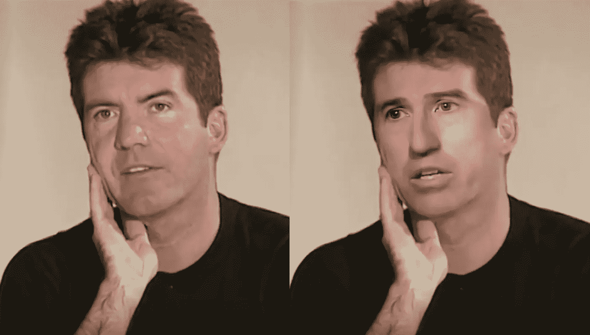
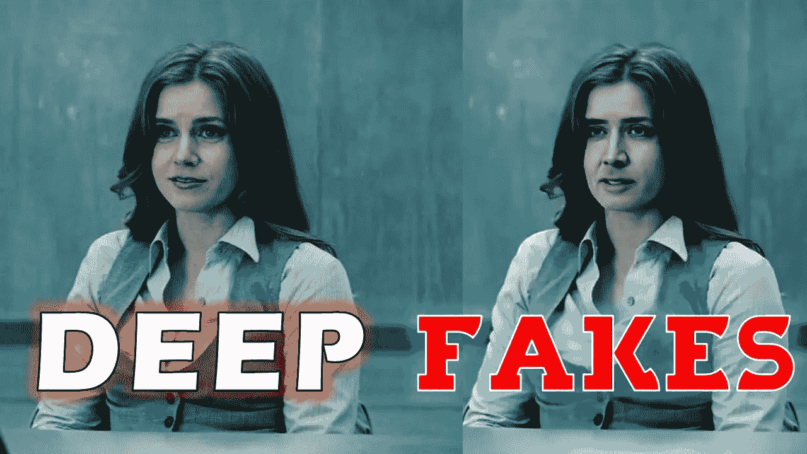

# Deepfake 是如何工作的，有什么优缺点？

> 原文：<https://medium.com/nerd-for-tech/how-does-deepfake-work-and-what-are-its-advantages-and-disadvantages-abd6599923a?source=collection_archive---------1----------------------->

eepfakes 是一种基于人工智能技术的技术，它通过将目标人物的脸与其他人交换来创建逼真的假图像或视频，这些人说的话或做的事实际上并不是他们做的。人们开始相信这种假视频，因为正常人的眼睛无法识别，需要深入分析。

# Deepfake 是如何工作的？

一个 Deepfake 视频看起来像是一个原创内容，让这个人做一些动作或就一个主题发言。并且在创建这种假视频时，来自不同角度的目标人的多个图像被用于叠加在原始人脸上。

图像与面部和其他身体部位相妥协，以使其看起来更具原创性，在创建视频时，声音也与目标人物一起克隆，使用人工智能工具来简化过程，并根据所说的话匹配嘴唇的移动。

> 深度视频影响了我们社会中的名人生活。政治家、演员、其他名人和企业界知名人士。基于人工智能和机器学习的工具被用来生成这样的内容。但借助[**deep fake detection**](https://cogitoai.home.blog/category/deepfake-detection/)服务有助于正确识别此类虚假视频。

Deepfake 的工作就像创造一个轰动的新闻故事，关于人们喜欢看的名人，也与他人分享或纳入他们的八卦。深度假色情视频得到更多的关注，并在成人网站上吸引更多的点击，增加了在线访问者对这些门户网站的依赖。

# 缺点

这种基于人工智能的技术对任何人都有利，但对我们社会的不同群体都有不利影响。除了制造假新闻和宣传之外，deepfake 主要用于报复色情，以诋毁著名的名人。

一旦虚假视频像病毒一样传播开来，人们开始会相信，并不断与他人分享，这会让目标人物在观看这种不寻常的行为时感到尴尬。除非目标名人的官方声明没有出现，否则许多人开始相信谣言，这使他们的生活变得困难，特别是当他们在社交媒体等各种平台上受到粉丝批评时。

# Deepfakes 优势

虽然它对社会有害，但它也有一些好处，如在网上观众中引起非凡的关注，使网页在搜索引擎上流行，因为越来越多的人开始搜索这些色情话题。

很少有不为所有人所知的名人也能一夜成名，因为人们开始搜索和阅读关于他们的信息，无论他们是谁，从事什么职业，以及更多关于他们的个人背景和目前在市场上的声誉。

> deepfake 的另一个实际优势是，它让我们意识到这些虚假的东西，我们不应该相信我们周围看到的一切。一旦我们发现它是假的，我们就会知道，下一次当这样的内容来自类似的来源时，我们会花时间去相信或做一些研究来验证新闻。

虽然这种好处只对观众而言，但对成为这种技术滥用受害者的人来说，并没有任何明显的好处。而及时检测这些伪造的图像或视频，只能帮助公认的人不成为 deepfake 的受害者，如果发生了，应该及时检测，以阻止进一步的传播。

无论如何，不管对我们社会的不同部分有什么影响，但是有许多公司提供 deepfake 检测服务来识别虚假图像或视频。 [**Cogito**](https://www.cogitotech.com/) 是提供 deepfakes 视频检测服务，为人工智能和机器学习提供训练数据，以开发基于人工智能的模型，可以准确检测 deep fakes 内容。