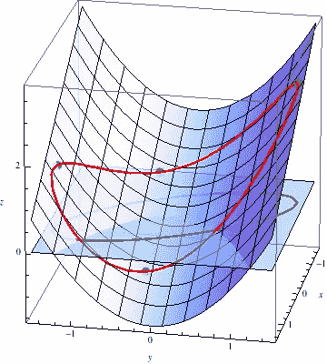

# 拉格朗日优化是如何工作的？

> 原文：<https://medium.com/nerd-for-tech/how-does-lagrange-optimization-work-fae0fcd9e674?source=collection_archive---------6----------------------->

在一个没有完美解决方案的世界里，优化现有的解决方案是进步的唯一途径。但是现实生活中的问题往往伴随着一系列的约束。在处理这种情况时，拉格朗日函数可以派上用场。每个企业每天都有许多约束要处理。制约因素可能包括制造设备、劳动力、预算等。所以目标是在约束条件下优化函数。

**第一步:**确定目标函数:它代表目标——利润最大化/错误率最小化

**第二步:**确定约束函数:它代表系统中的限制——预算、设备

**第三步:**通过组合上述两个函数，构造 Langrangian 函数。

考虑 x，z 是影响变量 u 的独立变量，我们试图优化它。

即 u 是 x 和 z 的函数，当翻译成数学语言时，可以写成:

u = f (x，z)

考虑一个约束 c，它也是 x，z 的函数

c = g (x，z)

将上述约束重写如下:

c — g (x，z) = 0

并且将其与所识别的目标函数相结合，待优化的方程由下式给出，Langrangian 函数= f (x，z)+λ(c-g(x，z))

这里，变量λ被称为 Langrangian 乘数，它测量被优化的目标变量的变化，给定一个单位的约束变化。它允许我们评估目标变量和约束之间的关系。现在回来，要优化的方程包含 3 个变量，即 x，z，λ。

微积分的一个强有力的应用是最优化。在优化上下文中，偏导数是梯度/斜率，它给出了函数向上或向下的方向。

这里的目标是找到受约束的最大/最小值。当我们继续沿着约束线前进时，会到达一个点，在该点处，约束线的斜率等于水平曲线的斜率(水平曲线是使用公式 f (x，y) = k 在等高线图上绘制的 2D 平面)。

因此，需要计算方程的三个偏导数， **∂** L/ **∂** x， **∂** L/ **∂** z， **∂** L/ **∂** λ并设置为 0。我们有 3 个方程和 3 个未知数。所以我们可以求解 x 和 z 的最优值，使 f 在给定的约束下最大化。

**示例:**优化目标函数 z+x2，服从约束 x+z=1

第一步:拉格朗日:L = z+x2 + λ(1-x-z)

第二步:偏导数

**∂**l/**∂**x = 2x—λ= 0…………..等式 1

**∂**l/**∂**z = 1—λ= 0……等式 2

**∂**l/**∂**λ= 1—x—z = 0………等式 3

步骤 3:求解三个联立方程:

λ = 1

x = y = 1/2

然而，在现实生活中，我们每天都需要做出商业决策，比如在财富约束下实现利润/效用最大化。

下面是一个著名的利用柯布道格拉斯方法解决制造商生产问题的例子:

f (x，y) = 100x^3/4 y^1/4

其中 x 是劳动单位，y 是资本单位。每个劳动单位花费€150，每个资本单位花费€250。劳动力和资本的总费用不能超过€50000。可能的最高生产水平是多少？

将约束转换为方程式:

150x + 250y = 50000

150x + 250y — 50000 = 0

待优化的拉格朗日函数由下式给出

l = 100x^(3/4)y^(1/4)—λ(150 x+250y—50000)

**∂**l/**∂**x =75x^(-1/4)y^(1/4)–150λ= 0……..等式 1

**∂**l/**∂**y =25x^(3/4)y^(-3/4)–250λ= 0……..等式 2

**∂**l/**∂**λ=-150 x—250y+50000 = 0……..等式 3

求解上述三个方程给出:

x = 250，y = 50

因此最大可能产量可以计算为:

f (250，50)= 100(250)^(3/4)(50)^(1/4)= 16719 单位