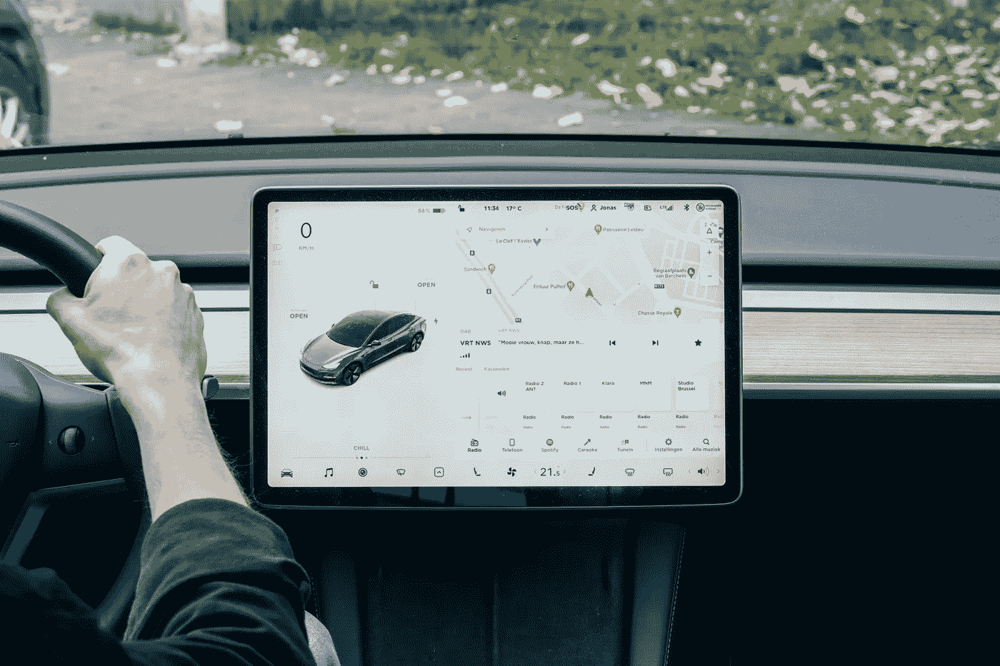

# 这家自动驾驶公司如何在不烧钱的情况下，一年内收入翻三倍？——第二部分

> 原文：<https://medium.com/nerd-for-tech/how-does-this-self-driving-company-triple-its-income-over-a-year-without-burning-money-part-2-e81b39f24577?source=collection_archive---------4----------------------->

## 第一阶段如何落地？

张德昭将自己的公司定位为“自动驾驶大脑”，像自动驾驶时代的“英特尔加安卓”模式，为 L4 级别的所有自动驾驶场景提供解决方案。

“英特尔加安卓”的模式是软硬件一体化，而其他自动驾驶公司往往只选择做“安卓”——也就是软件和算法的部分。

具体来说，Idriverplus 的自动驾驶大脑包括三层，张称之为“铁人三项”:

软件层是 AVOS，一个高内聚低耦合的自动驾驶软件平台。它集成了感知、认知、决策、控制等自动驾驶的必要模块，形成闭环操作系统。算法的核心层和应用层是分离的，有利于系统良好的扩展和可扩展性。

硬件层是自动驾驶域控制器 AVCU。它包括三个部分:综合感知/认知单元、智能决策单元和高精度控制单元。能耗低，已通过 AEC-Q 认证，符合 ISO 26262 功能安全标准。

数据层是打造一个数据闭环系统。大量数据反哺的算法可以适应更广泛的应用场景，从而助推数据技术的发展和商业化。对于不同场景的数据，Idriverplus 实现了基础功能软件和不同业务场景中使用的软件的分离，保证返回的数据可以在多个平台上使用。

“自动驾驶的本质是自主行走。”想象一个会开卡车的人坐在车里。虽然他/她不能马上掌握它的窍门，但与一个根本不会开车的人相比,“开车”的过程总是要容易得多。“超过 70%的数据可以通用，”张说。

根据自动驾驶大脑的技术平台，该公司在商业扩张上走上了一条“农村包围城市”的道路，即垄断农村地区的资源，控制对城市的供应。

对于一家以技术闻名的公司来说，选择着陆场景是重中之重。张表示，在实现商业化的过程中，科技公司必须考虑至少四个方向

第一，前沿科技。它意味着确保当安全员不在时，使用无人驾驶大脑的车辆仍能安全运行，不发生事故。

第二，市场空间大。在张看来，无论是什么场景，从一个项目的开始到最后的量产，一个公司需要投入的资源总是差不多的，这就要求公司把最小的精力投入到一个产出最大的市场。

第三，法律允许。自动驾驶公司将需要在当前法律允许商业运营的地方投入精力。如果目前的政策只允许测试、演示等。投入产出比会很低，不值得公司大量投资。

第四，与伙伴合作而不是危机感。Idriverplus 一直专注于自动驾驶大脑，深挖相关技术。

为此，该公司开发了三大产品线:智慧生活、无人驾驶特种车辆和智慧交通，因为前两者是龙头企业的支柱。

## 自动驾驶需要高质量的标记数据

从人工智能技术的研究方向来看，无论是在传统的机器学习领域还是深度学习领域，基于训练数据的监督学习仍然是一种主要的模型训练方法。尤其是在深度学习领域，需要更多的标记数据来提高模型的有效性。

在当前的人工智能应用实践中，不同水平的数据质量显示了人工智能解决方案价值的明显差距。

高质量的训练数据会让人工智能的效率最大化，而低质量的 AI 数据不仅不可能提高效率，还会在一定程度上阻碍人工智能的进化。

## 结束

把你的数据标注任务外包给 [ByteBridge](https://tinyurl.com/yccctrrm) ，你可以更便宜更快的获得高质量的 ML 训练数据集！

*   无需信用卡的免费试用:您可以快速获得样品结果，检查输出，并直接向我们的项目经理反馈。
*   100%人工验证
*   透明标准定价:[有明确的定价](https://www.bytebridge.io/#/?module=price)(含人工成本)

## 为什么不试一试？

资料来源:https://baijiahao.baidu.com/s?id = 1724718277147582954 & wfr =蜘蛛&for=pc