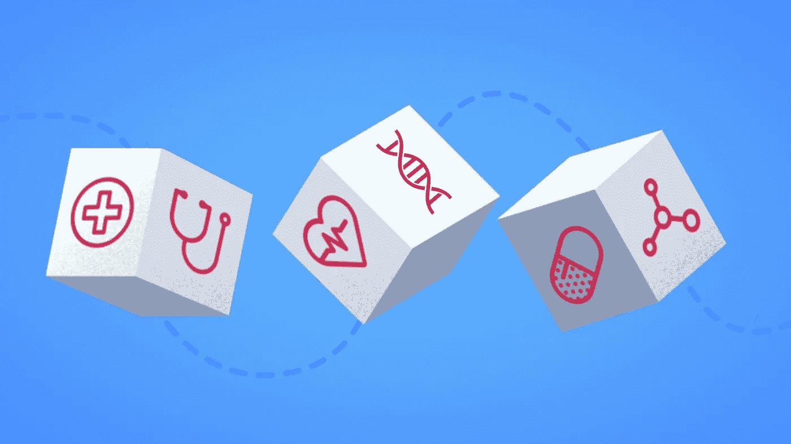

# web3 如何改善医疗保健基础设施？

> 原文：<https://medium.com/nerd-for-tech/how-does-web3-improve-the-healthcare-infrastructure-d71903a134a7?source=collection_archive---------3----------------------->

当 web 的第二次迭代 Web 2.0 出现时，发现了几个实际应用和用例。它引入了几项创新技术，如电子健康记录、远程医疗、医疗保健应用等，以改善医疗保健基础设施，使其更易于使用和组织。然而，当提供的服务和解决方案很棒的时候，它们也隐藏着许多危险。它带来了更大的安全威胁和其他主要问题，许多医疗机构正在重新考虑实施基于 Web 2.0 的技术。这些缺口需要填补，而 [Web3 solutions](https://www.leewayhertz.com/web3-development-company/) 可以成功解决这些缺口。

*让我们了解 Web 2.0 技术在医疗保健领域的缺点，以及 Web3 如何改善医疗基础设施。*

# Web 2.0 和医疗保健

随着网络发展到 Web 2.0 而发展起来的医疗保健被称为医疗保健 2.0。第二版医疗保健改变了医疗保健系统的传统方法，使其更加有效和稳健。各种技术，如移动医疗、远程医疗、互联医疗、EHR 等。，让患者更深入地了解他们的健康和相关问题。使用 MyFitnessPal 或 Hydro 蔻驰等应用程序，他们可以跟踪自己的食物和水摄入量、健身和锻炼时间、冥想和瑜伽，以保持健康。

然而，尽管它给医疗保健基础设施带来了积极和革命性的变化，但它带来的威胁更大。拥有保护薄弱的网站、数据库和服务器的医疗机构容易受到网络安全攻击。黑客和网络犯罪分子总是寻找配置错误或保护薄弱的数据库来攻破系统并索要赎金。不幸的是，世界上许多医疗机构没有强大的数据管理系统；因此，黑客可以随时侵入并利用系统。此外，许多医疗保健提供商拥有过时的医疗设备和装置，没有最新的威胁防御。

拥有电子受保护健康信息(ePHI)的医疗保健机构应具备足够的技术安全措施来防止任何风险。他们还应该拥有经常审查的网络安全政策和程序，最重要的是，有足够的网络意识。

# 医疗保健中的 Web3

[医疗保健中的 Web 3](https://www.leewayhertz.com/web3-in-healthcare/)旨在解决医疗保健中 Web 2.0 的缺点，并为基础设施增加价值。能够彻底改变医疗保健行业的 web3 组件包括:

*   区块链
*   虚拟空间
*   NFTs

web3 在医疗保健领域的几个使用案例包括:

## 1.患者数据管理和数据所有权

目前的医疗保健基础设施难以进行适当的数据管理。每个访问医疗保健机构的患者都需要单独的病历，存储和管理这些病历对这些机构来说可能会变得非常繁忙。此外，没有病人可以访问他们的医疗记录，这些记录存储在中央服务器上。这就是区块链可以帮助管理患者数据的地方。不可变的记录分类帐可以存储任何不可编辑或删除的信息。它有助于正确的数据管理，并保持数据的组织性和结构化。

患者只能访问存储在区块链中的数据，并且完全有权向他们想要的医疗保健专业人员提供访问权限。医疗保健专业人员使用智能合同在区块链上保存患者的病历。生成的公钥或独特的 ID 是允许任何人访问数据所必需的。持有钥匙的患者可以在任何需要的时候与专业人员分享它。

## 2.数据保护

现在医疗保健数据的管理方式容易受到安全缺陷的影响，并且很容易被黑客攻击。集中式服务器必须值得信任，患者希望服务能够保护他们的数据并遵守隐私法。

区块链技术无法被篡改，因为它是一个去中心化、分布式和不可变的账本。由于数据分布在节点上，攻击者必须攻击网络中的每个节点来入侵、修改或删除数据，这几乎是不可能的。此外，访问数据需要患者的许可，篡改数据也是不可能的。这使得医疗保健提供商能够存储敏感信息，而不会造成数据泄露。

## 3.防止药品假冒

由于供应链缺乏透明度，医疗保健行业越来越担心药品造假。原药被非法药品生产者篡改、假冒，导致药品中必要成分减少或活性物质未在标签上列出。

医疗保健领域的网络 3 将有助于管理和减少假药市场。自动区块链提供药物可追溯性和安全性。每个事务的信息都被添加到区块链环境中的数据块中，这些数据块是不可变的，不能被更改、销毁或修改。事务日志还包括时间戳。因此，如果整个供应链都转到区块链网络，每种药品在分销前都在供应链上注册，就可以消除假冒药品的问题。如果在区块链上找不到任何药品记录，它可以很容易地被识别为假药，并在到达消费者之前从供应链中消除。

## 4.外科手术

元宇宙集成了各种技术，如 AR、AI、VR、3D 重建、区块链等，为执行外科手术提供了一个独特的生态系统。通过元宇宙，需要手术但在本国不一定能获得手术的病人可以与世界各地的外科医生合作。然后，医生可以通过查看患者的资料并选择最佳行动方案来制定策略。

有时，著名的外科医生与其他地方的外科医生合作，通过元宇宙支持手术。这在无法获得某些疾病或紊乱治疗的国家是成功的。

## 5.医疗培训

在目前的医学培训技术中，学生只能观看和学习 2D 图形和视频。许多医学教育机构允许学生在尸体上练习，这引起了伦理和法律问题。

学生可以在元宇宙观察人体细胞水平的 3D 视图，这可以激发真实世界的过程并促进真实世界的操作。3D 可视化提供的身临其境的体验、社交互动和引人入胜的氛围都得到了增强，没有任何危险问题。在进行真实手术之前，学生们可以在元宇宙通过虚拟手术来练习他们的技能。

## 6.患者病历和货币化

目前没有单一的主病人记录文件，因为医疗记录保存系统是分散的。如果使用 web3 技术来管理和跟踪医疗记录，患者可以在一个位置对每个记录进行分类和组织。如果他们去了另一家医疗保健机构，他们仍然可以访问患者档案，避免携带他们的文件和向许多医生解释他们的病史。

患者也可以通过将他们的医疗记录转化为非功能性医疗记录来赚钱。这些数据可以转换成 NFT，然后存储在区块链中，患者以外的任何人都无法访问这些可追踪的 NFT。然后，他们可以把它卖给医生或那些想把这些信息用于学习、研究或创造新的医疗产品的人。

总体而言，医疗保健中的 web3 集成有助于维护结构化数据管理系统，并将数据控制权交还给消费者。