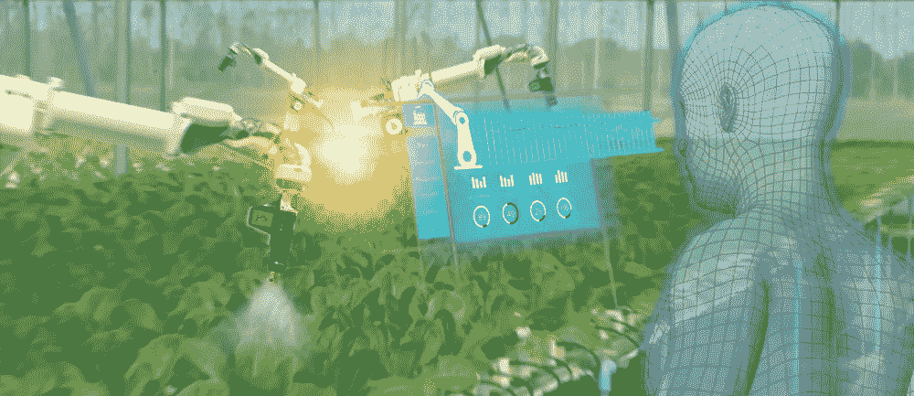

# 无人机如何应用于农业:无人机在农业中的应用

> 原文：<https://medium.com/nerd-for-tech/how-drones-can-be-used-in-agriculture-drones-applications-in-agriculture-1b4732523169?source=collection_archive---------13----------------------->

人工智能无人机也被称为**自主飞行物体**，在提高各个领域的效率和生产力方面发挥着重要作用。在农业领域，它被广泛用于执行各种任务，帮助农民提高农场生产力，提高作物产量。

**又读:** [图像标注在精准农业应用机器学习中的作用](https://www.anolytics.ai/blog/role-of-image-annotation-in-machine-learning-for-precision-agriculture/)

但是现在的问题是,**无人机目前是如何被用于农业的。**因此，在本文中，我们将通过示例和用例来讨论**无人机在农业**中的应用。以及如何通过机器学习训练过程使这种自主飞行器成为可能。

**无人机在作物健康监测中的应用**

农民正在使用无人机飞越成熟的农田，检查作物的健康状况。是的，通过基于计算机视觉人工智能的技术，这些无人机可以捕捉这些有用的信息，并向农民提供最有用的细节。如果作物有任何杀虫剂或其他问题，农民可以采取正确和及时的决定来保护作物免受这种威胁。

**无人机在基于 3D 的野外测绘中**

同样，农田也可以从耕种或耕作的角度来绘制。由于农业用地的奇特结构，很少有不适宜或不太肥沃的土地会产生低产。如果在耕种之前农民能得到肥沃的土地，这可以节省他们的时间和精力。而另一方面，无人机可以通过基于人工智能计算机视觉的相机提供这些数据，并获得准确的结果。

**无人机在存量房管理中的应用**

农业中的牲畜——当然，农业中的人工智能是最重要的业务。是的，在畜牧业中，无人机被用于监控牲畜，如在旷野吃草的牛、水牛或羊。这些无人机还接受了高质量的**无人机训练数据**的训练，通过它们的人脸识别技术识别每只动物，帮助农民不断检查他们的牲畜。

**无人机对田地进行地理传感**

同样，地理传感技术，通过捕捉卫星图像来检查地理区域。在农业领域，无人机帮助农业或生物科学研究农业领域的土壤状况，如水分水平、土地肥力、土壤质量以及从农业角度来看的其他重要信息。无人机可以在半空中飞行，长距离覆盖大片土地，节省了植物学专家分析各种有用信息和有效利用这些土地的时间和精力。

**无人机在森林管理中的应用**

参与种植园业务、种植树木并出于商业目的收获树木的农民也从人工智能无人机中受益。是的，这个自主飞行的物体被用来监视树木，监视非法砍伐树木者，观察不寻常的活动，如森林中的火灾，以及识别树木等。无人机中的人工智能摄像头可以执行此类操作，帮助农民提高植树业务的利润。这种无人机还可以用夜视摄像头在夜间监控树木。

**Anolytics** 是一家**数据注释公司**，为计算机视觉提供**机器学习训练数据集**。它还参与图像注释服务，为无人机 生成 [**训练数据集，使人工智能在农业和耕作中以更少的努力实现更高的生产率成为可能。**](https://www.anolytics.ai/solutions/autonomous-flying/)