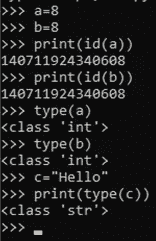
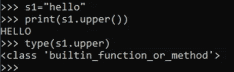
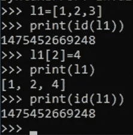
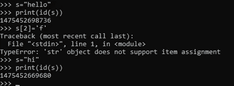
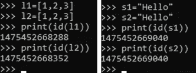
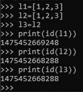
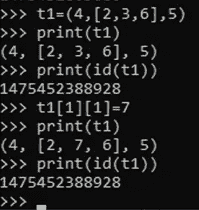

# python 中的一切都是对象？

> 原文：<https://medium.com/nerd-for-tech/how-everything-in-python-is-an-object-435b03945f98?source=collection_archive---------9----------------------->

Python 是一种面向对象的编程(OOP)语言。OOP 是关于创建类和对象的。在 python 中，一切都是对象，这意味着在用 python 编写代码时，对象被广泛使用。

在继续讨论 python 中的一切是对象之前，让我们首先讨论什么是对象？

**什么是对象？**

一个对象是一个类的实例，这个类有一些元数据，称为属性和相关的方法。属性是用来引用数据的变量，方法是定义对象行为的函数。这些对象可以赋给变量，也可以作为参数传递给函数。我们可以说*一个类的 python 变量和函数是由它的对象封装的。*

**python 中的一切都是对象-**

python 中的数字、列表、字符串、函数、模块和其他一切都是对象。甚至对象的属性和方法也是对象。

让我们考虑一些例子

1- id()返回对象创建时的唯一 id。type()返回对象的类型，该对象是它所属的类。

如上例所示，a 和 b 的 id 相同，这意味着它们引用了同一个对象。这也说明了*我们可以给同一个对象取多个名字。*a 和 b 的类型都是< class 'int' >，而 c 的类型是< class 'string' >。

2-对象的属性和方法通过点语法来访问。).下面的示例显示字符串有一个 upper()方法，该方法将字符串转换为大写。

我们还可以在上面的例子中看到，如果我们试图打印方法的类型，结果是<class>这表明*甚至一个对象的属性和方法本身也是一个对象。*</class>

**可变和不可变对象**

可变对象是那些可以被修改并且 id 保持不变的对象。示例-列表

不可变对象不能被修改。如果它的值改变，它的 id 也会改变。示例-字符串

让我们看另一个例子来理解如何将 id 赋予可变和不可变对象。

我们看到 l1、l2 列表有相同的内容，但有两个不同的 id，而 s1、s2 字符串有相同的内容和 id。

这是因为列表是可变的。它们是可以改变的。如果我们给出相同的内容，那么就会创建两个不同的对象，从而产生两个不同的 id。如果在列表 l1 中进行了任何更改，它们将不会反映在 l2 中，反之亦然。

如果我们想给一个可变对象一个不同的名字，我们可以用下面的方法:

例外:元组是不可变对象。但是如果我们想修改元组中列表的内容，我们可以这样做。此外，尽管元组是不可变的，但是元组的 id 将保持不变。

感谢阅读！