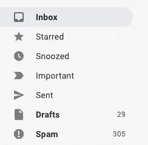
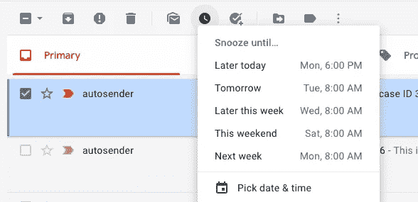
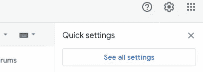
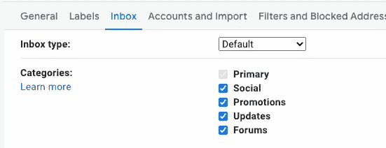
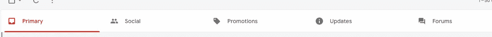
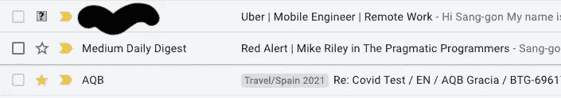
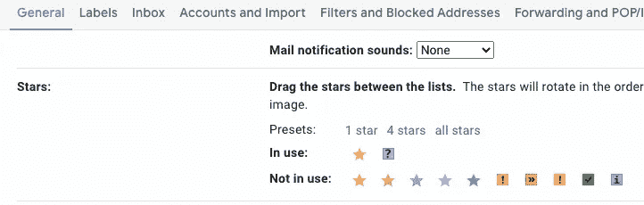
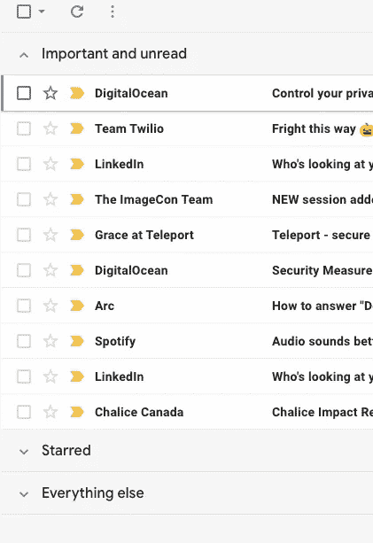

# 我如何总是保持我的 Gmail 有 0 封未读邮件，减少分心

> 原文：<https://medium.com/nerd-for-tech/how-i-always-keep-my-gmail-with-0-unread-emails-with-less-distraction-ede2a9bc5bc2?source=collection_archive---------3----------------------->

我的个人和工作的 Gmail 收件箱从来不会被浏览器标签中类似(37)的邮件淹没。感谢这一点，我从来没有错过或忘记我收到的电子邮件。感谢前一家公司的首席执行官教会了我这些！

# 小睡

小睡功能改变了我的生活。基本上，你可以用它来提醒那些你现在没有时间回复或处理的邮件，但你想在某个时候，比如说一周后。

点击时钟图标进入睡眠状态。

# 将不太重要的移至非主要选项卡

默认情况下，你有 3 个标签:主要，社会和推广。你知道你可以添加两个:更新和论坛吗？

要进行配置，请单击右上角的齿轮图标，然后单击“查看所有设置”:

然后单击“收件箱”选项卡，选择您自己的选项卡类别集:

你可能也注意到了“收件箱类型”。这将在后面的部分解释。

对于所有不重要的，我要么删除它们，要么移到其他标签。我个人的经验是，如果我问自己“一年后我可能还需要这封邮件吗？”只有在我回答“是”的情况下，我才会将它们放在主选项卡上。

# 定制星星

除了默认的黄色星星，您可以添加更多的星星类型。如果你想进一步分类你的电子邮件，这可能是有用的。(例如，在下面的截图中，我可能会对我正在讨论是否回复的电子邮件使用问号)

以同样的方式配置额外的选项卡，这次转到 General 选项卡，向下滚动一点，直到看到“Stars”部分。

# 优先收件箱

上面截图中设置的收件箱选项卡下的“收件箱类型”可以让你以一种整洁的方式组织你的主收件箱。您可以根据电子邮件是否被标记为重要、已加星标、未读或它们的某种组合来确定显示顺序的优先级。

就我个人而言，我不使用这个功能，因为我只在主选项卡中保留重要的内容，而不会在主选项卡中留下任何未读的内容(我要么阅读它们并采取后续行动，要么暂停它们)。