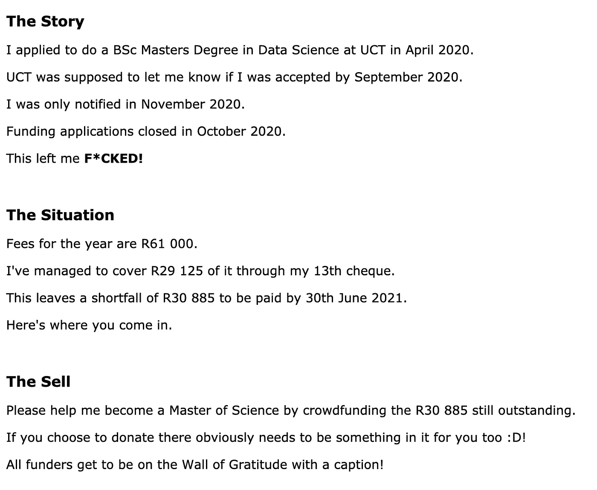
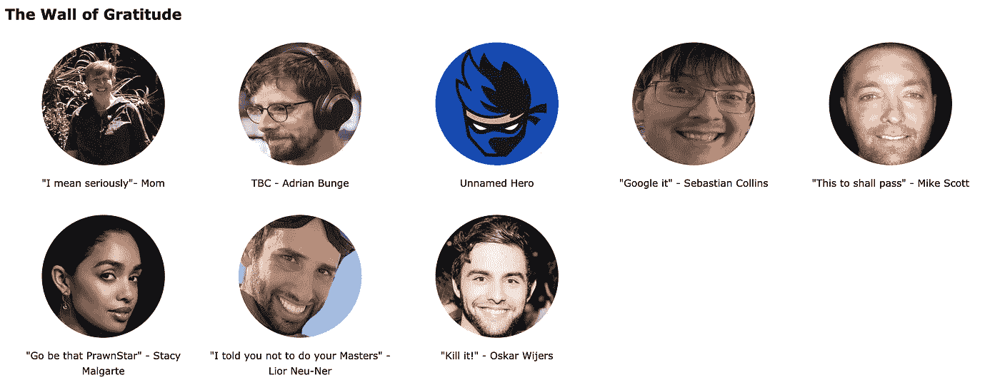
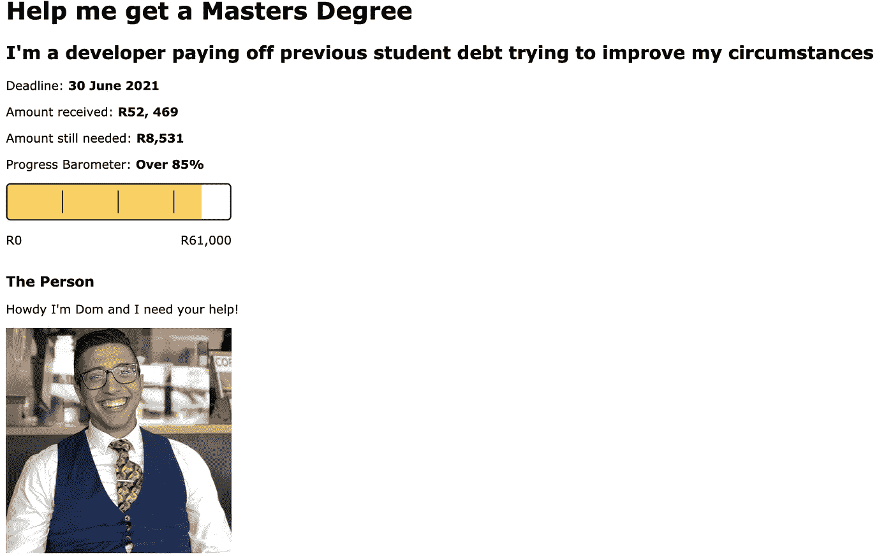
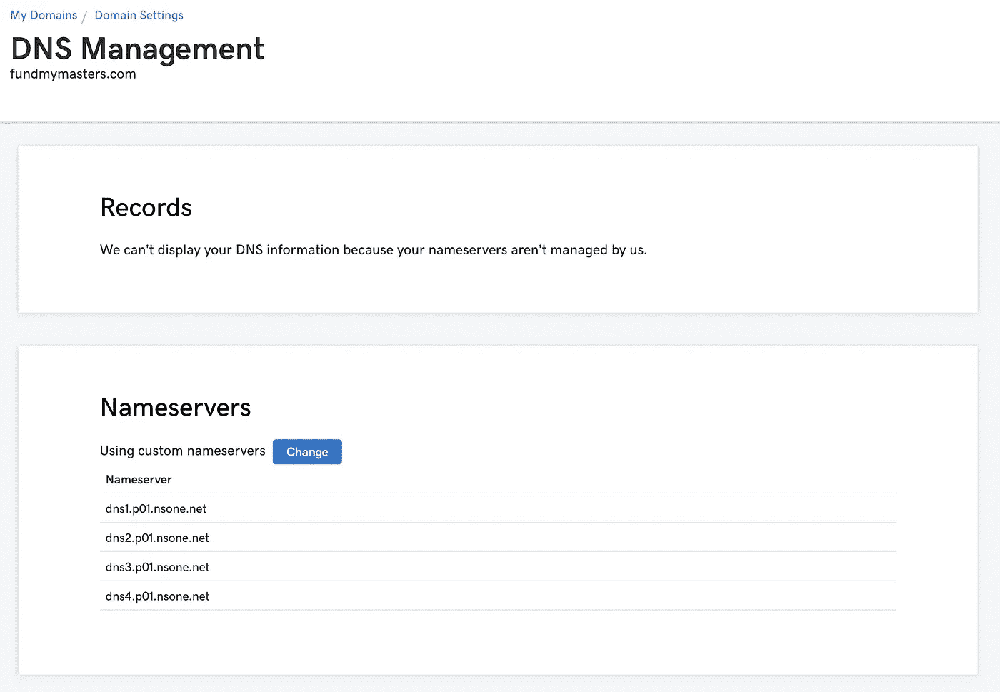

# 我如何建立一个网站来帮助众筹我的硕士学位

> 原文：<https://medium.com/nerd-for-tech/how-i-built-a-website-to-help-crowdfund-my-masters-degree-2836c2bc84e3?source=collection_archive---------15----------------------->

我最近被数据科学硕士项目录取了。不幸的是，大学管理部门给我的确认太晚了，我无法申请资助。让我陷入学费困境。

幸运的是，我用我的第 13 张支票筹到了所需金额的一半。然而，这仍然留下另一半需要支付。

在研究了不同的融资网站和潜在的融资机会后，很明显，他们中的大多数都拿走了收益的很大一部分(有些人拿走了近 10%)。

这简直让我无法容忍。

我想，既然我有这些技能，为什么不建立一个简单的网站，用我的银行信息向任何想做贡献的人解释这种情况。

这将允许我把收到的全部金额分配给主人。

以下是我如何在一天内建立并运行网站的。

# **保持简单**

由于这需要是一个简单的网站，我排除了使用任何框架(如反应，Vue 等)，因为这些增加了不必要的复杂性。

这就剩下了久经考验的 HTML 和 CSS 网站。

我开始写我想要的草稿，没有任何 CSS。我的重点是尽可能简单地传达信息。任何人都可以很快了解情况，并很容易采取行动——营销 101。

网站上的解释

在了解了核心故事之后，我以感恩墙的形式添加了一个小小的感谢。利用天下没有免费的午餐这一理念。

我的感恩墙(2021 年 3 月 16 日)

我还试图通过添加一张我自己的照片、一个漂亮的标题和副标题以及一个标尺来直观地展示已经取得的进展，从而使它更有个性。

*提示:我使用 VSCode 和*[*Live Server*](https://marketplace.visualstudio.com/items?itemName=ritwickdey.LiveServer)*扩展对快速开发这个网站至关重要。它自动加载浏览器中的更改，减少了重新加载 index.html 的需要。*

# 抓住它

接下来，我需要将它添加到我的 Github 中，这样我就可以应用更改并远程保存代码库(以防万一)。

# NETLIFY + GITHUB =动态二重奏

将我的 Github repo 链接到 Netlify 允许我将 CI/CD 管道添加到我的工作流中。每次我提交对 Github 的更改，它都会在 Netlify 上触发一次重新部署。

*提示:逐步指导* [*链接 Netlify 到 Github*](https://www.netlify.com/blog/2016/09/29/a-step-by-step-guide-deploying-on-netlify/) *。*

现在我在 Netlify 上建立了一个网址为 https://ecstatic-swartz-26fc94.netlify.app/的网站。

虽然 Netlify 允许你用一个随机的 URL 来托管一个网站，这是一个史诗，但不幸的是，当你在网上向别人要钱时，这看起来并不合法。

因此，我需要购买便宜但描述性的域名。

# 来吧，爸爸

我从来没有意识到注册一个域名是多么简单和便宜。 [Go Daddy](https://za.godaddy.com/domains) 让它变得非常简单实惠(大约 12 美元)。

你所需要做的就是[去网站](https://za.godaddy.com/)输入你想要的域名，然后按照步骤购买。我只花了 5 分钟。

*提示:你可以通过 Netlify 购买域名。我建议这样做是为了让事情变得简单，这样你就可以忽略这个和下一步。下面就有一个* [*如何做的指南*](https://www.netlify.com/blog/2018/06/19/buy-and-secure-a-custom-domain-through-netlify/) *。*

# 链接到 NETLIFY 的 DNS

为了简化事情，我让 DNS 使用 Netlify 的 DNS 服务。

这需要更改 GoDaddy 中的 DNS 设置。

GoDaddy 上的已更改名称服务器

然后嘣！我在[https://www.fundmymasters.com](https://www.fundmymasters.com)或[https://fundmymasters.com](https://fundmymasters.com)有一个安全的工作网站(可能需要一些时间来传播这个变化)。

*提示:如果你需要一步一步的指导，这里有一个* [*伟大的博客*](https://levelup.gitconnected.com/netlify-custom-domains-8b4cc5fddb5d) *。*

# 不要忘记那些小事

在得到一个可以工作的网站后，我问了一些好朋友，他们对这个网站有什么想法，以及他们认为我可以改进的地方。

这让我意识到我既没有 favicon 也没有 metatags，所以当我在脸书、LinkedIn 等网站上分享这个网站时，它看起来真的很棒

还要在 Netlify 中添加 SSL/TLS 证书，以便您的站点使用 https！在 Netlify 中进入域管理，点击 HTTPS 并添加一个[让我们加密](https://letsencrypt.org/)证书。

说明在 Netlify 中的何处进行此操作

这些小事让世界变得不同。添加所有内容后，共享内容如下:

看起来很安全。

# 现在是最难的部分！

设置好之后，就到了困难的部分——让人们捐款。

幸运的是，我相当成功。截至本文写作之时，只剩下 10%了。

我必须衷心感谢那些决定为我的未来投资的人——这真的意义重大。

我希望这能说明以域名为代价建立一个网站真的很容易。希望你能找到一个应用到自己生活中的用例:)！