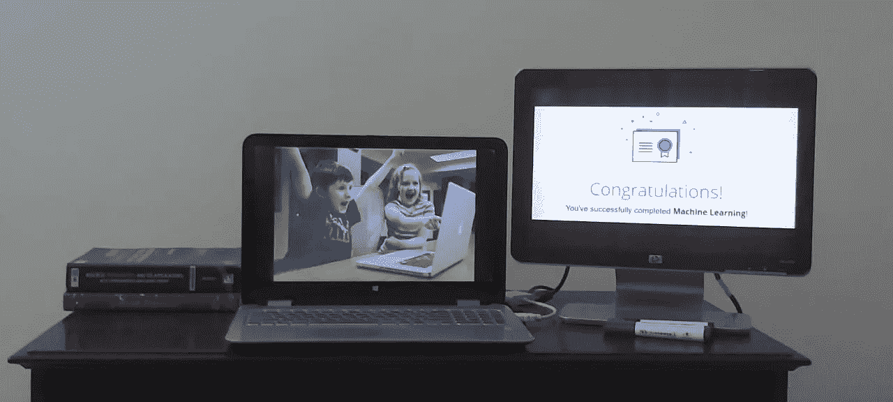

# 我是如何在 Coursera 上完成吴恩达教授的机器学习课程的？

> 原文：<https://medium.com/nerd-for-tech/how-i-completed-machine-learning-course-taught-by-prof-andrew-ng-on-coursera-761c98d59743?source=collection_archive---------1----------------------->

左边是作者提供的图片:笔记本电脑上的图片由 [StartupStockPhotos](https://pixabay.com/users/StartupStockPhotos-690514/) 在 [Pixabay](https://pixabay.com/) 上提供

是的，你也可以，只要努力，结果就会出现

# 小故事:我为什么开始学机器学习？

因为我喜欢做很酷的东西，喜欢玩我能真正理解并与你们交流的知识:)