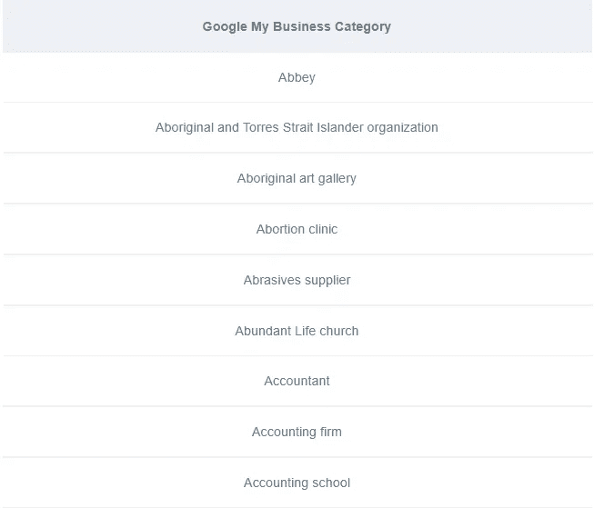
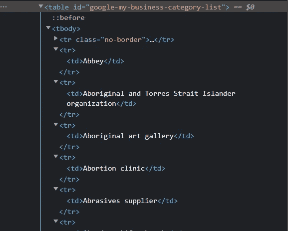
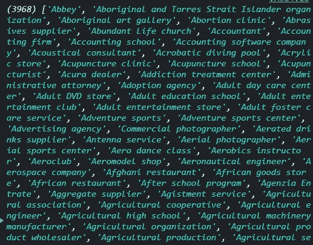
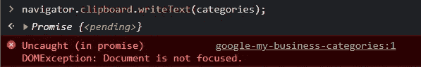
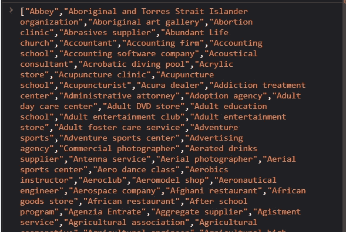

# 我如何使用 JavaScript 从一个网站上复制了大约 3968 条记录

> 原文：<https://medium.com/nerd-for-tech/how-i-copied-about-3968-records-from-a-website-using-javascript-b8e44514253e?source=collection_archive---------3----------------------->

Amy Shamblen 在 [Unsplash](https://unsplash.com/s/photos/fun-background?utm_source=unsplash&utm_medium=referral&utm_content=creditCopyText) 上的照片

因此，我在寻找一种方法来调出数以千计的商业类别，以节省我必须逐一键入它们的时间，我发现这个伟大的网站[道尔顿卢卡](https://daltonluka.com/blog/google-my-business-categories)列出了近 4000 个类别。

接近 4000 个业务类别来源— Dalton Luka

然后我让自己找到一种简单的方法，用 JavaScript 复制所有这些类别，并在我的项目中使用它们。

# 我是如何开始的

我使用 inspect 元素来查看这些数据是如何组织的，我看到这些数据是以表格的形式组织的，这使得这个过程对我来说简单多了。

此时，我需要做的就是找到一种方法来获取带有类别的所有表格单元格元素，遍历它们，并将它们的内部 HTML 存储在一个数组中。

这是我用的代码。

所以当你把**类别**登录到控制台，你会看到大概有 **3968** 条记录！那就接近 **4000 了！**

## 那么，我如何复制类别呢？

为了将类别复制到剪贴板，我们将使用**navigator . clipboard . write text()**。但是有一个问题。

如果您试图直接从控制台复制代码，您将遇到下面的错误。

为了处理这个错误，我们需要设置一个超时，在 5 秒钟、**后，它会将类别复制到剪贴板**，在此期间，我们将点击 web 页面上的任意位置，以获得要关注的文档**。**

由于我们将类别数组复制到剪贴板，我们需要使用 **JSON.stringify()将其转换为字符串。**

这是完整的代码

如果您没有收到错误，那么它一定是复制成功了。

要确认，使用**命令+ V.** 你应该看到下面的数据

> 一个好的 web 开发人员的能力在于他能够利用自己的知识找到解决问题的代码。

你有它！这就是我如何使用 JavaScript 从网站上轻松复制 3968 条记录的方法。