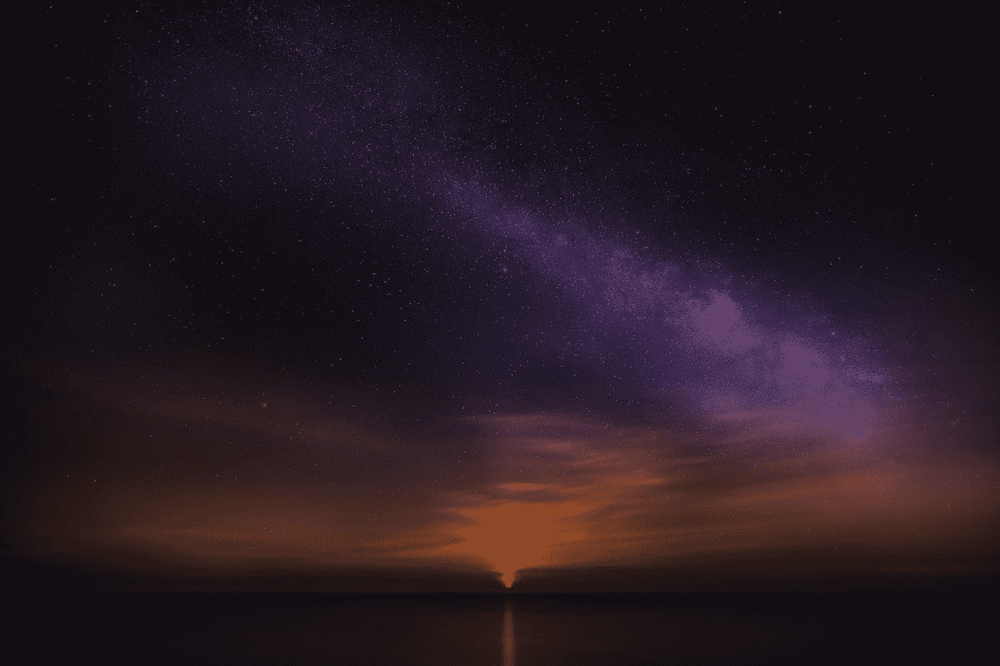
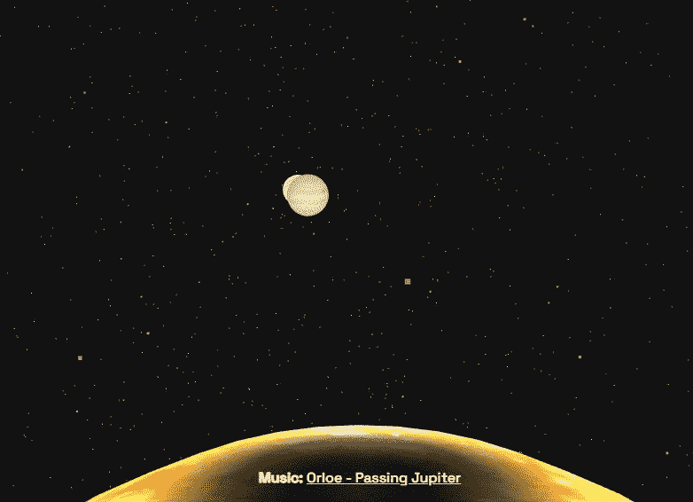
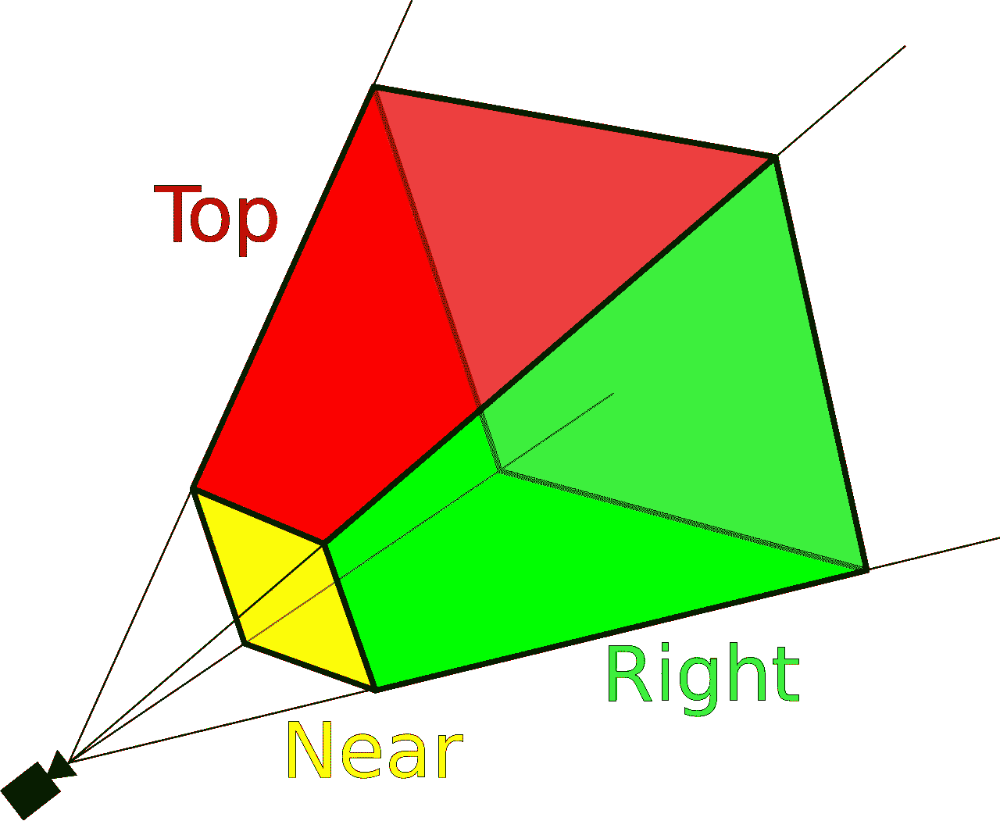
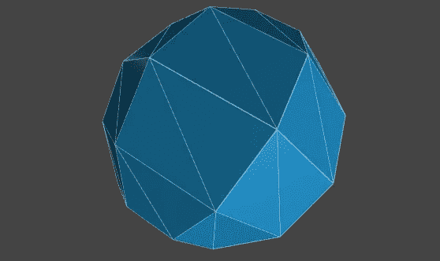
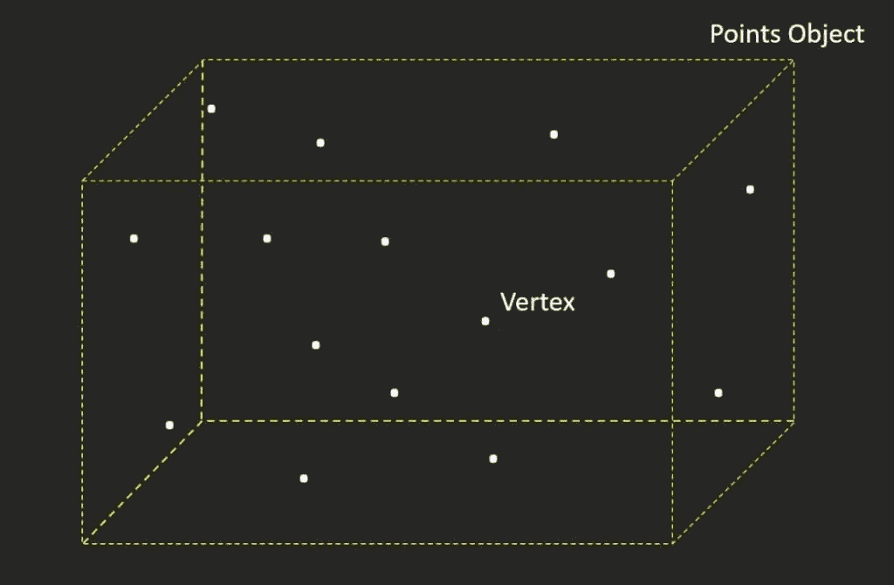
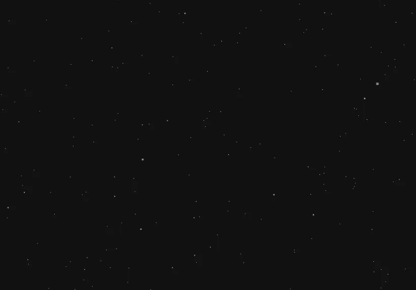
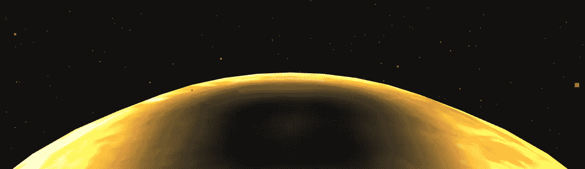

# 我如何创建我的第一个 three.js 项目

> 原文：<https://medium.com/nerd-for-tech/how-i-created-my-first-three-js-project-fb8fadbe9b6d?source=collection_archive---------2----------------------->

## 木星和土星会合



[Zoltan·塔斯](https://unsplash.com/@zoltantasi?utm_source=medium&utm_medium=referral)在 [Unsplash](https://unsplash.com?utm_source=medium&utm_medium=referral) 上的照片

我把这篇文章分成几个部分:

*   想法
*   Three.js 基础
*   创造星辰(宇宙)
*   添加行星
*   添加音乐
*   循环动画

[**Demo**](http://conjunction.mairo.eu/)***/Github 上的代码:**

[](https://github.com/miresk/planets-conjunction/blob/master/main.js) [## 米雷斯克/行星-会合

### 此时您不能执行该操作。您已使用另一个标签页或窗口登录。您已在另一个选项卡中注销，或者…

github.com](https://github.com/miresk/planets-conjunction/blob/master/main.js) 

*我建议在更大的屏幕上打开演示(应用程序的缺陷列在文章的最后)

## 想法

几年前，我发现了这个[圣诞实验网站](https://christmasexperiments.com/experiments)——一个以各种数字艺术家为特色的降临节网络日历。看起来该项目已经被放弃，最后一个版本是 2018 年的。

无论如何，当我检查这些例子时，我的头脑被震惊了，我感到很受鼓舞。但学习 three.js、canvas 或 WebGL 也感觉是一项令人生畏的任务，我的愿望出现得越快，消失得越快。多亏了我的一个朋友，我想到了一个 2020 年末的简单项目。

我首先想到的是创造一些圣诞节的东西，包括雪、树等等。但最终我发现，木星和土星将在 2020 年 12 月 21 日靠近他们的伟大会合。上一次发生这种情况是在 400 年前。正如[npr.org](https://www.npr.org/2020/12/09/944560103/jupiter-and-saturn-will-be-together-again-for-the-holidays?t=1607870435507)所写:

> 在正确的时间，无论是通过望远镜还是肉眼，这些气态巨行星的间距大约是典型满月直径的五分之一。在这种接近度下， ***行星看起来会接触甚至形成天空中一颗大而明亮的星星。***

这是一个激动人心的大事件，我决定用网络技术来可视化它。网上有很多 three.js [的例子](https://threejs.org/examples/)帮助我把它们放在一起。这是结果的预览:



土星和木星会合

我将只简要描述 three.js 的几个概念和项目的具体部分，因此要了解更多的实现细节，我推荐这本免费的书— [Discover three.js](https://discoverthreejs.com/book/) ，它解释了开始时你需要知道的一切！

## Three.js 基础

Three.js 由 3 个主要部分组成:

*   事件
*   照相机
*   渲染器

[**场景**](https://threejs.org/docs/?q=scene#manual/en/introduction/Creating-a-scene) 就是你在上面 Gif 中看到的宇宙。这是一个三维空间，其坐标系有三个轴— *x，y，z* (0，0，0 是宇宙的中心)。我们这样创建它:

```
scene = new THREE.Scene();
```

相机有几种类型，常见的有 [**透视相机**](https://threejs.org/docs/#api/en/cameras/PerspectiveCamera) 。它模仿了我们的视觉方式。有一种东西叫做[截锥](https://en.wikipedia.org/wiki/Viewing_frustum)，是屏幕上出现的空间的一部分。



[观察平截头体](https://en.wikipedia.org/wiki/Viewing_frustum#/media/File:ViewFrustum.svg)

例如，放在它后面的一些东西是看不见的。相机是这样定义的:

```
camera = new THREE.PerspectiveCamera(
  fieldOfView,
  aspectRatio,
  nearPlane,
  farPlane
);camera.position.x = 0;
camera.position.y = 100;
camera.position.z = 200;
```

**渲染器**使用 WebGL 库在你的屏幕(画布)上显示场景。它叫做 [WebGLRenderer](https://threejs.org/docs/?q=renderer#api/en/renderers/WebGLRenderer) ，定义为:

```
renderer = new THREE.WebGLRenderer();
```

作为最后一步，我们必须调用 *render()* 方法，在这个方法中，我们传递先前创建的场景和摄像机。

```
renderer.render(scene, camera);
```

此时，我们还看不到任何东西，因为我们没有创建任何几何对象，也没有灯光来照亮它们。

> 有趣的事实:你在场景中看到的一切都是由三角形组成的。



球体也是三角形:-)

几乎所有其他东西都是从 main *THREE* 类派生的，所以对于上面的球体，我们可以写:

```
*const* sphereGeometry = new THREE.SphereGeometry(1, 32, 16);
```

在我们变得更具体之前，我想先解释一下 three.js 的基础知识。

## 创造星辰(宇宙)

我们可以用几何图形(BufferGeometry)和粒子(Points)来创建星星。

> [buffer gerometry](https://threejs.org/docs/?q=BufferGeometry#api/en/core/BufferGeometry)——网格、线或点几何图形的表示。包括顶点位置、面索引、法线、颜色、uv 和缓冲区中的自定义属性，减少了将所有这些数据传递给 GPU 的成本。

你可以把它想象成一个里面有很多点的长方形。



[恒星粒子](https://redstapler.co/space-warp-background-effect-three-js/)

在下面的代码中，你可以看到我们定义了一个几何变量和一个顶点数组。我们为六千颗星星创建一个循环，并用随机分布的值(x，y，z)填充顶点数组。你可以想象一下上面的矩形里填满了 6000 个点。

我们将 1500 作为每个坐标的值。用数字来定义界限。然后我们使用 *geometry.setAttribute* 方法设置这些值的位置。

```
*const* geometry = new THREE.BufferGeometry();
*const* vertices = [];*for* (*let* i = 0; i < 6000; i++) {
  vertices.push(THREE.MathUtils.randFloatSpread(1500)); *// x* vertices.push(THREE.MathUtils.randFloatSpread(1500)); *// y* vertices.push(THREE.MathUtils.randFloatSpread(1500)); *// z* }geometry.setAttribute(
  "position",
  new THREE.Float32BufferAttribute(vertices, 3)
);
```

现在让我们创建代表恒星的粒子。

```
particles = new THREE.Points(
  geometry,
  new THREE.PointsMaterial({ color: 0x888888 })
);scene.add(particles);
```

我们可以给它们添加一些漂亮的纹理，但是在这种情况下仅仅定义一种颜色就足够了。这是我们静态宇宙的结果。我们将稍后制作动画。



## 添加行星

要创造一个星球我们必须使用[三个*。球面几何*](https://threejs.org/docs/#api/en/geometries/SphereGeometry) *()* 。

我们还使用 *TextureLoader()* 给球体添加纹理(图像)，使它们看起来像我们想要使用的行星。然后纹理被映射到材质上。three.js 中最主要的写实材质是[*mesh standard material*](https://threejs.org/docs/?q=MeshStandardMaterial#api/en/materials/MeshStandardMaterial)。有了这个材质，我们必须创建一些灯光(例如 [*点光源*](https://threejs.org/docs/?q=PointLight#api/en/lights/PointLight) )并将它们添加到场景中，以便看到物体(行星)。

在下面的代码中，我们为每个行星创建了三个. js 网格对象，它采用了之前定义的两个参数——几何体和材质。

有一个辅助函数 *createPlanet()* 我们用来让代码更简洁([干](https://en.wikipedia.org/wiki/Don%27t_repeat_yourself))。

```
*const* sphereGeometry = new THREE.SphereGeometry(1, 32, 16);*// TEXTURES
const* loader = new THREE.TextureLoader();
*const* sunTexture = loader.load("assets/sun.jpg");
*const* jupiterTexture = loader.load("assets/jupiter.jpg");
*const* saturnTexture = loader.load("assets/saturn.jpg");*// MATERIALS
const* sunMaterial = new THREE.MeshStandardMaterial({ map: sunTexture });
*const* jupiterMaterial = new THREE.MeshStandardMaterial({map: jupiterTexture,});
*const* saturnMaterial = new THREE.MeshStandardMaterial({ map: saturnTexture });*// SUN*
sunMesh = new THREE.Mesh(sphereGeometry, sunMaterial);
sunMesh.position.set(0, -200, 0);
sunMesh.scale.setScalar(200);
scene.add(sunMesh);*// JUPITER*
jupiterGroup = new THREE.Group();
*var* jupiterGroupRadius = -300;
*var* jupiterGroupX = (2 * Math.PI * jupiterGroupRadius) / 4;
jupiterMesh = new THREE.Mesh(sphereGeometry, jupiterMaterial);
createPlanet(scene, jupiterMesh, jupiterGroup, jupiterGroupX , 23, jupiterGroupRadius, 20);*// SATURN*
saturnGroup = new THREE.Group();
*var* saturnGroupRadius = -400;
*var* saturnGroupX = (2 * Math.PI * saturnGroupRadius) / 4;
saturnMesh = new THREE.Mesh(sphereGeometry, saturnMaterial);
createPlanet(scene, saturnMesh, saturnGroup, saturnGroupX, 10, saturnGroupRadius, 18);*// LIGHT
const* light = new THREE.PointLight("white", 1.2);
light.position.set(0, 0, 0);
scene.add(light);*function* createPlanet(scene, mesh, group, x, y, z, scale) {
  mesh.position.set(x, y, z);
  mesh.scale.setScalar(scale);
  group.add(mesh);
  scene.add(group);
}
```

我希望太阳的顶部出现在屏幕的中间，所以我把它放大了 200 倍，并在 Y 轴上移动了-200 倍。这是因为摄像机已经在 Y 轴和 Z 轴上移动了。



在 Three.js 中，角度是用弧度指定的，所以圆中没有 360∘，而是有 2 个 *π* 弧度。为了定位场景中的行星，我使用了一些基本的三角学。

## 添加音乐

在我们开始之前，让我们先给场景添加音乐。我添加了一个“播放”按钮来启动音乐和动画。为了工作，我只是从官方文档中复制并调整了一段关于音频的片段。

```
*function* playScene() {
  *var* music = document.getElementById("music");
  music.classList.add("playing");
  playBtn.disabled = true; // create an AudioListener and add it to the camera
  *const* listener = new THREE.AudioListener();
  camera.add(listener); *// create a global audio source
  const* sound = new THREE.Audio(listener); *// load a sound and set it as the Audio object's buffer
  const* audioLoader = new THREE.AudioLoader();
  audioLoader.load("assets/Orloe-PassingJupiter.mp3", *function* (buffer) {
    sound.setBuffer(buffer);
    sound.setLoop(false);
    sound.setVolume(0.5);
    dur = buffer.duration.toFixed(0); *// 176s* sound.play();
    rotatePlanets();
  });
}
```

我使用的轨迹叫做[从 Orloe 经过木星](https://orloe.bandcamp.com/track/passing-jupiter)，你也可以看到我存储了轨迹的持续时间。动画循环中使用持续时间来确定行星旋转到屏幕中间并形成新恒星所需的时间。

## 循环动画

在 three.js 中，我们可以制作任何对象属性的动画。例如，我们可以随时改变物体的旋转、缩放或颜色。网上有很多使用[*requestAnimationFrame()*](https://developer.mozilla.org/en-US/docs/Web/API/window/requestAnimationFrame)Javascript 方法的例子，但是较新版本的 Three.js 为我们提供了`.setAnimationLoop`方法，内部使用了 *requestAnimationFrame* 。

```
*// start the loop*
renderer.setAnimationLoop(() => {
  renderer.render(scene, camera);
});
```

让我们用这个方法旋转行星。不过，我们也必须处理跨帧的时间。为此，我们可以使用 Three.js *Clock* 类及其方法 *getDelta()，*，它告诉我们从上一帧开始已经过去了多长时间。

我用来旋转行星的完整函数是这样的:

```
*function* rotatePlanets() {
  clock.start(); renderer.setAnimationLoop(() *=>* {
    *const* time = clock.elapsedTime;
    *const* delta = clock.getDelta(); sunMesh.rotation.y += 0.03 * delta;
    particles.rotation.y += 0.01 * delta; *if* (time <= (dur/2)) {
      jupiterGroup.rotation.y -= delta/(dur/2);
      saturnGroup.rotation.y -= delta/(dur/2);
      jupiterMesh.rotation.y += 0.015 * delta;
      saturnMesh.rotation.y += 0.025 * delta;
    } *else* *if* (time > (dur/2)) {
      scene.add(flareLight);
      renderer.setAnimationLoop(null);
    } renderer.render(scene, camera);
  });
}
```

布鲁诺·西蒙在他的[课程](https://threejs-journey.xyz/lessons/6)中使用了[*getElapsedTime*](https://threejs.org/docs/#api/en/core/Clock.getElapsedTime)方法，他说我们不应该使用 *getDelta* :

> 另一个可用的方法是`**getDelta(...)**`，但是除非您确切知道[时钟](https://threejs.org/docs/#api/en/core/Clock)类代码中发生了什么，否则您不应该使用它。使用它可能会扰乱你的动画，你会得到不想要的结果。

我不知道时钟里到底发生了什么，但是 getDelta()现在对我起作用了。然而，很高兴知道我们在这里有更多的选择。

## **总结**

我创建了这个小项目来尝试和学习 Three.js 的一些部分。我简要地解释了 three.js 的基础是如何工作的，然后我描述了提供代码片段的项目的特定部分。这不是一步一步的详细解释，但作为参考，我列出了一些详细学习 Three.js 的好资源。

这款应用还有很大的改进空间。我想正确地加载资源，并在所有东西都完全加载之前显示一些漂亮的进度条。现在我们可以看到一秒钟的空白屏幕，因为我只是在渲染场景之前使用 setTimeout(不好)。

我想让行星从屏幕的左边移到它们重叠的中间。我摆弄这些值来得到我满意的结果，但是在手机屏幕上我们几秒钟都看不到行星。因此，可以改进响应行为和计算。

Three.js 是一项非常酷的技术，用于创建身临其境的 3D 网络体验，我很高兴我可以将这个不完美的演示放在一起，并学到一些新的东西。

试试看！欢迎大家分享自己的尝试:)

[**演示**](http://conjunction.mairo.eu/)

**Github 上的代码:**

[](https://github.com/miresk/planets-conjunction/blob/master/main.js) [## 米雷斯克/行星-会合

### 此时您不能执行该操作。您已使用另一个标签页或窗口登录。您已在另一个选项卡中注销，或者…

github.com](https://github.com/miresk/planets-conjunction/blob/master/main.js)