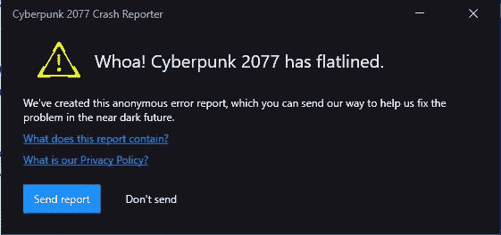
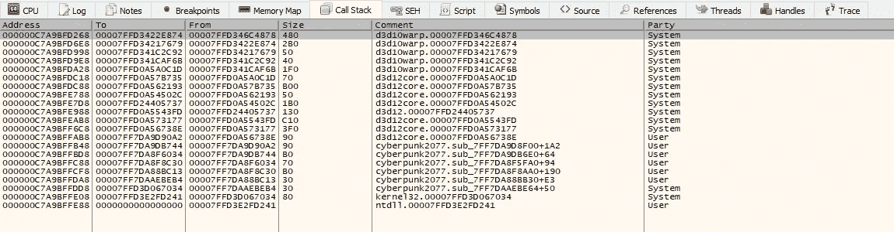
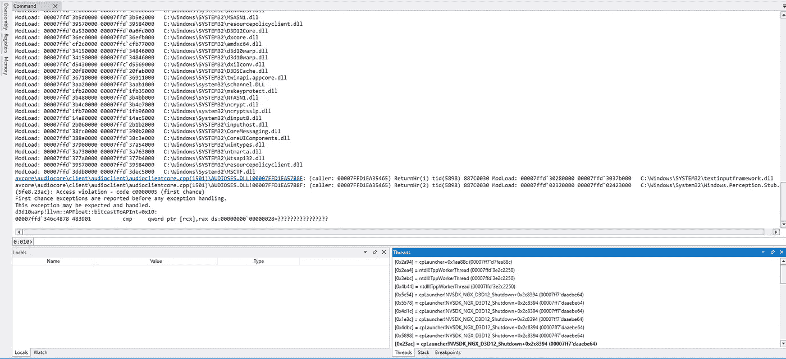
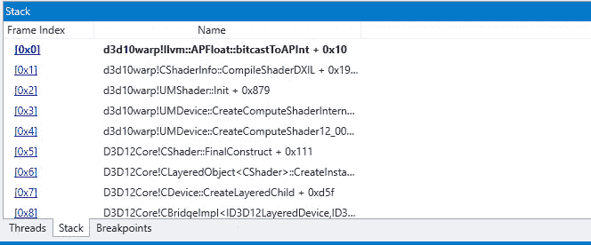
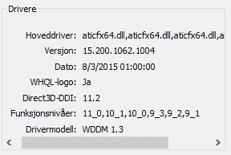

# 我如何调试赛博朋克 2077 崩溃

> 原文：<https://medium.com/nerd-for-tech/how-i-debugged-a-cyberpunk-2077-crash-5febdd5d7bd2?source=collection_archive---------16----------------------->

## 一个关于我如何调试赛博朋克 2077 找到崩溃背后的原因的详细解释。

我记得我第一次下载《赛博朋克 2077》时，它刚刚发行，我试着运行它。我立即看到了这个错误:

当你对比赛充满期待时，最好的事情就是

在花了几个小时在论坛和 reddit 上四处寻找后，我最终走进了一个死胡同。我尝试了一些事情，比如通过 Steam 验证文件的完整性，但是所有尝试都失败了。我最终放弃了，转而通过云游戏服务玩游戏(我用的是 Geforce Now，效果很好！).

然而，我今天早上随机开始思考赛博朋克 2077，并决定找出为什么游戏启动时不断崩溃。

# 调试过程

我做的第一件事是在调试器中打开游戏。我选择 x64dbg 是因为这是我现在常用的调试器。

我在调试器中运行应用程序，一直等到遇到一些异常。然后我发现了这个:

一个访问冲突异常…嗯，也许我们应该看看调用堆栈？

我只看到一些 DirectX 模块的函数调用，以及一个 Windows DLL 文件(光栅化)的 d3d10warp 模块。在进一步检查这些函数内部的代码后，我很快意识到继续对没有符号名称的代码进行逆向工程是一件痛苦的事情。

# 风铃来救援了！

我决定尝试使用 [Windbg](https://docs.microsoft.com/en-us/windows-hardware/drivers/debugger/debugger-download-tools) ，希望它能给我更多的信息。我再次运行这个应用程序，这次是在 Windbg 中，下面是我看到的内容:

我点击右下角的“堆栈”来查看调用堆栈，你瞧！

符号名称！似乎访问冲突发生在 D3D12 设备的初始化期间，更具体地说是在处理着色器时。这让我起了疑心，我知道问题可能出在哪里。为了证实这一点，我打开了 **dxdiag** 来检查我的 GPU 是否真的支持 DirectX 12。

funskjonsniver =功能级别

嗯，该死…我的 GPU 好像不支持 DirectX 12，考虑到[我的显卡已经 11 岁了](https://www.techpowerup.com/gpu-specs/radeon-hd-6970.c258)，这也不奇怪。

虽然我还没有证实这是崩溃的实际原因，但假设这是非常合理的。因此，如果你在启动时遇到同样的赛博朋克 2077 崩溃，请确保你的 GPU 实际上支持 DirectX 12。