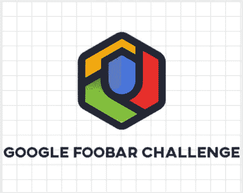
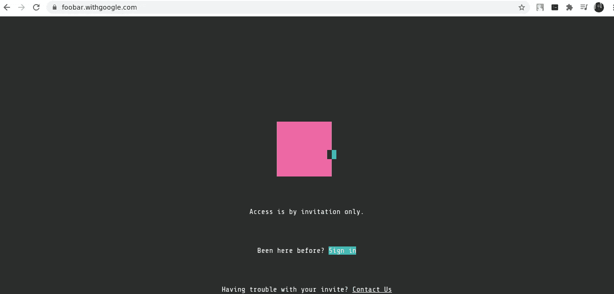
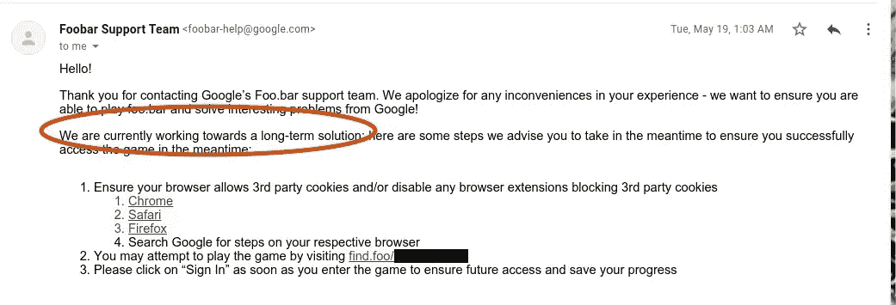
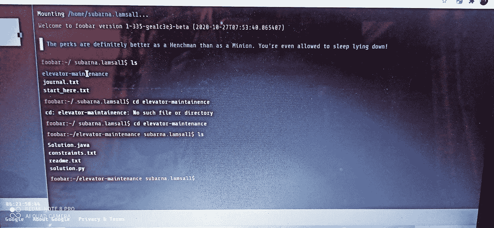
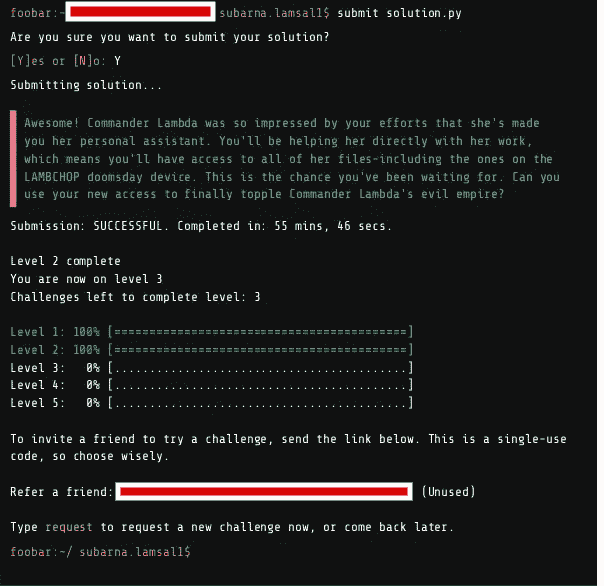
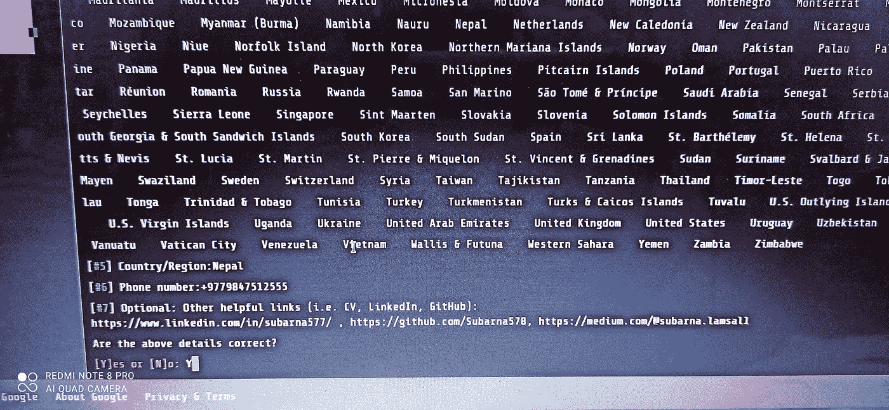

# 用电子邮件秘密参加 Google Foobar 挑战赛

> 原文：<https://medium.com/nerd-for-tech/how-i-easily-got-into-google-foobar-challenge-with-an-e-mail-4ac31f14db54?source=collection_archive---------2----------------------->

oogle Foobar 是谷歌用来招募全球最优秀的开发人员的招聘程序之一，他们认为这些开发人员很适合他们的组织。有难度越来越大的 5 级**挑战。我相信在阅读这篇文章之前，你一定已经了解了 Google Foobar 挑战。如果你还没有，看看这篇文章 [*FOOBAR*](https://www.quora.com/What-is-Google-Foobar-1) 。这篇文章的主要目的是展示我是如何用一封邮件进入 Foobar 的。**

> **Foobar 挑战赛通常如何进行**

当某人搜索一些与编程相关的单词/短语时，大多数 Foobar 挑战都出现在他/她的浏览器上。例如:-众所周知，在搜索“互斥锁”、“Python 列表理解”或“无头浏览器”时，浏览器窗口出现如下消息:

不是每个搜索编程查询的人都能得到 Foobar Challenge。除了谷歌，没人知道背后的算法。然而，有一种观点认为，它可能是基于用户的搜索历史或任何技术关键词。人们还认为，在谷歌主页上对一个技术关键词进行多次搜索之后，就会有人被邀请。虽然这不是我的情况，但我相信我们完整的谷歌活动在获得邀请方面发挥了更大的作用。

> **我是如何进入 Foobar 的**

对我来说，这只是一封简单的电子邮件。YESS！！你没听错。了解了 Foobar 之后，我简单地打开了它的官方网站[*http://foobar.withgoogle.com/*](http://foobar.withgoogle.com/)，进入了下面的页面。

此后，我点击了**联系我们**部分，该部分向我提供了电子邮件:

*foobar-help@gmail.com*

我只是给团队发了电子邮件，说我无法访问 Google-Foobar Challenge，请求他们帮助我解决这个问题。

在第 16 天后，我收到了以下信息。

虽然我得到了挑战的独特和机密的链接，但我还想指出一件事。该团队表示，他们目前正在努力寻找一个长期的解决方案。坦率地说，我不知道他们试图告诉我什么样的长期解决方案。

访问完链接后，像往常一样，我进入了看起来像 UNIX 命令嵌入式界面的网站。虽然我没有从头到尾拍照，但我设法从我的手机上拍了几张和几张截图。Foobar 挑战通常是如何发生的！

完成 2 级后，我得到了另一个推荐链接，并把它给了我的朋友。(图片截图)

完成第三级后，Foobar 让我与一位谷歌招聘人员分享我的解决方案。我提供了我所有的详细信息:姓名、电话号码、国家、职业和其他有用的个人链接。

目前，我在 4 级。我听说 4 级和 5 级真的很有挑战性，所以我想给他们足够的时间，不要争论。

这就是我如何通过一封邮件加入 Foobar Challenge 的故事。我不知道 Google 是否还用那种方法提供 Foobar 的链接，但是绝对值得一试。此外，我听说谷歌已经停止通过 Foobar 招聘开发人员，但还没有找到任何证据。不管是否能在谷歌找到工作，尝试 Foobar 都有很多好处，在此列举如下

a)我们将在每个级别学习新的东西。最后，每个人都会学到一些东西，不管资历高低。

这是检验我们知识的机会。

c)虽然得到邀请本身就是一种成就，但解决问题能带来更多的满足感。

d)向谷歌招聘人员展示我们的知识的机会，这可能会打开新机会的大门。

> **我从 Foobar 学到的东西**

不是每次 Foobar 都能找到你，有时候你需要找到它。

就是这样。如果您有任何疑问，请随时评论或联系我。祝你学习愉快，并祝你一路顺风！