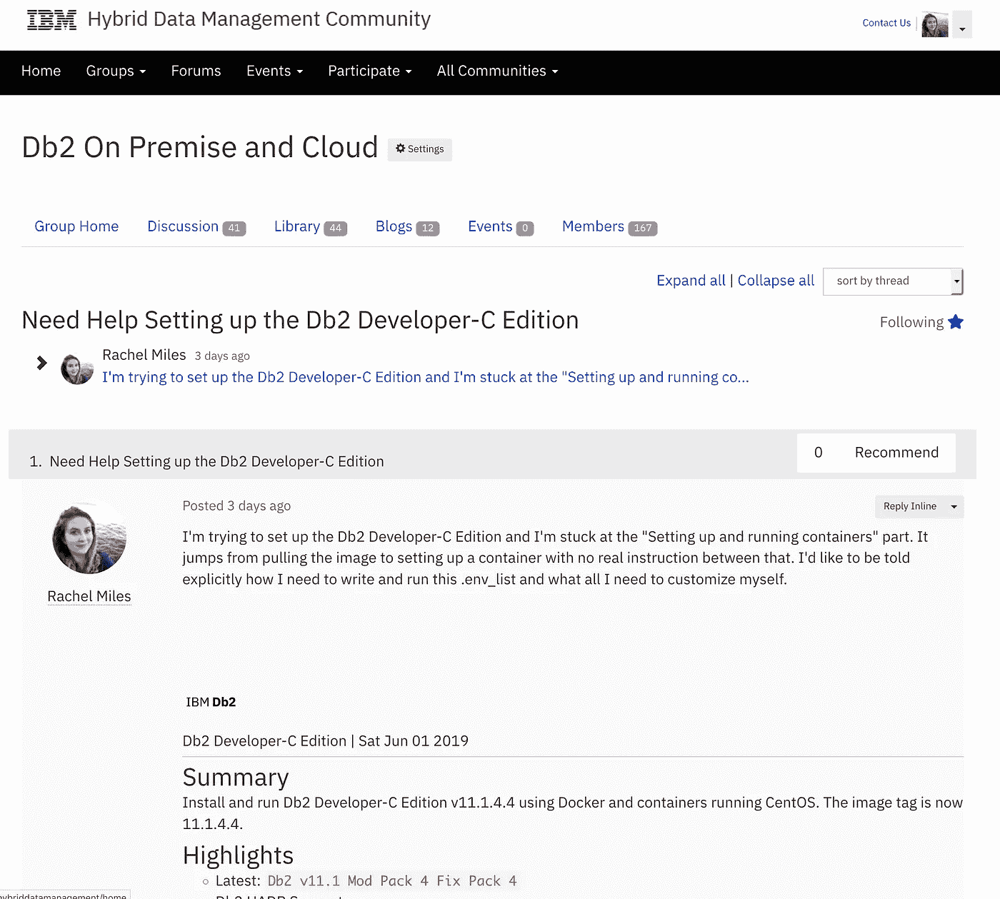

# 我如何使用 Docker 在 Mac 上安装 Db2

> 原文：<https://medium.com/nerd-for-tech/how-i-installed-db2-on-my-mac-using-docker-6a1e6e641b8d?source=collection_archive---------1----------------------->

由[凯文·Ku](https://unsplash.com/@ikukevk?utm_source=medium&utm_medium=referral)在 [Unsplash](https://unsplash.com?utm_source=medium&utm_medium=referral) 上拍摄的照片

好吧，我不是数据库管理员，也不一定是 Db2 方面的专家。我是一名 IBM 员工，帮助设计基于 Db2 的工具，如数据服务器管理器(现在称为 [Db2 管理控制台](http://ibm.biz/Db2Console))、数据虚拟化和基于复制的灾难恢复。

我认为尝试使用 Db2 可能是好的，并且我被告知在我的 Mac 上获得它的唯一方法是通过 Docker。

嗯，我试着安装它，但遇到了一些问题，因为安装说明假设对 Docker 和在终端中编写命令有一定程度的熟悉。

我在 IBM 社区上寻求了一些帮助。特别是在 [Db2 On Premise 和 On Cloud 讨论部分](https://community.ibm.com/community/user/hybriddatamanagement/communities/community-home/digestviewer/viewthread?GroupId=2983&MessageKey=6fe545fa-b737-408e-a63a-9ed32edcb11f&CommunityKey=ea909850-39ea-4ac4-9512-8e2eb37ea09a)，并设法让 Db2 启动并运行起来！

我在[社区页面](https://community.ibm.com/community/user/hybriddatamanagement/communities/community-home/digestviewer/viewthread?GroupId=2983&MessageKey=6fe545fa-b737-408e-a63a-9ed32edcb11f&CommunityKey=ea909850-39ea-4ac4-9512-8e2eb37ea09a)上的帖子。

## 这些是我遵循的步骤:

1.如果你还没有安装 Docker[到你的机器上，并指定一个你想保存 Docker 的目录(比如桌面或文档)。](https://docs.docker.com/v17.12/install/#supported-platforms)

2.转到[https://hub.docker.com/_/db2-developer-c-edition](https://hub.docker.com/_/db2-developer-c-edition)并选择“结账”

3.打开你的命令行(在 Mac 上，是终端)。

4.通过键入以下内容导航到您的 Docker 目录:

`cd Desktop/Docker`

(其中“桌面”是，替换您的文件路径)

5.登录 Docker
`docker login`
(提示时输入 ID/密码；图像下拉并从“docker 图像列表”中可见)

6.您可能想要 Linux 版本的 Db2，所以在命令行中键入:

`docker pull store/ibmcorp/db2_developer_c:11.1.4.4-x86_64`

7。等待它下载。完成后，您需要创建一个配置文件。

8.创建一个隐藏”。env_list "文件通过" vi "命令:
`vi .env_list`

9。按原样剪切/粘贴以下值。(如果这是 Mac，把 IS_OSXFS 改成“true”) `LICENSE=accept
DB2INSTANCE=db2inst1
DB2INST1_PASSWORD=password
DBNAME=testdb
BLU=false
ENABLE_ORACLE_COMPATIBILITY=false
UPDATEAVAIL=NO
TO_CREATE_SAMPLEDB=false
REPODB=false
IS_OSXFS=false
PERSISTENT_HOME=true
HADR_ENABLED=false
ETCD_ENDPOINT=
ETCD_USERNAME=
ETCD_PASSWORD=`

10。退出并保存文件，先按 escape 键，然后按`:wq!`，再按 enter 键。

11。使用 RUN 命令从下载的映像创建一个容器。建议您在终端之外编辑这个命令，因为您必须定制它:
`docker run -h db2server — name db2server — restart=always — detach — privileged=true -p 50000:50000 -p 55000:55000 — env-file .env_list -v /Users/mxk281/Desktop/Docker:/database 399b96dc7c1b`

*   在你看到“/Users/mxk281/Desktop/Docker”的地方，你需要把它改成你的文件路径。您可以使用“pwd”来显示您所在目录的完整路径名，并将其剪切/粘贴到这里。
*   “399b96dc7c1b”是图像名称。你可以通过输入“docker 图片列表”找到它将它更改为您的下载旁边列出的内容。

12.执行命令让你进入新启动的虚拟容器(即登录到服务器)
`docker exec -ti db2server bash -c “su — db2inst1”`

*特别感谢迈克尔·克拉菲克(*[*@ MKrafick*](https://twitter.com/MKrafick)*)为你度过这一切提供的帮助！*