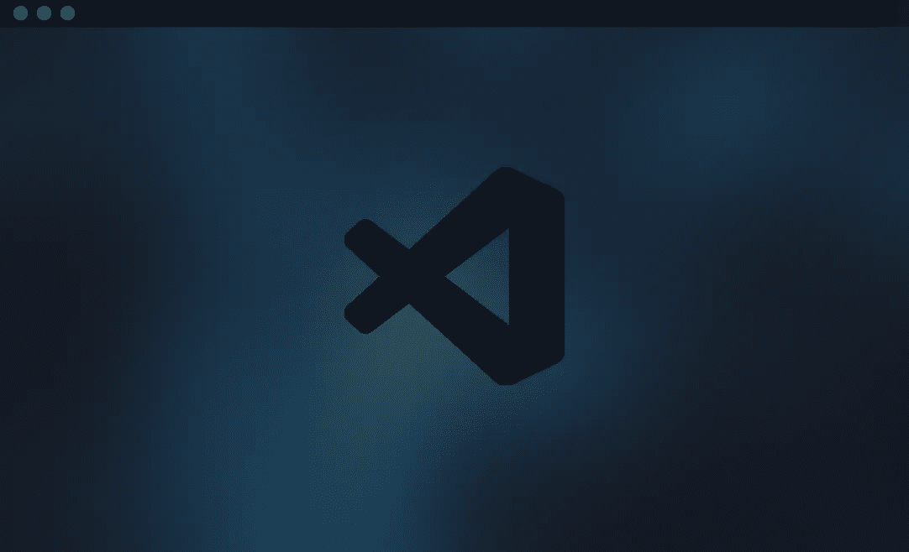
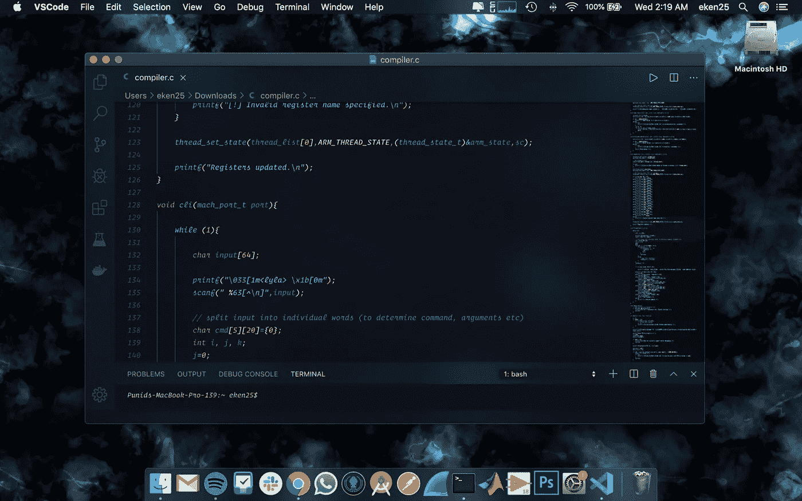
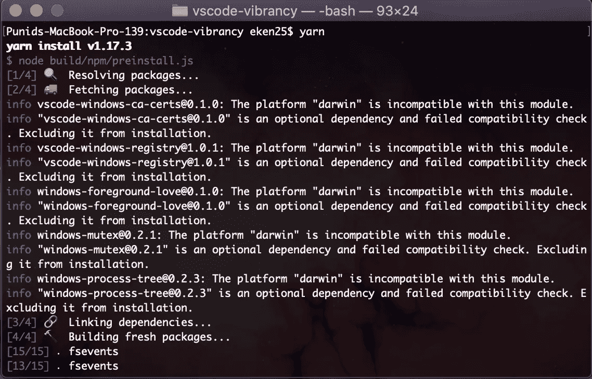
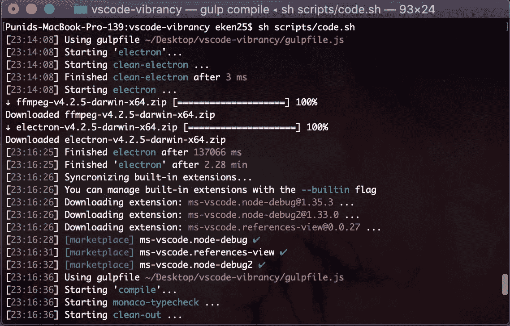
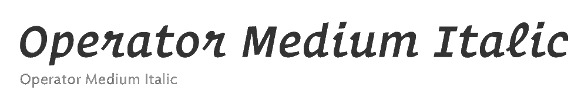

# 我如何让我的 VSCode 看起来令人惊叹

> 原文：<https://medium.com/nerd-for-tech/how-i-made-my-vscode-look-stunning-21e8c72179da?source=collection_archive---------1----------------------->



微软的 Visual Studio 代码是一个非常流行的轻量级、跨平台的代码编辑器，被世界各地的许多开发人员使用。凭借其庞大的扩展、交互式游戏、字体连字支持、emmet、智能感知，它已成为顶级代码编辑器之一。

为了让事情变得更有趣，微软在 GitHub 上发布了他们流行的编辑器的源代码。尽管这有一个小小的警告。这个特殊的版本没有微软的任何专有代码。这有一些*相当大的*含义，将在后面的部分处理。



**“你有没有可能让我们知道你用它做了什么？”**

我将指导您完成以下步骤，您甚至可以使用代码编辑器复制相同的内容。请记住，它目前仅支持 **MacOS 用户**。

# 再见 Visual Studio 代码

你猜对了。这些定制的调整不能在微软开发和销售的标准版本的 VSCode 上复制。相反，我们将使用 VSCode 的开源版本，也称为 *Code- OSS* 。除非你是一个专业的开发人员，能够自己编辑源代码，只需看一眼图片就可以复制，否则我们将需要一些开发人员的帮助。因此，对于我们的这个小冒险，对于那些希望他们的代码编辑器看起来一样的人来说，我将假设你熟悉使用终端。

我们的第一站是 VSCode 的 GitHub 分支。打开**终端**应用程序并创建一个库的克隆，然后您需要将工作目录更改为' **vscode-vibrancy** '。

将以下软件包安装到您的计算机上:

1.  [节点。JS](https://nodejs.org/en/download/)
2.  [纱线](https://yarnpkg.com/en/docs/install#mac-stable)
3.  [一饮而尽](https://gulpjs.com/)
4.  Python 和 C/C++编译器

# 该编译了

运行以下命令，

```
yarn
```

此命令下载代码编辑器运行所需的所有依赖项。

这将需要相当长的时间，所以要有耐心。



下载完依赖项后，运行命令

```
yarn run watch
```

该命令将启动编译过程。一旦编译成功。用 **Ctrl + C** 终止进程

现在，要打开 VSCode，请运行以下命令

```
sh /scripts/code.sh
```



现在，您应该已经看到了代码编辑器的所有优点。现在要做的就是做一些小的修改。

# 说够了，我们定制吧

对于颜色主题，请到 GitHub 下载这个自定义的颜色主题。将下载的文件夹复制到 vscode-vibrancy 的 extensions 文件夹中。将' **workbenchSettings.txt** 的内容复制到 **settings.json** 中。现在你所要做的就是应用颜色主题。


对于字体，我使用 GitHub[的这个工具将](https://github.com/kiliman/operator-mono-lig) [Fira Coda](https://github.com/tonsky/FiraCode) 的连字复制到 [Operator Mono](https://www.typography.com/fonts/operator/styles) 中。



# 缺点

经过这么多麻烦，你终于让它运行起来了。它看起来很棒，并且拥有 VSCode 的大多数特性。会出什么问题呢？

我提到过它是一个开源版本，对吗？原来 Visual Studio Marketplace 是专有的，不能访问。不过有一个解决方法，只需将下面的代码复制到 **product.json** 文件中。微软对 VSCode 的自定义添加也将被错过。

```
"extensionsGallery": {"serviceUrrl": "https://marketplace.visualstudio.com/_apis/public/gallery","cacheUrl":"https://vscode.blob.core.windows.net/gallery/index","itemUrl":
"https://marketplace.visualstudio.com/items"},
```

除此之外，你将错过关键的更新。所以每次有新的更新时，我都不会抱太大希望。

你认为这一切努力值得吗？一定要让我知道！