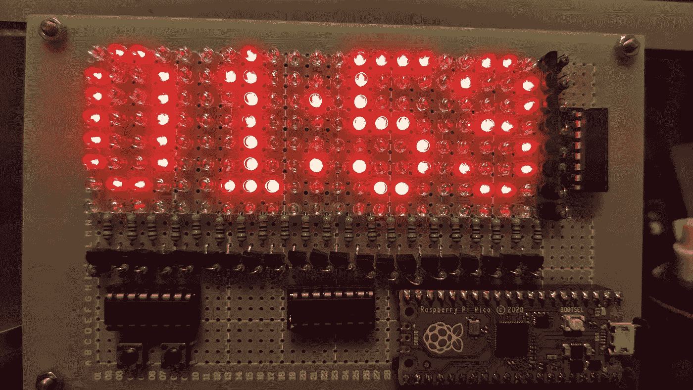
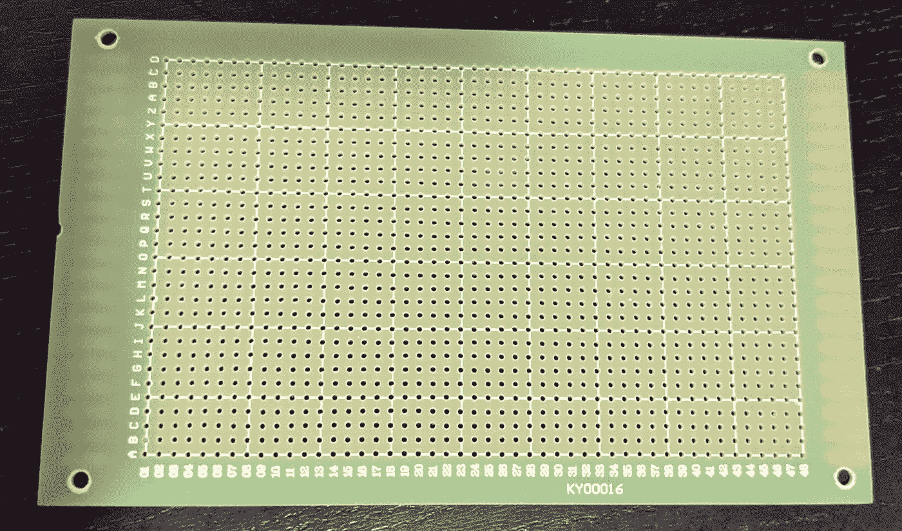

# 我是如何用树莓皮做这个实时时钟的

> 原文：<https://medium.com/nerd-for-tech/how-i-made-this-real-time-clock-with-raspberry-pi-pico-700ed5b531cd?source=collection_archive---------1----------------------->

继我之前的 LED 矩阵项目之后，我想做一个更大的 LED 矩阵。我的库存中有一些 7cm x 9cm 的单面纸板，看起来像这样:

7 厘米 x 9 厘米性能板