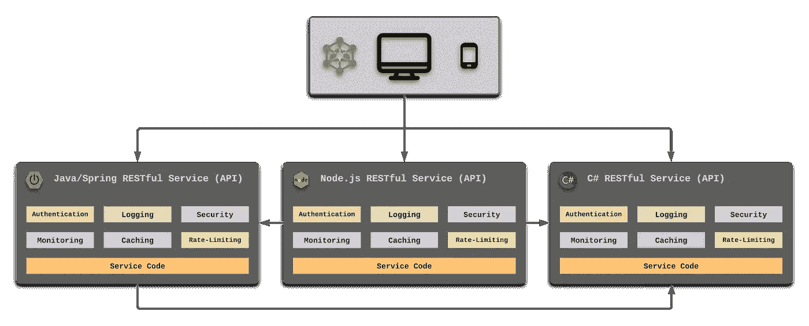
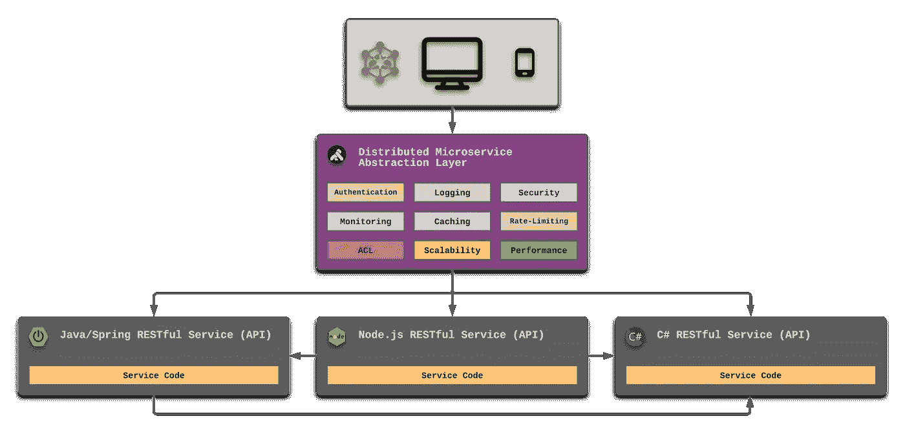
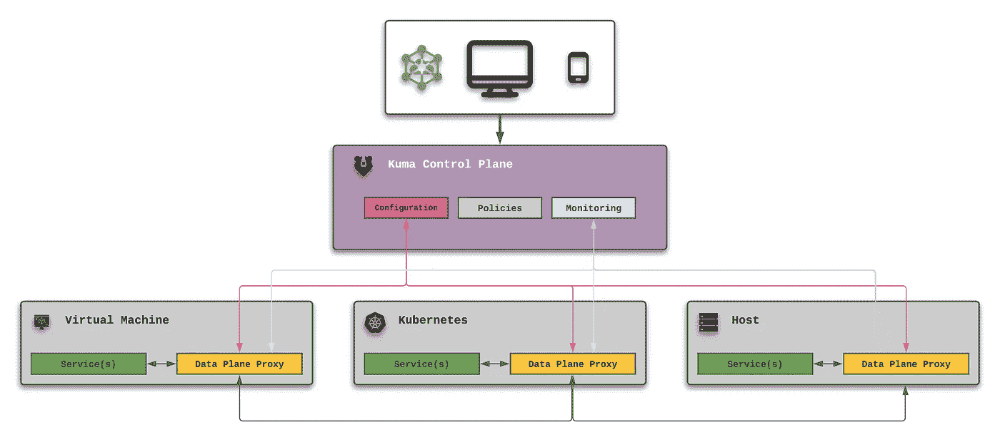
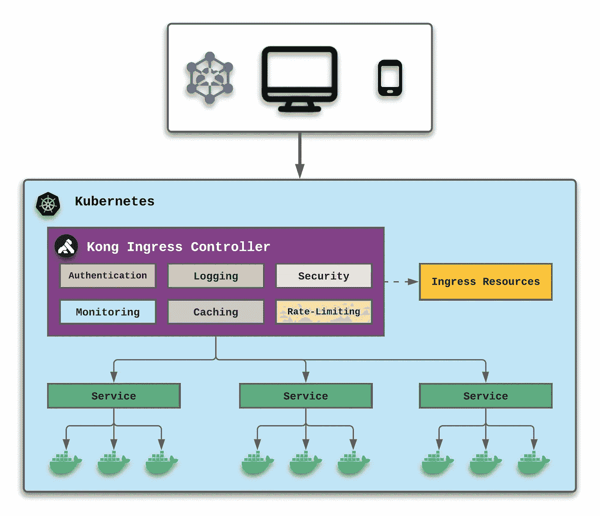
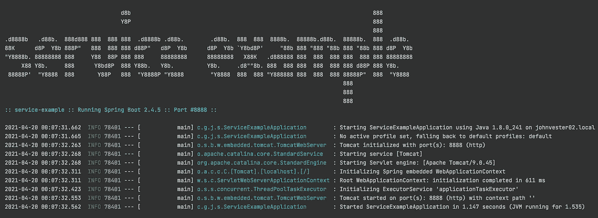

# 我是如何用孔停止编写重复的服务组件的

> 原文：<https://medium.com/nerd-for-tech/how-i-stopped-coding-repetitive-service-components-with-kong-1308be4000e3?source=collection_archive---------8----------------------->


在过去的 10 年里，我一直在构建 RESTful 服务，作为通过咨询机会分配给我的项目的特性团队成员，或者作为一名全职公司员工。这代表了我职业生涯的三分之一，也是我最享受的。

然而，在所有这些年里，当系统成为应用程序现代化计划的一部分时，我感觉我在一遍又一遍地学习相同的课程:

1.  不要用另一个伪装成现代化服务的整体来代替一个整体。
2.  避免接受不良的数据模型，以符合现代化的系统。
3.  永远不要假设现有的程序逻辑是 100%正确的。
4.  安全性和身份应该抽象/整合到更高的级别。
5.  日志记录、监控和路由应包含在初始设计中。

这些经验中的每一个都可以成为一本致力于正确实现应用程序现代化的出版物的焦点。更确切地说，对于这份出版物，我将把重点放在支持成功运行的应用程序上——尽管这五条经验(如上)都失败了。

# 我们生活的世界

在我认真对待计算机编程的几年前，有一首歌叫《我们生活的世界》，是由一个叫做[王聪](https://en.wikipedia.org/wiki/Wang_Chung_(band)) [的新浪潮乐队演唱的。](https://en.wikipedia.org/wiki/Wang_Chung_(band)).)那首歌中负面的歌词讲述了一个重要的世界和我们自己行动的结果。很多时候，作为 API 的消费者，当我试图浏览非标准 API 和意想不到的体验时，我会感觉到这首歌的核心在我的血管中流动。

一些让我指尖麻木的痛点:

*   强迫我对每个请求发送不必要的授权
*   违反核心设计标准的 RESTful 调用(获取变化的数据)
*   仅仅因为遗留系统的需求而执行补充的 API 调用
*   没有良好的机制来正确调试和解决问题

事实上，如今许多基于服务的应用程序都遵循类似于下图所示的设计:



在这个例子中，每个服务都在服务层实现了六个公共组件。这导致了必须手动管理的重复——尤其是当底层源代码(如上所示)使用不同的语言和框架时。

作为一名特性开发人员，我努力寻找更有效率的方法。我寻找方法来最大化我分配的时间，以满足接受标准，并使业务规则导致成功的产品增强。最重要的是，我想避免我的指尖在我这个年龄变得麻木。

# 后来我找到了孔…

如果如上图被重构并合并，如下图所示，会怎么样？



在上面的例子中，所有重复的组件被整合到一个分布式微服务抽象层中，这个抽象层通常被称为 API 网关。事实上，我在 Kong 的云原生 API 网关产品(也称为“Kong Gateway ”)中发现了这个设计。

**孔关口**

[Kong Gateway](https://github.com/Kong/kong) 产品允许我的服务层 API 的复杂性减少到一组端点(或 URIs ),集中于满足一组业务需求和功能。通常，重复的组件(如身份验证、日志记录和安全性)由网关处理，可以从服务层设计中删除。
除了原图中显示的通用组件外，Kong Gateway 还提供了其他功能:

*   动态负载平衡
*   健康检查
*   服务发现
*   无服务器
*   使聚集
*   可量测性
*   表演

Kong Gateway 最大的优点是它是一个云原生(平台无关)开源软件(OSS)解决方案，几乎可以在任何地方使用。使用 OSS 产品也没有许可费用。

# 库马

从更广的层面来看，[库马](https://github.com/kumahq/kuma)是另一款面向服务网格和微服务管理的平台无关 OSS 解决方案，支持 Kubernetes、虚拟机(VM)甚至裸机环境的控制平面。孔将捐赠给了云计算原生计算基金会(简称)，并且仍然积极地为不断发展的代码库做出贡献。

虽然 Kong Gateway 是位于请求者和服务之间的一个单独的层，但库马采用了一种“sidecar”模式——类似于摩托车上的 sidecar。然而，这种边车不是为乘客提供额外的空间，而是连接到单独的集装箱上——因此形成了一个“网”而不是一个单独的层。

库马利用[Envoy](https://www.envoyproxy.io/)——一个开源的 edge 和服务代理——通过一致的可观察性来可视化任何程序领域。除了高级用户界面，孔库马还包括三个关键功能:

*   通用控制平面
*   轻量级数据平面
*   自动的



借助库马，分布式环境可以利用核心的 Kong 网关特性和功能，同时还包括以下方面:

*   多区域支持
*   细粒度的服务和流量策略
*   水平可伸缩
*   支持关键任务使用案例

# 孔入口控制器

对于那些使用 Kubernetes 进行容器编排的组织，Kong 创建了 [Kong Ingress Controller](https://github.com/Kong/kubernetes-ingress-controller) ，它可以跨 Kubernetes 集群实现认证、转换和其他功能(通过插件)。

Kong 入口控制器更新了标准 Kubernetes 实现，如下所示:



有了 Kong 入口控制器，Kong 网关产品中提到的特性就可以通过插件架构来访问。上面的例子中描述了六个插件。

# 孔网关(OSS)在行动

我想采取孔网关(OSS)进行测试驱动，所以我用 Spring Boot 创建了一个非常简单的 URI:

*   /accounts-检索帐户对象的列表([http://localhost:8888/accounts](http://localhost:8888/accounts))

此 URI 背后的数据将是静态的，并在服务启动时创建。几分钟后，我的本地机器的端口 8888 上的服务就可用了:



为了简单起见，我决定使用 MacBook Pro 系统和 Docker 中的 PostgreSQL 数据库运行 Kong Gateway。
**在 MacBook Pro 上安装孔**

使用[家酿](https://brew.sh/)包管理器，我用几个命令安装了 Kong Gateway:

```
╭─john.vester@jvc ~/projects/jvc/kong 
╰─$ brew tap kong/kong
╭─john.vester@jvc ~/projects/jvc/kong 
╰─$ brew install kong
```

完成后，执行以下命令来验证 Kong Gateway 2 . 4 . 0 版是否已正确安装:

```
╭─john.vester@jvc ~/projects/jvc/kong 
╰─$ kong version 
2.4.0
```

# 使用 Docker 安装和配置 PostgreSQL

为了让 PostgreSQL 通过 Docker 作为我的数据库运行，我从[ [Docker Hub](https://hub.docker.com/_/postgres) ]下载了最新版本的 Postgres:

```
╭─john.vester@jvc ~/projects/jvc/kong 
╰─$ docker pull postgres
```

一旦 Docker 映像准备就绪，PostgreSQL 就会在 Docker 中启动:

```
 ╭─john.vester@jvc ~/projects/jvc/kong 
╰─$ docker run — name postgres -e POSTGRES_PASSWORD=some-password -d -p 5432:5432 postgres763a9303b586ea8953717ea6c68fa04437301fe367a5a85b43d5d1fa8523fba6
```

随着数据库的运行，Kong 网关的元素被添加到正在运行的实例中:

```
CREATE USER kong; 
CREATE DATABASE kong OWNER kong;
```

数据库准备的最后一步是执行以下命令:

```
╭─john.vester@jvc ~/projects/jvc/kong 
╰─$ kong migrations bootstrap -c /etc/kong/kong.conf…
41 migrations processed
41 executed
Database is up-to-date
```

# 配置 Kong 网关

数据库迁移完成后，孔网关准备启动:

```
╭─john.vester@jvc ~/projects/jvc/kong 
╰─$ kong start -c /etc/kong/kong.conf
Kong started
```

随着孔网关的设置和准备工作的进行，下一步是集中精力配置上面提到的的。第一步是使用以下 cURL 将 Spring Boot RESTful 服务配置为“account-service ”:

```
curl — location — request POST ‘[http://localhost:8001/services'](http://localhost:8001/services') \
 — header ‘Content-Type: application/x-www-form-urlencoded’ \
 — data-urlencode ‘name=account-service’ \
 — data-urlencode ‘url=[http://localhost:8888/accounts'](http://localhost:8888/accounts')
```

这会导致以下响应—引用 Postgres 中存储的配置数据:

```
{
 “connect_timeout”: 60000,
 “path”: “/accounts”,
 “read_timeout”: 60000,
 “name”: “account-service”,
 “write_timeout”: 60000,
 “created_at”: 1618933968,
 “updated_at”: 1618933968,
 “tls_verify”: null,
 “id”: “7ba5d84c-0b4d-454a-83b3–5381d4e52c61”,
 “tls_verify_depth”: null,
 “retries”: 5,
 “tags”: null,
 “ca_certificates”: null,
 “port”: 8888,
 “client_certificate”: null,
 “host”: “localhost”,
 “protocol”: “http”
}
```

接下来为名为“account-service”的主机创建一个路由，将从调用 Spring Boot 服务的地方引用该路由:

```
curl — location — request POST ‘[http://localhost:8001/services/account-service/routes'](http://localhost:8001/services/account-service/routes') \
 — header ‘Content-Type: application/x-www-form-urlencoded’ \
 — data-urlencode ‘hosts[]=account-service’
```

cURL 命令的结果从 Kong Gateway 生成以下 JSON 响应:

```
{
 “headers”: null,
 “name”: null,
 “hosts”: [
 “account-service”
 ],
 “created_at”: 1618936295,
 “path_handling”: “v0”,
 “id”: “d70a3bf2–4a82–4ec5-a644–90806c53f5b5”,
 “protocols”: [
 “http”,
 “https”
 ],
 “paths”: null,
 “request_buffering”: true,
 “response_buffering”: true,
 “destinations”: null,
 “methods”: null,
 “https_redirect_status_code”: 426,
 “preserve_host”: false,
 “strip_path”: true,
 “regex_priority”: 0,
 “updated_at”: 1618936295,
 “snis”: null,
 “sources”: null,
 “service”: {
 “id”: “7ba5d84c-0b4d-454a-83b3–5381d4e52c61”
 },
 “tags”: null
}
```

此时，可以使用以下 cURL 通过 Kong 网关检索“帐户-服务”路由:

```
curl — location — request GET ‘[http://localhost:8000/'](http://localhost:8000/') \
 — header ‘Host: account-service’
```

它从 Spring Boot 服务返回预期的 JSON 数据:

```
[
 {
 “id”: 1,
 “name”: “Eric”
 },
 {
 “id”: 2,
 “name”: “Finn”
 },
 {
 “id”: 3,
 “name”: “Nicole”
 },
 {
 “id”: 4,
 “name”: “John”
 },
 {
 “id”: 5,
 “name”: “Sydney”
 }
]
```

成功！这与直接击中时的数据完全相同，只是通过了孔关口。

# 添加速率限制插件

接下来，我使用以下 cURL 在 Kong 网关中实现了速率限制插件:

```
curl -X POST [http://localhost:8001/services/account-service/plugins](http://localhost:8001/services/account-service/plugins) \ 
 — data “name=rate-limiting” \ 
 — data “config.second=1” \ 
 — data “config.minute=3” \
 — data “config.policy=local”
```

这种配置虽然有限制，但每秒钟只允许一个帐户服务请求，每分钟最多三个请求。

这个帖子的提交产生了以下响应负载:

```
{
 “route”: null,
 “tags”: null,
 “name”: “rate-limiting”,
 “config”: {
 “year”: null,
 “path”: null,
 “limit_by”: “consumer”,
 “hide_client_headers”: false,
 “second”: 1,
 “minute”: 3,
 “redis_timeout”: 2000,
 “redis_database”: 0,
 “redis_host”: null,
 “redis_port”: 6379,
 “policy”: “local”,
 “hour”: null,
 “header_name”: null,
 “redis_password”: null,
 “fault_tolerant”: true,
 “day”: null,
 “month”: null
 },
 “protocols”: [
 “grpc”,
 “grpcs”,
 “http”,
 “https”
 ],
 “created_at”: 1618947648,
 “service”: {
 “id”: “7ba5d84c-0b4d-454a-83b3–5381d4e52c61”
 },
 “consumer”: null,
 “id”: “a3d8532a-0464–4117-bbfd-716300966fe7”,
 “enabled”: true
}
```

现在，当对以下 URL 进行多次调用时:

```
curl — location — request GET ‘[http://localhost:8000/'](http://localhost:8000/') \
 — header ‘Host: account-service’
```

Kong 网关抛出一个 429(请求太多)HTTP 响应，其有效负载如下:

```
{
 “message”: “API rate limit exceeded”
}
```

使用 Kong Gateway 的开源版本，可以按照上面提到的相同模式轻松添加以下插件:

*   基本和 JWT 身份验证
*   CORS 和知识产权限制
*   ACL 和请求大小限制
*   调用无服务器功能
*   数据转换
*   多个日志记录选项

# 结论

如果我要为任何 IT 专业人士起草一份简明的使命陈述，那会非常简单:

> 将您的时间集中在提供扩展知识产权价值的特性/功能上。将框架、产品和服务用于其他一切。

Kong 提供的产品和服务不仅避免了服务层的重复，而且在许多情况下，从功能开发人员的头脑中抽象出了公共组件。这种方法的结果允许一个精简的代码库，并关注于满足验收标准。

Kong 自己也遵循相同的任务声明，允许来自 Kong Gateway 的方面作为 Kong Ingress 控制器产品中的插件来实现。因此，组件只需配置一次，就可以随处使用。

Kong 采用了一种平台无关的方法，允许遗留应用程序在短期或长期内使用相同的服务。因此，支持本出版物引言中提到的棘手问题变得不那么重要了。

祝你今天过得愉快！