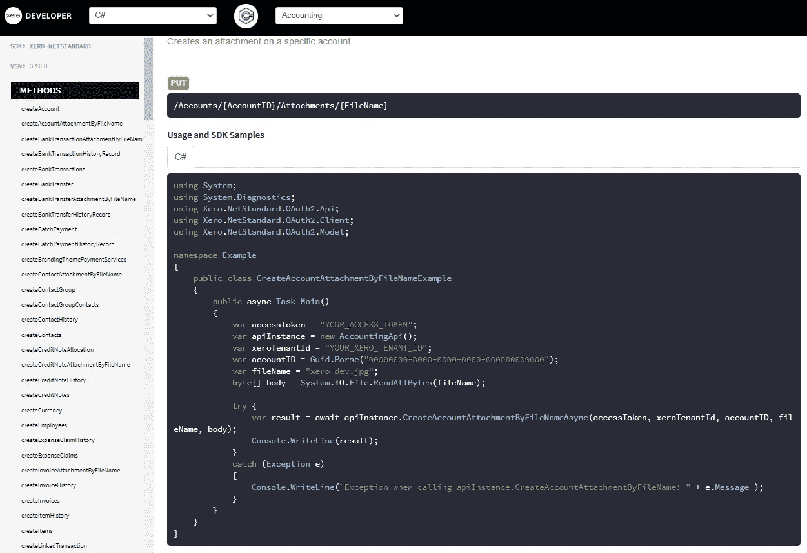
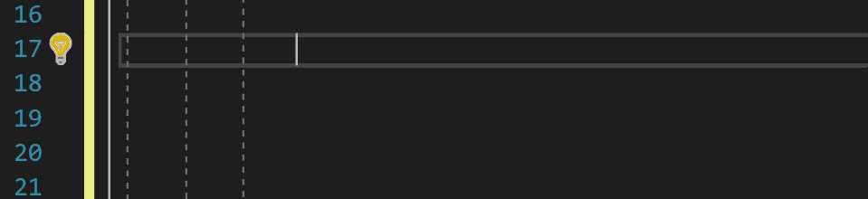
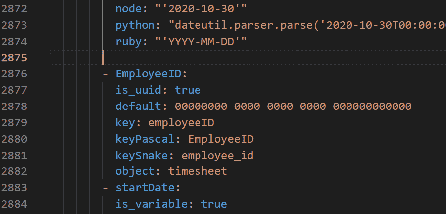
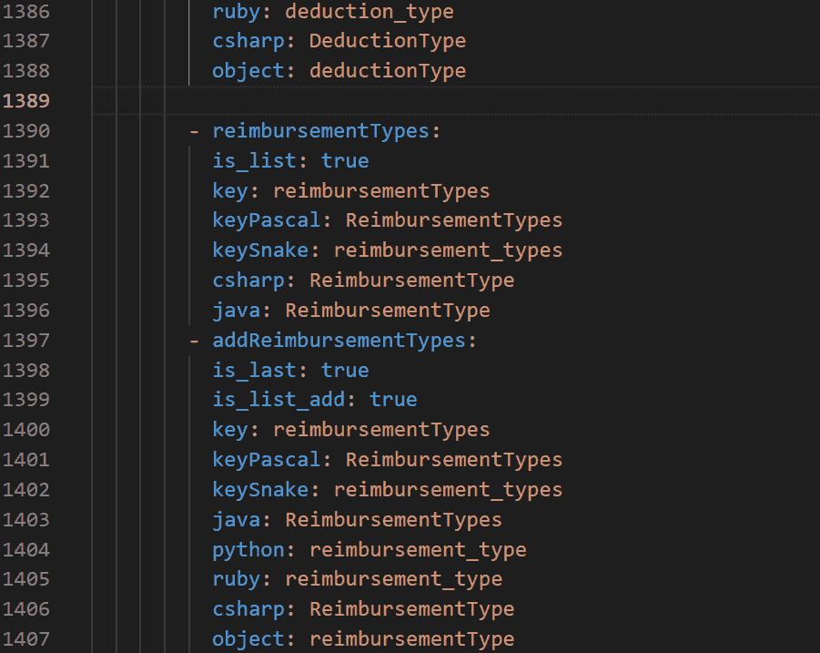

# 我如何使用 VSCode 片段来减少输入并提高编码速度

> 原文：<https://medium.com/nerd-for-tech/how-i-used-vscode-snippets-to-type-less-and-code-faster-58af67e4029e?source=collection_archive---------24----------------------->

在我相对短暂的编程生涯中，我有幸与一些资深和有经验的开发人员一起进行编程，我一直关注的是他们在 IDE 中运行和编写代码的效率。

一段时间以来，我一直致力于提高我的打字速度，学习快捷方式和工具来提高我的编码效率。我还有很多东西要学，但是我最近发现了一种方法，它帮助我完成了一个特别繁琐的涉及 OpenAPI 规范的编程。

# OpenAPI 生成器和规范文件

我刚刚在 Xero 的开发者福音团队呆了 3 个月，我在团队期间做的事情之一是为 Xero SDKs(软件开发工具包)编写[新文档](https://xeroapi.github.io/Xero-NetStandard/accounting/index.html)，开发者使用这些 SDK 来集成 Xero API 并创建[市场应用](https://apps.xero.com/au?utm_source=xero_blog&utm_medium=link&utm_campaign=1000apps_announcement)。(Xero 刚刚达到了生态系统中超过 1000 个连接应用程序的令人敬畏的里程碑。)

Xero SDKs 是从一个名为 OpenAPI 规范的 YAML 文件生成的，它是 RESTful Xero 公共 API 的人类和计算机可读的描述，使用 [Swagger Codegen](https://swagger.io/tools/swagger-codegen/) 。

使用与生成 SDK 相同的生成器(做了一点额外的工作来创建一个额外的。mustache 文件)，我们还可以为每个特定的 API 集生成一个 HTML 文件，其中包含 SDK 中所有可用方法的可运行代码示例。

新 Xero-NetStandard SDK 文档截图

这是对旧文档的巨大改进，旧文档只是为一些 API 方法手动创建的示例代码。

生成器非常智能，它出色地接受了 OpenAPI 规范和 mustache 模板，并为 SDK 的大多数 GET 方法提供了工作示例。但是，因为我们支持的每种语言(Java、php、Node、Ruby、NetStandard、Python)中的 SDK 都有不同的语法和命名约定，所以有必要在 YAML 文件中添加一些称为 x-examples 的额外元数据，以便处理更复杂的任务，如更新和创建方法所需的对象创建。这包括添加不同大小写( *PascalCase* 、 *snake_case* 和 *camelCase* )的“密钥”(对象或变量名)，枚举在不同语言、不同日期时间格式等中具有不同的约定。

当我加入团队时，Xero 的会计 API 规范已经有了 x-examples，但是我很快发现自己在剩余的 SDK 中为每个创建和更新方法添加了 x-examples。(其中有很多。)有些只有很少的方法(文件 API 规范只有 6 个创建或更新方法),所以虽然输入很乏味，但还可以忍受，但我很快就转向了更大的工资 API，并发现自己对输入相同内容的次数感到沮丧。(每个工资单 API 规范都增加了 1000 多行代码。)

我尝试了一些不同的方法来加快速度——主要是复制、粘贴和手动键入的各种组合，或者复制几次键并修改不同的大小写和值。但是不管怎样，这都是非常乏味的工作，而且容易出错。这是我认为我肯定有一个更简单的方法来做到这一点。

# vs 代码片段

代码片段是帮助开发人员快速编写重复代码模式的模板。我早年学到的第一个片段。NET career(感谢小哥哥 Artur 教我这个)是 Visual Studio 中的 foreach + tab + tab 片段。

这些代码片段可以加快开发速度，并在键入循环等常见模式时使事情变得更容易。但是没有任何可用的片段可以给我 OpenAPI 规范 x-examples 所需要的独特结构。幸运的是，VSCode 为我们提供了创建自定义代码片段的选项，所以我仔细阅读了[文档](https://code.visualstudio.com/docs/editor/userdefinedsnippets)，在短短几分钟内，我就能够创建一个非常简单的代码片段，它复制了我需要的基本键结构，然后将光标导航到每个下一个 *Tabstop* ，这样我就可以输入正确的值。

虽然这个代码片段很有用，对我有一点帮助，但我只使用过几次，然后就想知道是否有一种方法可以自动化大小写转换，因为这是这个过程中最乏味的部分之一，也是我在第一个代码片段中没有克服的部分。幸运的是，我发现 snippets 允许在 snippets 中进行变量转换，将字符串的一部分匹配到组中，然后我们可以使用格式字符串来格式化这些组，并进行简单的修改，比如改变大小写。已经有了从 *snake_case* 到 *PascalCase* 的开箱即用选项，对于 *camelCase* 我能够编写一些简单的正则表达式来匹配和转换外壳。所以现在我已经可以按下一个关键字符来使用我的代码片段并键入一次键，而不是一遍又一遍地键入整个结构并在各种情况下写 4 次相同的键。

到了这个阶段，我开始变得有点疯狂，开始为我们在 x-examples 中使用的大多数其他属性编写小代码片段，比如 GUIDs 和 Lists。列表片段可能是最大的时间节省，因为没有它，输入的量有点疯狂，我总是不得不回到以前的例子，并确保我遵循相同的模式，并确保我没有错过什么。

仅仅用了这一小段，我就把原本需要 350 次按键变成了 9 次。

当我完成所有的片段时，我感觉自己就像一个魔术师，曾经单调乏味的重复工作变得很有趣，也很快。它不仅节省了我大量的时间和精力，还减少了打字错误和语法错误，使整个过程更加简单。

我创造了我所有的片段后的我！

# 结论

我希望这篇文章鼓励你下次发现自己过于频繁地输入重复代码时，去编写自己的自定义代码片段。

如果你想知道更多关于如何编写你自己的代码片段的细节，请查看关于[vs code snippet](https://code.visualstudio.com/docs/editor/userdefinedsnippets)的文档，你可以在这里查看我创建的代码片段。如果你对 Xero SDKs 感兴趣(它们都是开源的)，请查看 [Xero API GitHub](https://github.com/XeroAPI) 。

最后，如果您有兴趣与 Xero 合作并加入市场上的 1000 多个应用程序，请访问 Xero 开发者门户网站！