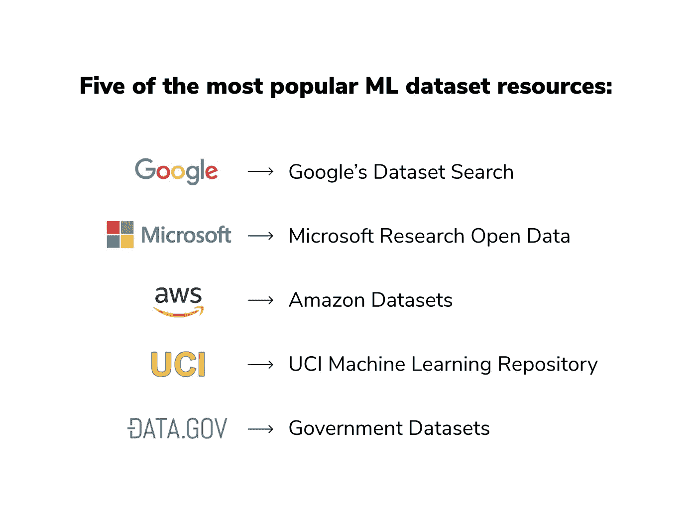
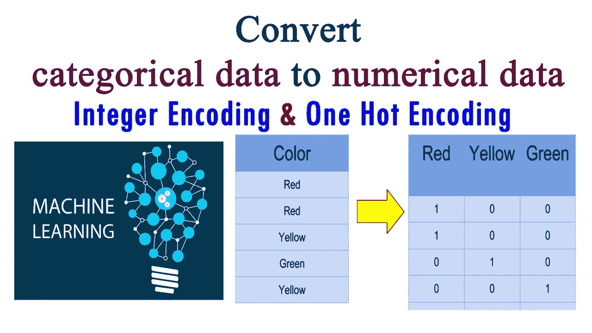
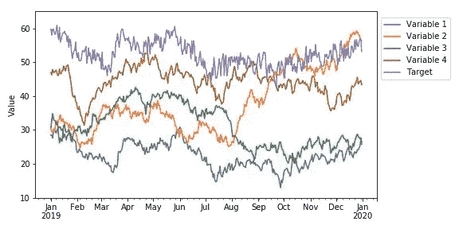

# 数据在机器学习中有多重要？

> 原文：<https://medium.com/nerd-for-tech/how-important-is-data-in-machine-learning-259d51e86435?source=collection_archive---------4----------------------->

我们看到我们周围的数据。有许多公司产生大量数据，可分别用于不同的机器学习和人工智能目的。我们看到亚马逊、脸书或谷歌产生了极其庞大的数据。

谷歌中的每次搜索都会产生大量数据，随着大量用户的加入，我们看到了巨大的数据生成量。因此，我们可以获得大量数据，我们必须确保充分利用这些数据。让我们也了解一下我们所拥有的数据类型，这样我们就能很好地理解可以完成的特征工程技术。

拥有大量数据的公司

在机器学习中，应该注意的一件事是给予模型的数据类型。如果我们有更多的数据，机器学习算法就有更高的机会理解它，并分别对未看到的数据做出准确的预测。

通常，我们必须对数据执行特征工程，以便生成新的特征和列。除此之外，对于特定的列，数据可能没有任何值。因此，我们必须填充数据并对其进行修改，以便它对分别用于预测的机器学习模型非常有用。

# **数据类型**

可以有许多形式的数据可用于机器学习目的。在这里，我们将讨论我们将提供给机器学习算法进行预测的主要数据类型。数据类型包括:

1.  分类数据
2.  数据
3.  时序数据
4.  文本数据

这些是我们将在大多数机器学习应用中使用的数据类型。现在让我们讨论上述数据类型的含义，并给出一些例子，以便容易理解我们提供给机器学习模型进行预测的数据。

## **1。分类数据**

在这种类型的数据中，我们有不同的类别分别代表特定的对象。例如，考虑一下汽车的颜色。可以有许多颜色，如绿色、蓝色或银色。由于这些数据不是数值型的，而是由不同种类的汽车颜色组成的，我们分别称之为分类数据。下面，我们看到有三类颜色。我们将执行一次热编码，以便将分类数据转换为数字数据进行计算。我们必须始终记住，机器学习算法只会将数学值作为输入，从而执行计算。因此，必须将全部数据分别转换成某种形式的数字进行计算。

将分类数据转换为数字数据

## 2.**数值数据**

顾名思义，在数字数据的情况下，我们将只处理数字。下面，我们看到有不同的功能集，如攻击、防御等。此外，我们看到有一组特定的数值分别与它们相关联。我们看到它们是浮点数，但我们仍然看到它们本质上是数字。因此，我们可能会遇到一个数据集，它可能分别包含数字数据特征和分类特征。

数据

## **3。时间序列数据**

有时，还需要使用时间序列信息和与之相关的数据来提高机器学习模型的性能。因此，我们将分别考虑包含时间序列信息的特征。在时间序列数据中，我们将获取特定时间间隔的特定输出值，并将这些结果与我们的数据关联起来。因此，我们将分别使用数据中的时间序列信息来执行机器学习操作。在下图中，我们看到了数据中特定值的时间序列表示以及 2019 年 1 月到 2020 年 1 月之间的时间间隔。我们可以使用这个特征，并将其添加到我们的原始数据中，这可能会分别提高机器学习模型的准确性。

时序数据

## **4。文本数据**

我们可以通过帖子、文章和博客的形式获得大量的文本数据。我们会考虑这些数据，并对它们应用不同的机器学习方法。实际上，我们会通过使用不同形式的矢量化，将文本数据转换为数学向量，这样我们就可以获得文本的数学形式，稍后机器学习算法可以使用这些形式进行预测。我们在 python 中有不同的矢量器，如 BOW 矢量器和 TFIDF 矢量器，它们将手头的文本转换为它们的数学等价物，进而可以被机器学习模型用于预测。

文本数据

## **结论**

我们看到有不同类型的数据。我们将考虑不同类型的数据，并分别为机器学习模型提供预测值。有不同的数据类型，如文本数据，数字数据，分类数据和时间序列数据。我们必须对不同类型的数据特征执行不同的特征工程技术，并确保它们是数字格式，以便机器学习模型可以分别解释和理解它们。

如果你想通过 LinkedIn 联系，我们可以进一步讨论机器学习和最新进展，下面是我个人资料的链接。请随意连接。谢了。

**领英:**【https://www.linkedin.com/in/suhas-maddali-b9b146136/】T2

**GitHub:** [苏哈斯马达利(Suhas Maddali)(github.com)](https://github.com/suhasmaddali)