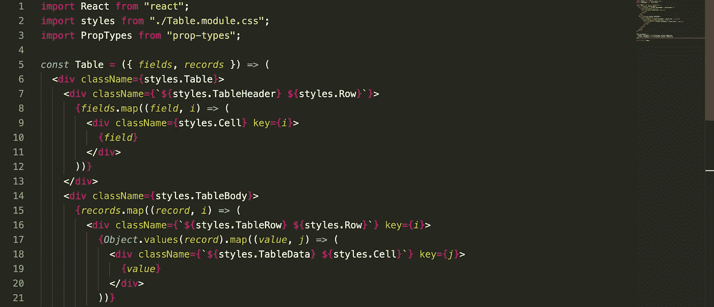
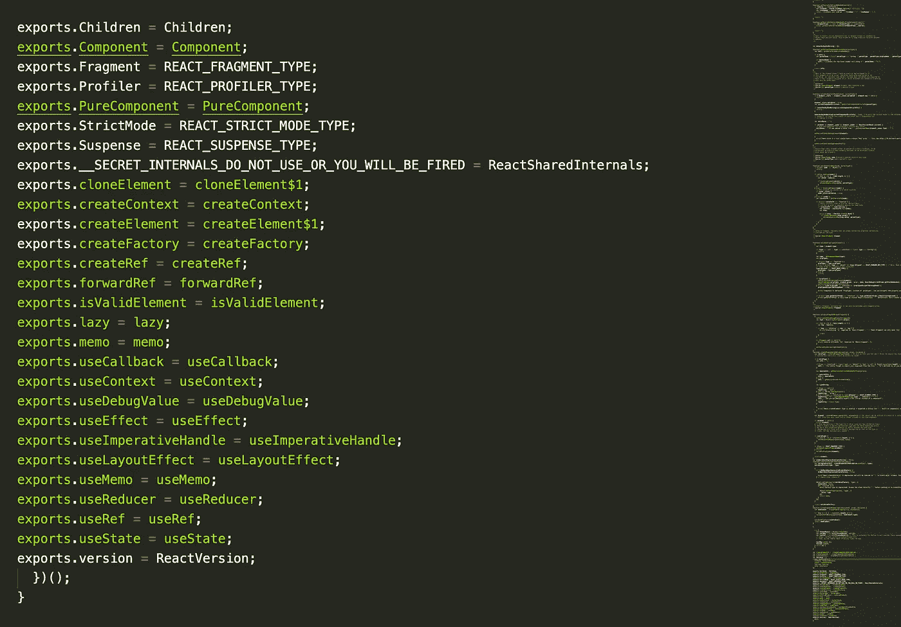
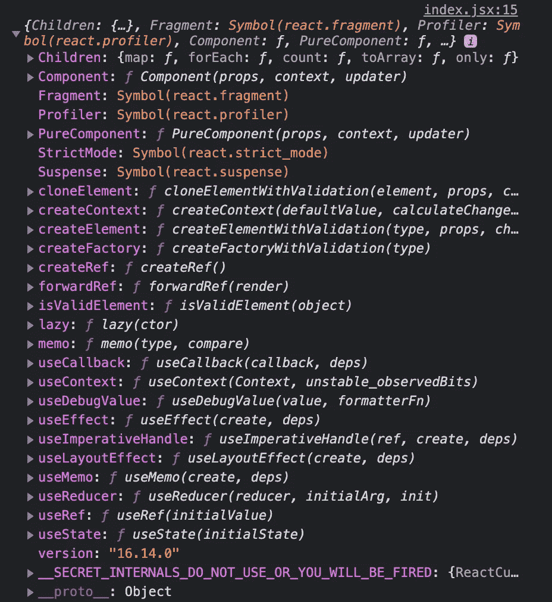

# 导入在 React 中如何工作

> 原文：<https://medium.com/nerd-for-tech/how-imports-work-in-react-121e3741fb70?source=collection_archive---------1----------------------->

## 我对 Javascript/Node 中模块系统的理解



可重复使用的反应表

如果不真正理解 Node.js 模块系统和 Javascript 对象引用是如何工作的，那么在 React 和通常的 Javascript 中导入和导出内容可能会令人困惑。

这里有一些例子，可能会让人想知道幕后到底发生了什么。

```
import React from 'react';
import * as React from 'react';
import React, { useState } from 'react';
import React, { Component } from 'react';
```

这花了我一些时间，但我想我终于明白了！好吧，让我们看看这个大脑的内部。我可能会删除一些引用。

**模块**

首先，您应该理解模块的概念。在 Node 中，每个文件都被视为一个独立的模块。你应该阅读 Node.js 中的模块包装器

```
I like to think of a module as an object that represents the file.
```

和我在一起…

我可能过于简化了，但是让我们坚持模块是一个最初为空的对象文字`{}`。

在我们继续之前，我还想谈谈我认为我理解的两个模块系统:`CommonJS`和`ESModules`。

共性:`module.exports`向消费者公开，`require()`向消费者提供。你可能见过周围的`exports`。`exports`只是对`module.exports`的一个引用，输入起来更短(为了方便)。这意味着`exports`和`module.exports`指向内存中的同一个对象。

`module`是对当前模块(一个对象)的引用，它的`exports`属性(`module.exports`)定义了模块导出的内容。

```
*module*.*exports* = {}*exports* = *module*.*exports*
```

ESModules: `export`公开，`import`可用。如果你像我一样，你可能学过 ES6/ES2015 的 React，而 ESModules 是你可能知道的唯一模块系统。我记得在制作一些配置时遇到了`module.exports`，这让我非常困惑。

CommonJS `module.exports`其实相当于 ES 模块`export default`。

**React.js**

如果您从未看过 React 的代码，我建议您看一看——因为这将提高您的信心和对框架的理解。你会惊讶地发现它基本上是 Javascript——和你写的一样。

你可以检查一下[回购](https://github.com/facebook/react)或者从查看你的本地副本开始，试着检查文件。

```
node_modules/react/cjs/react.development.js
```



16.14.0

您意识到 React 代码库使用了 CommonJS。`exports.Children`指向`module.exports.Children`。根据上面关于模块的知识，您可以用几种方式导入 React:

```
import React from 'react';
```

这基本上是获取暴露的对象(`module.exports`)并将其分配给消费者中一个名为`React`的变量。就像导入默认导出一样。

变量可以是任何其他名称，您仍然可以获得公开的 API。

```
import noStandardName from 'react';
```



console.log(React)和 console.log(noStandardName)

然而，使用任何其他名字都会使程序崩溃，因为`'React' must be in scope when using JSX`。linter 期望 API 被命名为`React`，所以它对你尖叫，但是 React 的所有方法和属性实际上都是可用的。

```
import * as React from 'react';
```

这和上面的方法类似。心智模式是它获取由`exports.<API>`公开的所有内容，将其组合成一个对象，并将该对象赋给一个名为 React 的变量——或任何其他名称。

以上两种方法的结果是，现在所有的 API 都是 React 对象上的属性，可以通过`React.<API>`访问，例如`class <ComponentName> extends React.Component {}`。

为了方便起见，您可以分别导入不同的 API(或者作为一种捷径)——有点像`exports`对`module.exports`的场景，如下所示:

```
import React, { useState } from 'react';
import React, { Component } from 'react';
import React, { useState, Component } from 'react';
```

这种方法**“析构”**暴露的对象(`module.exports`)，因此 API 可以独立调用，例如`class <ComponentName> extends Component {}`。