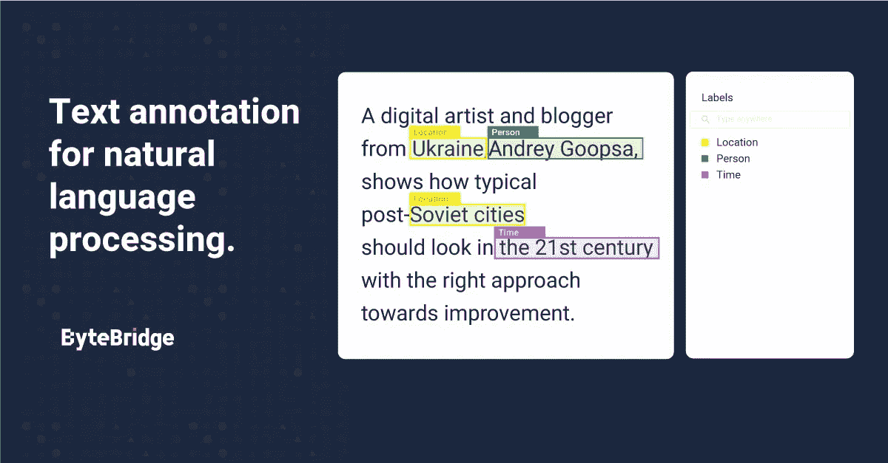

# 人工智能在销售行业是如何应用的？—第二部分

> 原文：<https://medium.com/nerd-for-tech/how-is-artificial-intelligence-applied-in-the-sales-industry-part2-5ff3bf4c26f3?source=collection_archive---------11----------------------->

在上一篇文章中，我们讨论了产品推荐机制和对话式人工智能产品——聊天机器人。现在来说说预测分析和情感分析。

## **3。预测分析和洞察**

利用数据进行客户细分和产品定位是 55%的营销人员的首要任务。如果公司想要有一个更好的结果，他们需要摆脱只使用描述性分析(谷歌分析)和采用预测工具。

预测性和最近的规范性分析可以帮助公司克服数据混乱，并确定最有利可图的营销渠道和行动。机器学习算法为公司提供了以下帮助:

1.  预测并应对不断变化的消费者行为
2.  在公司的客户关系管理(CRM)中对潜在客户进行评分，并提出达到销售数字的最佳措施
3.  优化公司的点击付费(PPC)预算，在不影响公司广告支出的情况下增加销售额
4.  识别并获得“相似”的潜在客户
5.  发现缺失的关键词并跟踪内容营销机会

小公司在采用预测分析方面通常具有竞争优势，因为他们在准备数据进行分析方面的时间和技术投入较少。

## **4。社交倾听和情感分析**

了解人们对一家公司或其竞争对手的看法对于制定有效的社交媒体营销策略至关重要。此外，人工智能技术在从实时热点话题中解读见解方面比人类劳动力更具竞争力。

数据科学已被积极应用于社交媒体营销，用于微细分和定位、社交媒体收听和 KOL 营销活动管理。基于人工智能的社交倾听进一步扩展了营销人员的能力，使他们能够:

1.  识别和量化消费者在社交媒体上的购买意向。
2.  了解购物者对公司产品和竞争对手产品的看法
3.  了解推动行业对话的因素以及这些对话的内容如何随着时间的推移而变化。
4.  实时关注并回答有关公司产品/服务的问题。
5.  识别在社交媒体上寻求产品推荐的买家并与之互动。

更好的是，人工智能工具可以帮助公司减少错误。

更多阅读:[情感分析](https://bytebridge.medium.com/text-labeling-case-fine-grained-multi-category-labeling-of-emotions-d811f863f67b)

## 对最高质量人工智能训练数据的需求

目前，各行业对最优质的 AI 训练数据需求迫切。人工智能应用于各个领域，如教育、法律、智能驾驶、银行和金融等。每个领域都有细分和专业化的要求。

其中，特别是**进行智能化转型的传统企业和科技企业，需要有丰富项目经验的培训数据服务商的协助，帮助整理数据标注指令，获取更合适的数据。**高质量数据在特殊场景下的使用，减少了研发周期，加速了实施过程，帮助企业更快更好地进行智能化转型。

在深入的产业落地过程中，人工智能技术与企业需求仍有差距。企业用户的核心目标是利用人工智能技术实现业务增长。实际上，人工智能技术本身并不能直接解决所有的业务需求。它需要创建可以基于特定业务场景和目标大规模实现的产品和服务。

## NLP 服务

我们在电子商务、零售、搜索引擎、社交媒体等领域提供不同类型的自然语言处理。我们的服务包括语音分类、情感分析、文本识别和文本分类(聊天机器人相关性)。

ByteBridge，一个人力和 ML 驱动的数据标签工具 SaaS 平台

ByteBridge 与全球 30 多个不同的语言社区合作，现在提供[数据收集和文本注释服务](https://tinyurl.com/m5zpvntx)，涵盖**英语、中文、西班牙语、韩语、孟加拉语、越南语、印度尼西亚语、土耳其语、阿拉伯语、俄语等语言**。

# 结束

将你的数据标注任务外包给 [ByteBridge](https://tinyurl.com/dm3kxd86) ，你可以更便宜更快的获得高质量的 ML 训练数据集！

*   无需信用卡的免费试用:您可以快速获得样品结果，检查输出，并直接向我们的项目经理反馈。
*   100%人工验证
*   透明和标准定价:[有明确的定价](https://www.bytebridge.io/#/?module=price)(包括人工成本)

为什么不试一试？

资料来源:http://www.elecfans.com/rengongzhineng/893554.html